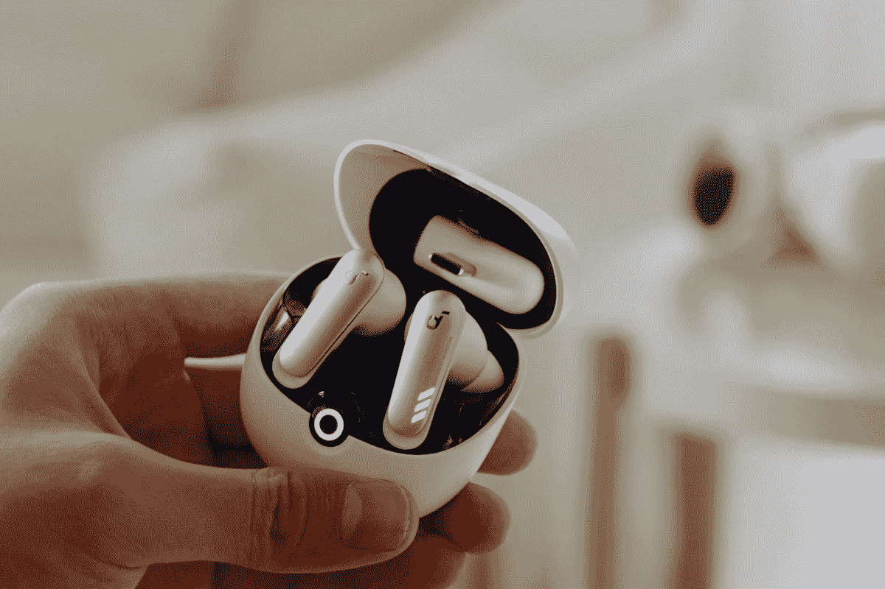

# Soundcore 的 VR P10 为 Meta Quest 2 提供低延迟无线音频

> 原文：<https://www.xda-developers.com/soundcore-vr-p10-launch/>

对于 VR 初学者和爱好者来说, [Meta Quest 2](https://www.xda-developers.com/meta-quest-2-100-price-increase/) 是一个极好的选择。但是，如果你想要完全沉浸其中，一套好的耳机或耳塞将会把事情带到另一个层面。虽然有线耳机很好，但它们没有无线解决方案的自由。不幸的是，传统的无线蓝牙耳塞，即使被吹捧为最好的[，也往往有延迟问题，使它们成为 Quest 2 的糟糕选择。令人欣慰的是，Soundcore 已经宣布了专门为 Meta Quest 2 制作的最新无线耳塞，提供了出色的声音、强大的功能，最重要的是，支持低延迟音频。](https://www.xda-developers.com/best-wireless-earbuds/)

Soundcore VR P10 被吹捧为“专为 Meta 制造”，这仅仅意味着这些产品是专门为 Meta Quest 2 设计的。那么，这意味着什么呢？这意味着你将获得 30 毫秒以下的低延迟无线音频，能够跟上 Quest 2 提供的最激烈的游戏。在 Superhot VR 中对付敌人时，您可以享受 Beat Saber 而不会错过任何一个节拍或听到每个清晰的细节。让这一切成为可能的是 VR P10s 2.4GHz 高速无线连接及其对 LC3 编解码器的支持，用于无损音频传输。

除了干净的连接，您还可以从无线耳塞获得出色的声音，其 11 毫米驱动器和低音功能。您还可以获得充足的播放时间，耳塞一次充电可支持 6 小时，外壳可支持 24 小时。最重要的是，Soundcore VR P10 不仅适用于 Meta Quest 2，还可以用于 PlayStation 4、PlayStation 5、Switch、PC 等各种产品，甚至是 [Steam Deck](https://www.xda-developers.com/buy-steam-deck-get-two-weeks/) 。此外，它可以使用蓝牙或随附的 2.4GHz 无线转换器进行连接。此外，如果你想带着这些耳塞去慢跑，知道它们提供 IPX4 防水功能就可以放心了。

Soundcore VR P10 目前售价 99.99 美元。在有限的时间内，您甚至可以在结账时使用折扣代码“ **VRP10NEW20** ”获得 20 美元的折扣。

 <picture></picture> 

Soundcore VR P10

##### Soundcore VR P10

无线耳塞与 Meta Quest 2 完美搭配。

* * *

**音源** : [音芯](https://shop-links.co/link/?exclusive=1&publisher_slug=xda&article_name=Soundcore%27s+VR+P10+offer+low+latency+wireless+audio+for+the+Meta+Quest+2&article_url=https%3A%2F%2Fwww.xda-developers.com%2Fsoundcore-vr-p10-launch%2F&u1=UUxdaUeUpU44234&url=https%3A%2F%2Fus.soundcore.com%2Fproducts%2Fvr-p10-a3850z21%3Fref%3Dmaster_banner_1%26nrtv_cid%3D.nrtv_plchldr.%26utm_source%3Dnarrativ%26utm_medium%3Daffiliate%26nrtv_as_src%3D1)