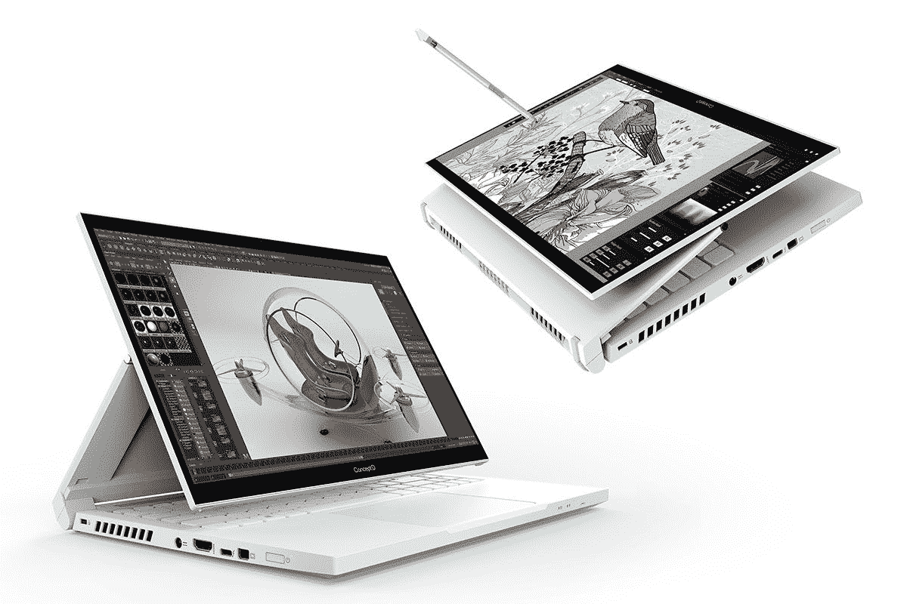

# 在 Acer concept d 上动手操作 SpatialLabs 立体 3D 显示器

> 原文：<https://www.xda-developers.com/spatiallabs-stereoscopic-3d-acer-conceptd-hands-on/>

宏碁的新[概念笔记本电脑](https://www.xda-developers.com/acer-conceptd-notebooks-creators-3d-display/)有 3D 显示屏。是的，你没看错。坦白说，这很酷。它被称为 SpatialLabs，它跟踪你的眼球运动来创建不同的三维图像。最重要的是，你不需要眼镜或任何特殊设备。

我知道你在想什么。这听起来很像[红氢手机](https://www.xda-developers.com/red-hydrogen-one-review-recap/)，除了它是一台[笔记本电脑](https://www.xda-developers.com/best-laptops/)，配有 RTX 30 系列显卡，而不是智能手机。虽然它们看起来很相似，但还是有一些关键的区别。首先，RED 非常关注内容消费，与电影公司达成协议，以他们的内容格式销售电影。此外，RED 真的认为它的手机会成为主流。

现在大象出了房间，我们只能说宏碁的目标完全不同。ConceptD 是为创作者打造的阵容。如果你正在做像 3D 建模这样的事情，这是一种简单的方式来查看你的工作，而不需要混合现实耳机。这里也有一些很酷的 3D 动画用例。

### 宏碁空间实验室的工作原理

宏碁空间实验室有两个关键组件:摄像头和显示器。

首先是立体摄像机，它跟踪你的眼睛和头部。建议你坐在离屏幕 35 厘米到 75 厘米的地方，只向左或向右移动 17 厘米。

基于眼睛和头部的追踪，它创造了你现在看到的两幅图像。你的大脑将这些图像合并成一个三维图像。请记住，因为它是用它来创造深度，所以机器需要一点时间来调整。如果你在看这些内容的时候经常走动，你可能会有点头晕，或者至少这是我的经验。如果你一直来回移动，很难集中注意力。

但是，也有一些内容是让你四处移动的。例如，有一个虚幻的引擎演示，它可以让你左看、右看、上看和下看。如果你曾经试着环顾你的屏幕，好像你会看到更多，这是你的幸运日。

这是这两种情况的区别。后者只是基于你的视角进行调整。但对于前者，实际上呈现方式不同。多亏了 NVIDIA 的 RTX 显卡，这些都是实时渲染的。

另一部分是立体 3D 显示器。屏幕上有一个光学透镜。在两个图像(每只眼睛一个)被创建后，它们通过透镜折射到眼睛所在的位置。您可以随时在 2D 和 3D 模式之间切换。

### 动手操作 3D 立体显示器

这种体验真的很酷，但确实需要一些时间来适应。当宏碁第一次为我演示这个时，我没有意识到它是基于我的眼睛来创建深度的。我发现自己来回移动，试图集中注意力。这让事情变得更糟，因为它没有给 ConceptD 笔记本时间来补偿我的移动。

在下面的视频中，我实际上在一块纸板上切了一个洞，并通过它进行记录。我还戴了太阳镜，这样它就能跟踪相机而不是我的眼睛。

你可以看到，在整个演示过程中，有工作也有娱乐。更酷的东西包括一些 3D 视频等，但这并不完全是这个的目的。您将看到使用 Blender、Unreal Engine 等应用程序的其他演示。

宏碁正在推出一项 SpatialLabs 开发者计划，您可以在 2021 年 6 月 30 日之前申请该计划。如果你被录取，公司将免费送你一个概念空间实验室的原型三个月。可以[在这里](https://webforms.pipedrive.com/f/1CuYhTvTecDcm0BLPMhGMNWrBDM8gFrqNucU8D0eM90z0AxUcQdpH34uwxG9D75hF)申请。

 <picture></picture> 

Acer ConceptD

##### 宏碁概念

ConceptD 是宏碁为创作者提供的一系列产品，包括简约的设计和强大的功能