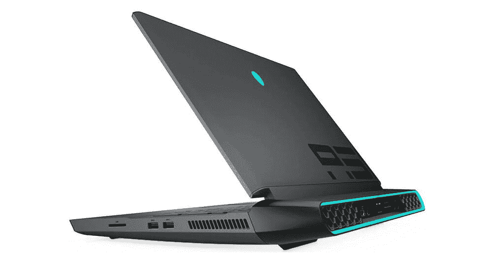
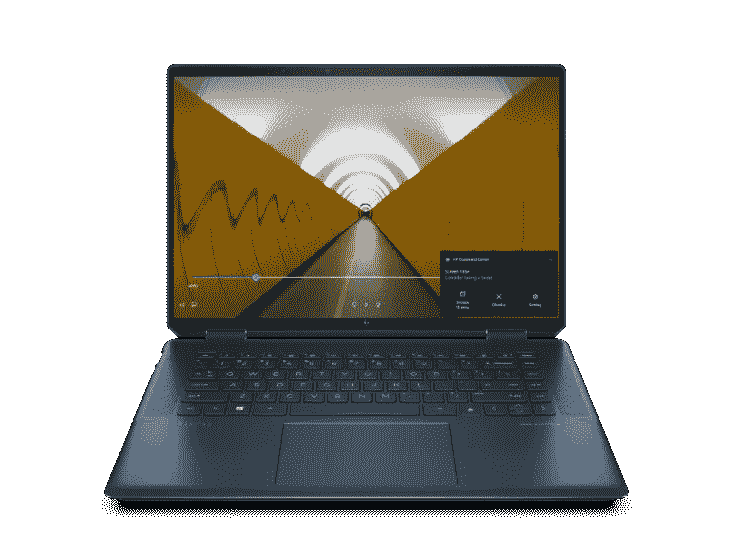

# 惠普 Spectre x360 有专用显卡吗？

> 原文：<https://www.xda-developers.com/spectre-x360-graphics/>

与许多其他惠普笔记本电脑一样，HP Spectre x360 是一款出色的超极本，这意味着它非常适合在旅途中工作。它还具有二合一的优势，因此用途非常广泛。但是游戏是一个完全不同的领域，你可能会想要一台带独立 GPU 的笔记本电脑。惠普 Spectre x360 有专用显卡吗？是的，只要你看的是正确的型号。

## 什么是 GPU？

GPU 是图形处理单元的缩写，是一种特殊的处理器，专注于渲染图像。虽然 CPU 可以处理所有一般的计算机任务，但如果您想玩更现代、更密集的游戏以及内容创作，强大的 GPU 非常重要。如今，大多数笔记本电脑处理器都包括一个 CPU 和一个集成的 GPU，足以满足日常使用。

但是，如果你是一个狂热的游戏玩家，拥有一个独立的 GPU 可能是一个不错的选择。独立 GPU 是独立于 CPU 的，这意味着它有自己单独的功率限制。这些通常更大，消耗更多的电力，但它们可以让你在大多数游戏中获得更好的性能。这意味着你在用电池寿命和便携性换取性能。这就是为什么[最好的游戏笔记本电脑](https://www.xda-developers.com/best-gaming-laptops/)往往非常大。同样，强大的 GPU 也可以真正帮助图像和视频编辑。

 <picture></picture> 

A Dell Alienware 51m gaming laptop

## 我需要专用显卡吗？

如果你总是想玩最大的工作室的最新游戏，专用 GPU 是一个不错的选择。一些现代游戏可能在笔记本电脑的集成显卡上运行缓慢。然而，如果你降低游戏中的质量设置，你仍然可以玩很多游戏。

随着技术的不断发展，公司一直在处理器中塞进更强大的集成 GPU。最新的英特尔处理器内置了 Iris Xe 显卡，这可能足以在较低质量的设置下运行许多游戏，甚至是一些旧游戏，而不会有太大的牺牲。AMD 还为游戏和生产力制造了非常强大的笔记本电脑处理器。如果您主要使用笔记本电脑工作，但您喜欢偶尔玩一些游戏，集成 GPU 可能仍然是一个不错的选择。

可以利用强大 GPU 的另一个方面是媒体创作。如果你花很多时间编辑图像和视频，你会发现拥有一个专用的 GPU 可以大大提高性能。视频编辑尤其需要大量的能力，尤其是当您处理 4K 素材或更高分辨率时。同样，如果没有专用的 GPU，使用大量图层的专业图像编辑可能会很棘手。然而，如果您主要进行简单编辑和处理低分辨率视频，超极本处理器就足够好了。你可能需要多等一会儿才能渲染出来，但是这是非常有用的。

## 惠普 Spectre x360 有专用显卡吗？

由于这是一款设计非常便携的超极本，Spectre x360 的较小版本没有专用显卡。以前有一些版本的 HP Spectre x360 15 包含独立显卡，但现在不再提供了。然而，惠普最近推出了 Spectre x360 16，其中包括 NVIDIA GeForce RTX 3050 Ti 作为一个选项，所以你可以走这条路。这是一个现代和相当强大的 GPU，所以你可以运行大多数现代游戏没有太大的问题。

所有这些都与 Spectre x360 系列的其他产品采用了相同的 2 合 1 外形规格。这意味着你可以旋转屏幕，用手指或笔来使用触摸屏。这也是一个 4K 面板，所以你也可以用它来观看最好质量的电影。它比普通的超极本重一点，只有 4.23 磅，但这是意料之中的。你可以看看下面:

 <picture></picture> 

HP Spectre x360 16

##### x 360 16 频谱

HP Spectre x360 16 外形多样，功能强大。它拥有英特尔酷睿 i7-11390H 处理器和 NVIDIA GeForce RTX 3050 Ti 显卡。

如果您主要使用笔记本电脑进行办公，其他 Spectre x360 型号可能是更好的选择。最新版本配备了英特尔处理器，配有 Iris Xe 显卡，非常适合轻度游戏。惠普 Spectre x360 14 是你现在可以买到的最好的笔记本电脑之一，除了强大的处理器，它还有一个 3:2 的高显示屏，让你一次在屏幕上看到更多内容。你也可以用 3K2K 的分辨率得到它。您还可以为其配置高达 16GB 的 RAM 和 2TB 的存储空间。所有这些都包含在一个不到 3 磅的包中，因此更容易随身携带。

 <picture></picture> 

HP Spectre x360 14

##### 惠普 Spectre x360 14

HP Spectre x360 14 是一款更轻的笔记本电脑，可以轻松处理大多数日常任务。如果你主要用它来工作，只是偶尔玩玩轻度游戏，它仍然是一个很好的选择。

是否需要专用 GPU 取决于你用笔记本电脑做什么。无论您的需求是什么，Spectre x360 都有适合您的选项。对于狂热的游戏玩家，您可以通过 Spectre x360 15 获得强大的专用 GPU。或者，如果您经常使用英特尔 Iris Xe 显卡，也可以选择更小更轻的型号。它仍然能够处理一些轻度游戏。