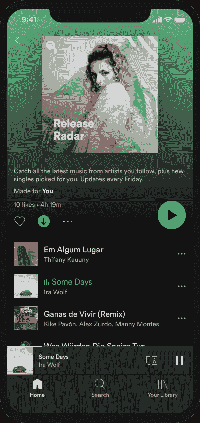
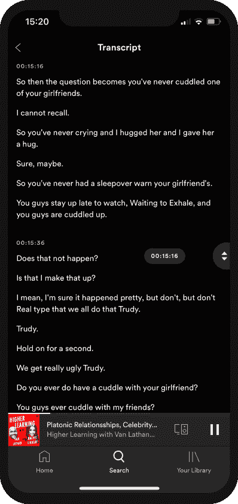

# Spotify 的 iPhone 和 Android 应用程序可以获得自动播客转录等等

> 原文：<https://www.xda-developers.com/spotify-automatic-podcast-transcriptions-more/>

# Spotify 的 iPhone 和 Android 应用程序可以获得自动播客转录等等

Spotify 获得了另一批新功能，使这款应用对身体有障碍的人来说更容易使用。看看他们！

流媒体大战正在升温。在苹果宣布苹果音乐将推出无损音频的一天后，瑞典流媒体巨头 Spotify 今天早上宣布了其 iOS 和 Android 应用的三个新更新，将改善其 3.56 亿听众的用户体验。在这些更新之前，[上个月](https://www.xda-developers.com/spotify-library-redesign-improved-navigation/)进行了更新，改进了移动应用的图书馆美学，以方便导航和在脸书应用内[听 Spotify 的能力。](https://www.xda-developers.com/spotify-miniplayer-facebook-app/)

正如 Spotify 网站上的一篇博客文章所解释的，Spotify 的 iPhone 和 Android 应用程序将自动转录播客，增加文本大小，超过手机的系统限制，应用程序按钮具有新的格式和颜色。

 <picture></picture> 

Spotify's new update brings buttons with stronger formatting and bolder colors.

所有这些变化的目的都是为了让这款应用对身体有障碍的人来说更容易使用。例如，更大的文本和不同颜色的按钮可以帮助视力障碍者在手机上更容易地看到应用程序，播客转录使听力损失者仍然可以享受播客。即使对于那些足够幸运没有身体障碍的人来说，阅读播客而不是听播客的能力也是非常有用的。用户还可以快速滚动和浏览段落，点击特定的单词，并从该点开始播放音频。

 <picture></picture> 

Spotify will soon be able to transcribe podcasts automatically for some of its podcasts.

据博客文章称，自动播客转录正处于测试阶段，目前仅适用于 Spotify 的“原创和独家”播客。然而，该公司表示，其目标是最终为 Spotify 上的所有播客提供这项服务。

Spotify 的博客文章称，这是三个独立的更新，将在未来几周内推出到移动应用程序。