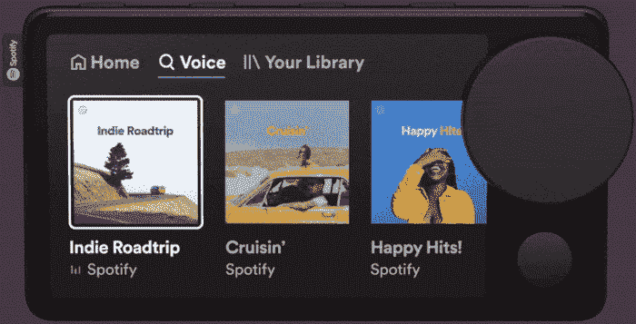

# Spotify 的新“汽车用品”是你绝对不需要的汽车配件

> 原文：<https://www.xda-developers.com/spotify-car-thing/>

Spotify 已经尝试发布基于其音乐流媒体服务的硬件，但其设备都没有大范围发布。这一次，该公司宣布了“Car Thing”，这是一个为你的汽车设计的触摸屏面板，只能播放 Spotify。

Spotify 在其公告中写道:“目前美国符合条件的用户可以使用 Car Thing，它可以让你更快地播放你最喜欢的音频，所以你甚至可以在开出车道之前就已经在听那首热门歌曲或最新的播客片段了。[...]在控制设备时，以最适合你的方式使用它，无论是语音、触摸还是物理控制。”

[汽车用品](https://carthing.spotify.com/technical-things)宽 4.6 英寸，高 2.5 英寸，触摸屏对角线长 4 英寸。顶部有四个预设按钮，可以设置为启动特定的播放列表、播客或其他内容。除了触摸屏，大部分功能都可以通过侧面的拨号盘来控制。你也可以说“嘿 Spotify”来播放内容。Car Thing 使用蓝牙或 3.5 毫米插孔连接到您的汽车。

 <picture></picture> 

Car Thing

尽管它的设计很吸引人，但很难看出它有任何必要或有任何有意义的帮助。它没有解决任何廉价手机车载支架(可能还有廉价的蓝牙/AUX 适配器)无法解决的问题，而且它*仍然*需要通过蓝牙连接的手机和付费的 Spotify Premium 计划。它在你的手机和汽车之间增加了一个不需要存在的额外层，特别是因为 Spotify 移动应用程序已经有了汽车模式(这使得按钮和菜单变得更大)和 Android Auto/Apple CarPlay 支持。

就像 Spotify 的其他硬件公司一样，汽车用品并没有在商店出售——至少现在还没有。Spotify 表示，这款设备只能在美国获得邀请，一些 Spotify 听众可以免费获得。

如果你想被列入可能获得该设备的列表，请前往[网站](https://carthing.spotify.com/)。售价 79.99 美元。