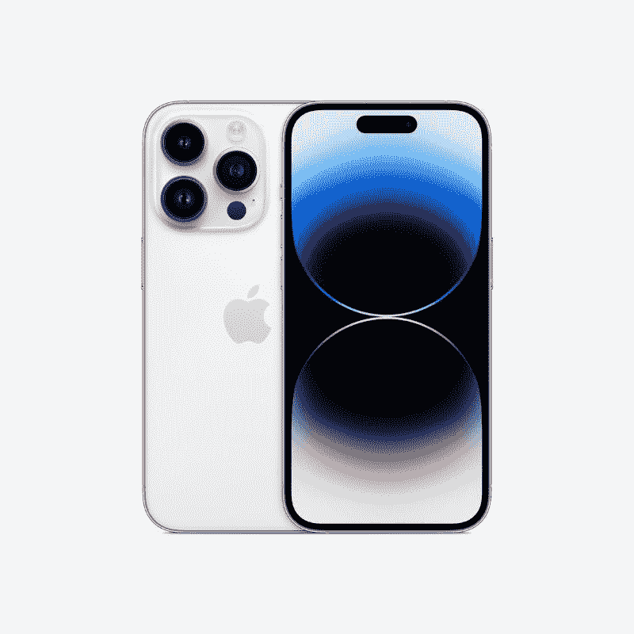
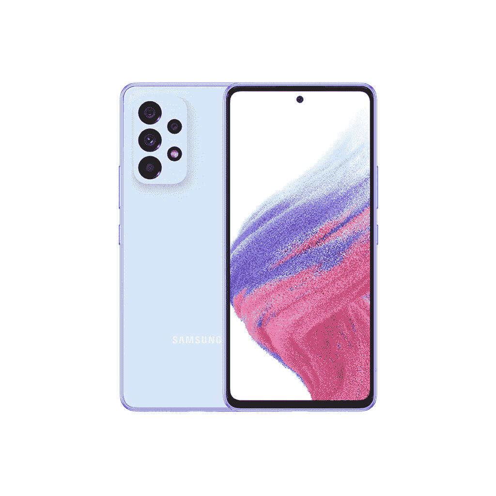
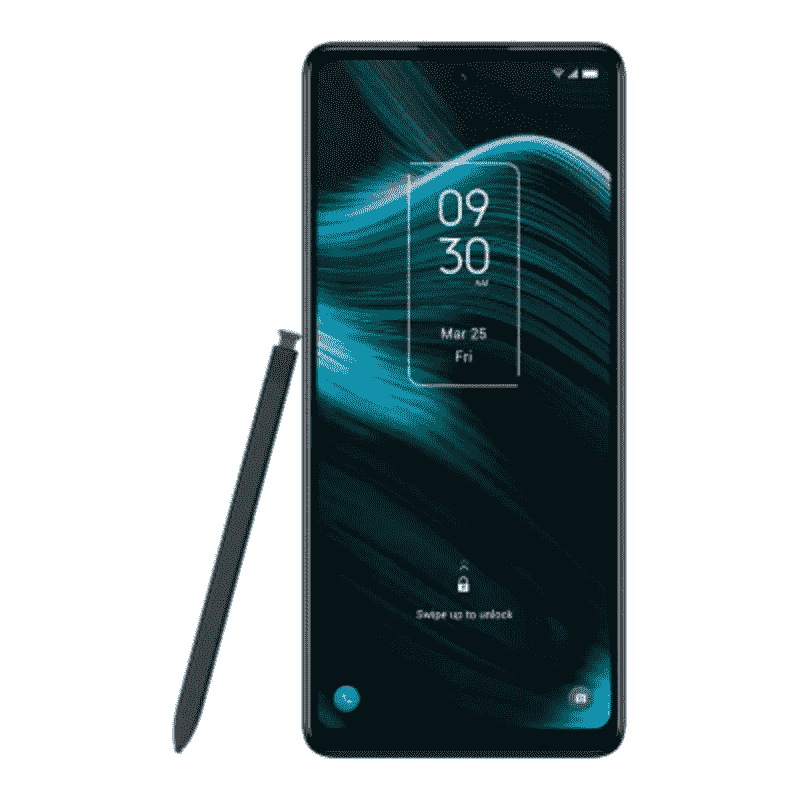

# 2023 年最佳 T-手机

> 原文：<https://www.xda-developers.com/sprints-new-unlimited-plan-with-ridiculous-capped-speeds/>

T-Mobile 是美国最大的无线运营商之一，提供各种智能手机和套餐。无论你是在寻找一部经济实惠的手机，高端旗舰手机，还是介于两者之间的手机，T-Mobile 都能满足你。在美国，几乎所有入选 2022 年最佳智能手机的智能手机都可以通过 T-Mobile 购买，我们预计今年也将继续如此。我们仍在等待第一批 2023 年的智能手机上市，但你可以看看下面我们收集的最好的 T-Mobile 手机，找到一些现在可以考虑的好选择。让我们开始吧！

## 最佳整体手机:三星 Galaxy S22 Ultra 5G

三星的 Galaxy S23 Ultra 即将推出，但我们怀疑这是否会带走当前 Galaxy S22 旗舰产品带来的难以置信的价值。因此，如果你想在市场上购买一部新的智能手机，那么我们建议看看 Galaxy S22 Ultra，它是这个特定系列中最好的 T-Mobile 手机之一。它结合了 Galaxy S 和 Galaxy Note 系列的优点，提供了一个具有最佳规格和功能的强大设备。它还配有 S Pen，可以解锁 Android 领域无可匹敌的大量生产力工具。

三星 Galaxy S22 Ultra 借鉴了一些现有三星手机的设计元素。它拥有 Galaxy Note 20 的基本贴合性和光洁度，但它看起来也很像去年的 Galaxy S21 Ultra。它的构造就像一辆坦克，三星在耐用性方面可谓无所不用其极。Galaxy S22 Ultra 配备了 Gorilla Glass Victus Plus，并使用装甲铝金属框架将所有东西固定在一起。

Galaxy S22 Ultra 的 6.8 英寸 120Hz QHD+ AMOLED 大面板很容易成为其亮点之一。它的亮度不如 iPhone 14 Pro 的显示屏，但比目前市场上大多数其他智能手机屏幕都要亮。它也是最好的 AMOLED 面板之一，具有鲜艳的颜色和清晰的视觉效果。

谈到光学系统，Galaxy S22 Ultra 是目前已知拥有最多功能相机系统的相机。主 108MP 相机传感器与 12MP 超宽相机、具有 3 倍光学变焦的 10MP 长焦镜头和具有 10 倍光学变焦的 10MP 长焦潜望镜镜头一起运行该节目。你还可以获得一个 4000 万像素的前置摄像头，用于自拍和视频通话。所有这些相机传感器聚集在一起，捕捉一些令人印象深刻的照片和视频。你可以查看所有相机样品，也可以在我们的 [Galaxy S22 Ultra review](https://www.xda-developers.com/samsung-galaxy-s22-ultra-review/) 中了解更多关于这些相机的信息。

Galaxy S22 Ultra 由美国骁龙 8 Gen 1 芯片组提供支持，可以顺利连接到 T-Mobile 的 5G 网络。骁龙 8 Gen 1 不是目前最强大的芯片组，但它能够毫无问题地处理所有日常工作负载。这款手机的其他一些值得注意的功能包括 IP68 防尘防水等级，支持 45W 充电的 5,000mAh 大电池等等。

T-Mobile 目前正在为 Galaxy S22 Ultra 提供一些不错的交易。你可以在 Magenta MAX 上获得高达 800 美元的折扣。此外，当您根据符合条件的费率计划以符合条件的设备折价时，您还可以获得高达 400 美元的奖励。它有幻影黑、酒红色和绿色三种颜色可供购买，并且您可以在 128GB、256GB 和 512GB 存储版本之间进行选择。你也可以选择全款购买手机，或者选择 24 个月的融资，以获得高达 800 美元的新 Magenta MAX 系列。

你也可以考虑看看 [Galaxy S22](https://www.xda-developers.com/samsung-galaxy-s22-review/) 和 [Galaxy S22 Plus](https://www.xda-developers.com/samsung-galaxy-s22-plus-review/) ，这两款手机都略小，是 Ultra 手机的低调版本。你不会得到这两款设备的所有顶级功能，但它们以合理的价格获得了所有的基本功能。

 <picture></picture> 

Samsung Galaxy S22 Ultra

三星 Galaxy S22 Ultra 是最完整的智能手机，提供了最好的屏幕，多功能的相机系统，Android 中最好的 SoC，以及手写笔。

* * *

## 备选最佳:苹果 iPhone 14 Pro

苹果新推出的 iPhone 14 Pro 无疑是今年我们见过的最好的智能手机之一。它可能看起来与它的前身没有太大的不同，但今年有相当多的变化。事实上，Pro 机型今年配备了一些令人敬畏的功能，使它们从常规的 iPhone 14 机型中脱颖而出。从更新的 SoC 到改进的“Pro”相机系统，iPhone 14 Pro 有很多值得喜欢的地方，它应该成为这个系列中你现在可以买到的最好的 T-Mobile 手机之一。

今年专业版车型最大的变化之一就是镂空。显示屏顶部的凹口已经被一个药丸形状的切口取代。苹果正在使用一些软件技巧将这个特定的剪切块变成屏幕上的互动元素。它被称为动态岛，目前只限于专业型号。这种特殊的剪切/互动软件元素不会改变你使用 iPhone 的方式，但它给主屏幕带来了有用的简略信息。

iPhone 14 Pro 的另一个新功能是新的“Pro”相机系统。主摄像头现在有了更大的传感器和更快的光圈。这也是一个更高的 4800 万像素传感器，使用像素宁滨来产生 1200 万像素的拍摄。我们已经测试了这款新相机，并在我们的 [iPhone 14 Pro Max 评测](https://www.xda-developers.com/apple-iphone-14-pro-max-review/)中添加了一堆样品，所以一定要检查一下。苹果还改进了 iPhone 14 Pro 的视频录制功能。除了改进的电影模式，还有一个新的动作模式，可以帮助您捕捉移动物体的稳定镜头。

在硅方面，苹果正在使用 A16 仿生芯片为新的 Pro 型号提供动力。这是目前市场上最强大的移动芯片组，其性能优于 Android 端的任何产品。iPhone 14 Pro 其他一些值得注意的功能包括新的永远在线显示功能，户外最高 2000 尼特的峰值亮度等等。当谈到较小的 iPhone 14 Pro 型号的电池寿命时，有一些不同的意见，所以你可能想多花 100 美元来获得更好的电池寿命的 Pro Max 型号。

苹果还没有提高充电速度来赶上安卓手机制造商。这意味着你仍然被限制在最高 25W 的充电速度。它也支持 MagSafe 和 Qi 无线充电，但你必须在每种情况下自带充电器。

T-Mobile 提供了 iPhone 14 Pro 的所有四种颜色，您可以在 128GB、256GB、521GB 和 1TB 存储空间之间进行选择。该运营商为 iPhone 14 Pro 提供了几项有趣的交易，包括高达 500 美元的折价交易。您还可以通过 24 个月的账单信用获得高达 700 美元的第二部 iPhone 14 或 iPhone 13 系列设备。

 <picture></picture> 

Apple iPhone 14 Pro

iPhone 14 Pro 具有永远在线的显示屏、动态岛、新的 48MP 摄像头等等。

* * *

## 最佳安卓体验:谷歌 Pixel 7 Pro

谷歌的新 [Pixel 7](https://www.xda-developers.com/google-pixel-7-review/) 和 [Pixel 7 Pro](https://www.xda-developers.com/google-pixel-7-pro-review/) 无疑是迄今为止最精致的 Pixel 手机，它们很容易成为我们[最喜欢的将于 2022 年推出的 Android 手机](https://www.xda-developers.com/best-android-phones/)之一。虽然普通的 Pixel 7 提供了最大的性价比，但我们向大多数希望获得绝对最佳 Android 体验的用户推荐 Pro 型号。这两款手机的主要区别之一是物理尺寸和其他几个关键规格，包括更大的电池，更高的刷新率显示屏等等。使用这两款手机的整体体验将基本保持不变，但 Pixel 7 Pro 只是略有溢价，因为它代表了谷歌迄今为止最好的智能手机硬件。

在设计方面，Pixel 7 Pro 与去年的 Pixel 6 Pro 有很多相似之处。新款 Pixel 手机的背面还有一个水平横跨手机机身的摄像头条。谷歌这次在 Pixel 7 Pro 上用铝覆盖了相机杆，它很好地融入了手机的侧轨，形成了无缝的外观和感觉。Pixel 7 Pro 有黑曜石、雪和榛色可供购买，它们将在相机栏上有对比鲜明的色调，以获得干净的双色调外观。

Pixel 7 Pro 拥有 6.7 英寸的面板，支持高达 120Hz 的刷新率。就像去年的型号一样，Pixel 7 Pro 的显示屏两侧也有弯曲的边缘，所以请记住这一点。弯曲的边缘不一定是交易的破坏者，因为与我们在即将推出的模型中看到的相比，这一次它们更加微妙。在内部，Pixel 7 Pro 由新的 Tensor G2 芯片提供支持，该公司正在使用该芯片来支持智能软件功能，如音频消息转录、照片去模糊等。正是这些智能功能使 Pixel 7 Pro 优于市面上流行的旗舰产品。

你可能已经知道，相机是像素的一大部分，今年的 Pro 型号有一个非常通用的设置。除了常规 Pixel 7 上的主广角和辅助超广角相机，Pro 型号还带来了一个带 5X 光学变焦的长焦相机。它还利用了 Super Res Zoom 图像处理算法，即使在以 30 倍变焦拍摄时，也能获得更清晰的图像。谷歌还增加了一些其他简洁的相机功能，以提供全面的体验。

总的来说，Pixel 7 Pro 无疑是你现在能买到的最好的安卓手机之一。它可能不是最快的手机，但它以典型的谷歌方式处理其他一切，提供有趣的 Android 体验和优质硬件。T-Mobile 现在正在提供 Pixel 7 Pro 的一些交易，所以请务必点击下面方框中的链接来查看它们。

 <picture></picture> 

Google Pixel 7 Pro

Pixel 7 Pro 是谷歌有史以来最好的手机，拥有精致、优质的设计和谷歌第二代硅芯片，以及一如既往的出色摄像头。

* * *

## 最物有所值:谷歌 Pixel 6a

我们已经把目光放在了像素 7a 上，但预计这不会很快到来。虽然有一些[价格合理的智能手机](https://www.xda-developers.com/best-cheap-android-phones/)可供选择，但如果你想买一部价格合理的安卓智能手机，我们希望你能考虑谷歌 Pixel 6a。你可以通过选择新的产品线从 T-Mobile 获得一个免费的 Pixel 6a 单元，如果你不介意坚持使用 T-Mobile 24 个月，这是一个非常好的交易。这款手机本身提供了巨大的价值，即使在美国要价 449 美元。

谷歌 Pixel 6a 最棒的一点是，它以合理的价格提供了 Pixel 6 和 Pixel 6 Pro 的许多功能。例如，Pixel 6a 与该系列中的其他两款手机采用了相同的谷歌张量 SoC。这是一个高性能的芯片组，可以跟上高通、苹果等公司更强大的芯片。谷歌的张量芯片也优先考虑机器学习和人工智能，以提供一些智能功能。

如你所见，谷歌 Pixel 6a 也带来了与 Pixel 6 和 Pixel 6 Pro 相同的设计。它的特点是背面有一个与手机机身相同的摄像头挡板。你也可以选择一些有趣的颜色，如木炭色、鼠尾草色和粉笔色，打造双色漆面。所有这些有趣的设计元素使 Pixel 6a 在市场上的中档手机海洋中脱颖而出。这绝对是一款外观更高端的设备，我们会毫不犹豫地推荐给一堆外观相似的廉价手机。

然而，谷歌在 Pixel 6a 上偷工减料，以保持低价。缺少高刷新率面板可能是最突出的一个问题。Pixel 6a 只有 60Hz 的显示屏，这使得它比其他一些在预算空间中具有 90Hz 甚至 120Hz 刷新率的手机稍逊一筹。它有一些作为 OLED 面板的可取之处，比如准确的颜色，更高的峰值亮度等等，所以它不一定是一个糟糕的智能手机显示屏。

谷歌 Pixel 6a 上的摄像头也使其成为该领域中最好的拍照手机。谷歌在 Pixel 6a 上使用的是相对较旧的传感器，但它凭借其软件实力成功创造了奇迹。在这个价位上，它无疑比几乎所有其他手机都能捕捉到更好的照片。它还配备了一个相对较大的 4，410 mAh 电池，在适度使用的情况下，应该足以支持你一整天。这款手机的其他一些值得注意的功能包括防尘防水的 IP68 等级，谷歌一流的软件支持等等。

如果你选择在 24 个月内从 T-Mobile 获得一条新线路，谷歌 Pixel 6a 可以免费获得。但即使是 449 美元的要价，Pixel 6a 与许多其他类似价格的手机相比也是一个更好的选择。

谷歌 Pixel 6a 以较低的价格保留了 Pixel 6 的许多优点。

* * *

## 备选最佳价值:三星 Galaxy A53 5G

三星 Galaxy A53 5G 在过去多次获得我们的推荐，这是理所当然的。它无疑是美国最好的中端手机之一，物有所值。它的价格与谷歌的平价 Pixel 相同，它是一个可靠的替代品，可以解决我们在 Pixel 6a 上遇到的许多问题。Galaxy A53 5G 也可以与美国的 T-Mobile 网络很好地配合，这意味着成为这个系列的一部分也很好。

Galaxy A53 5G 最棒的一点就是它的显示屏。我们看到的是 6.5 英寸 120 赫兹三星 Super AMOLED 面板，比 Pixel 6a 的 60 赫兹 OLED 面板要好。正如我们在 [Galaxy A53 5G 评测](https://www.xda-developers.com/samsung-galaxy-a53-5g-hands-on/)中提到的，这是一款典型的三星 AMOLED 面板，具有鲜艳的颜色、墨黑色和高峰值亮度。此外，120Hz 的刷新率使它成为一个充斥着配备基本显示屏的廉价手机的市场中的一个优越选择。

我们喜欢 Galaxy A53 5G 的另一点是它的设计。这款手机整体看起来非常简单，但我们喜欢背面的摄像头凸起。正如你所看到的，摄像头岛变得轻松，融入了手机背面的其余部分。看起来很像 OPPO Find X5 Pro 的背部设计。Galaxy A53 5G 的整体贴合性和光洁度对于价格来说也很棒。还值得强调的是，Galaxy A53 5G 具有 IP67 的防尘和防水等级，以及用于可扩展存储的 microSD 卡插槽。

说到光学系统，Galaxy A53 采用了三摄像头设置，其中包括一个 64MP 主摄像头，12MP 超宽摄像头，以及一对 5MP 主系统中的微距和深度传感器。这些可能不是最好的相机传感器，但我们设法捕捉到了一些非常好的镜头。你可以在我们的评论中了解更多关于这款相机的信息并找到更多样品(本节前面有链接)，所以一定要去看看。自拍由 32MP 前置摄像头处理，对于自拍和视频通话来说相当不错。

最后，还值得注意的是，Galaxy A53 5G 配备了三星令人难以置信的软件支持。该公司承诺为 Galaxy A53 5G 提供长达 4 年的 Android 更新和长达 5 年的安全更新，使其优于该领域的许多其他手机。因此，如果你想买一部能够长时间使用最新软件的手机，那么你可以买 Galaxy A53 5G。

这款手机与美国的 T-Mobile 网络配合良好，而且现在也很容易买到。你可以选择支付全价，也可以通过 T-Mobile 的每月金融服务获得 24 个月的融资。

 <picture></picture> 

Samsung Galaxy A53

##### 三星 Galaxy A53 5G

Galaxy A53 以实惠的价格提供了现代设计、大屏幕和电池

* * *

## 也很棒:TCL 手写笔 5G

TCL Stylus 5G 是这份名单上更令人兴奋的手机之一。这是这份名单上最便宜的廉价手机，然而它带来了手写笔，帮助你在智能手机上做更多的事情。正如我们在 [TCL Stylus 5G 评论](https://www.xda-developers.com/tcl-stylus-5g-review/)中提到的，这是一款很好的经济型手机，在美国要价 258 美元，物超所值。它在 T-Mobile 上运行得非常好，这意味着它也是这个最佳 T-Mobile 手机集合的一个很好的补充。

TCL 手写笔 5G 最好的一点就是手写笔。这款手机也有一个空间来存放手写笔，不像其他一些手机那样让你像携带配件一样单独携带它们。不过，这是一款无源手写笔，这意味着它没有电池，也不依赖蓝牙来工作。我们发现它在手机上运行良好，并且在书写和记笔记时具有最小的延迟。就像 Galaxy S22 Ultra 一样，TCL Stylus 5G 也可以让你在不解锁手机的情况下快速记笔记。

我们还喜欢 TCL 如何构建一些定制应用程序，让您可以利用设备上的手写笔。手机捆绑了 Nebo for TCL 和 MyScript Calculator 2。如果你不知道，Nebo 是一个手写识别工具，它可以将你的笔记转录成可复制的文本。MyScript Calculator 2 是一款应用程序，它可以接受您的手写计算，并为您进行计算。在我们使用该设备期间，这两款应用都运行良好。

TCL 手写笔 5G 还配有 6.81 英寸显示屏。这是一款外观简单的显示器，顶部有一个凹槽，底部有一个相当大的边框。你不会得到最暗的黑色，超级对比的颜色，甚至没有像这款显示器那样的功能，但它看起来很不错，适合日常使用。我们只是希望它能亮一点，因为 500 尼特的亮度使它在阳光直射下很难阅读。

至于内部，TCL 手写笔 5G 配有联发科 Dimensity 700 SoC 和 4GB RAM。这款手机的性能与你对这个价位的其他手机的预期相当。它不会赢得任何奖项，但它会毫无问题地完成工作。4000 毫安时的电池应该也能让你舒适地使用一天，不会出现任何问题。这款手机背面还配有四个摄像头传感器，包括 50MP PDAF 传感器、5MP 广角传感器、2MP 宏观传感器和 2MP 深度传感器。

总的来说，如果你不介意继续使用 T-Mobile，TCL Stylus 5G 是一款不错的手机。如果你获得一条新线路并锁定 24 个月，运营商实际上会免费赠送一台 TCL Stylus 5G。它只有黑色可选，并且只有一个储物选项，请记住这一点。

 <picture></picture> 

TCL Stylus 5G

##### TCL 手写笔 5G

TCL Stylus 5G 是一款带有 garaged stylus 的经济型智能手机。它也有一个漂亮的屏幕，伟大的软件，和一个像样的相机。正好是 258 美元的智能手机。

* * *

## 最佳可折叠手机:三星 Galaxy Z Fold 4

三星 Galaxy Z Fold 4 是目前唯一一款在美国上市的折叠手机，这就是为什么它被我们推荐为最佳可折叠手机。它还可以与包括 T-Mobile 在内的美国所有主要运营商很好地合作，因此它是这个最佳 T-Mobile 手机集合的坚实补充。T-Mobile 似乎也正在美国为这款手机提供[最优惠的价格](https://www.xda-developers.com/best-samsung-galaxy-z-fold-4-deals/)，这很好，因为否则这款手机可能会很贵。

Galaxy Z Fold 4 在很大程度上与去年的 Galaxy Z Fold 3 相似，这主要是因为整体底盘基本保持不变。即使把两部手机并排放在一起，你也很难分辨出两者的区别，除非你仔细观察细节。然而，即使是很小的变化，也使 Galaxy Z Fold 4 在现实生活中的握持和使用效果明显更好。新升级的铰链也使设备感觉更高级。它仍然不会像传统手机那样耐用，但三星的可折叠手机已经取得了很大进步。

三星还改进了 Galaxy Z Fold 4 的相机系统，使其与市场上的其他旗舰手机更加一致。该公司从其 Galaxy S22 借用了主要的 50MP 拍摄镜头和具有 3 倍光学变焦的 10MP 长焦镜头。它仍然使用 Galaxy Z Fold 3 的相同 12MP 超宽传感器，但它们都可以很好地配合工作，以提供一些真正好看的整体效果。在我们的 [Galaxy Z Fold 4 评测](https://www.xda-developers.com/samsung-galaxy-z-fold-4-review/)中，我们有更多的相机细节和样品，所以在做出购买决定之前，请务必检查一下。

Galaxy Z Fold 4 还配备了升级的内部部件，整体性能更好。您将获得由 12GB 内存和高达 1TB 存储支持的骁龙 8 Plus 第 1 代处理器。三星还投入了更多精力来改善手机的整体软件体验。现在在屏幕底部有一个持久的任务栏来帮助你更好地进行多任务处理。Galaxy Z Fold 4 上的新 OneUI 软件包含一些很棒的功能，如 Flex mode，以提高您的工作效率。你也可以在 Galaxy Z Fold 4 上使用 S Pen，但值得一提的是，设备内部没有地方存放手写笔。你必须单独携带它，或者买一个别致的盒子来固定它。

T-Mobile 还在美国为 Galaxy Z Fold 4 提供了一些令人难以置信的交易。你可以在 Magenta MAX 上获得高达 800 美元的折扣。如果没有，当您携带符合条件的设备以旧换新购买新的 Galaxy Z Fold 4 时，您还可以获得高达 400 美元的优惠。T-Mobile 推出了幻影黑、米色和灰绿色的 Galaxy Z Fold 4，你还可以选择 256GB 和 512GB 的存储版本。

三星 Galaxy Z Fold 4 同时是智能手机和迷你平板电脑，三星对硬件和软件进行了充分的打磨，实现了无缝过渡。如果你想灵活使用你的个人设备，这款手机是你需要的。

* * *

在美国，不缺乏与 T-Mobile 合作的手机，但这些是唯一值得在 2023 年考虑的手机。从最昂贵的 Galaxy Z Fold 4 到更多的预算选项，如 TCL Stylus 5G，我们已经设法整理了一份健康的美国 T-Mobile 手机列表。这是一个不断发展的列表，我们将经常更新，以添加更多相关的选项，所以请务必回来查看更新和可能更好的手机。

正如我们之前提到的，第一批 2023 年的智能手机就在眼前，所以也要留意那些。我们已经从谣言工厂听到了一些关于三星 Galaxy S23 系列和 T2 一加 11 系列的好消息，所以我们希望尽快将它们添加到这个列表中。敬请期待！