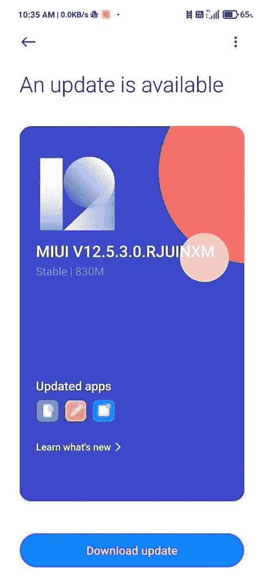

# POCO X3 专业版开始接收稳定的 MIUI 12.5 更新

> 原文：<https://www.xda-developers.com/stable-miui-12-5-rollout-poco-x3-pro-india/>

# 稳定的 MIUI 12.5 更新开始在印度推出 POCO X3 专业单位

稳定的 MIUI 12.5 更新已经开始在印度推出 POCO X3 专业单位。该更新重 830MB，包括 2021 年 6 月的补丁。

继上个月小米 10T 和小米 10T Pro 的 MIUI 12.5 更新之后，[最新版本的小米定制皮肤](https://www.xda-developers.com/xiaomi-announces-miui-12-5-mi-redmi-smartphones/)现在正在向另一个设备进军:POCO X3 Pro。

今天早些时候，POCO 印度董事 Anuj Sharma 在一条推文中宣布，该公司已经开始向印度的 POCO X3 Pro 用户提供稳定的 MIUI 12.5 更新。更新目前只在有限的单位推出。如果在有限的首次展示中没有发现严重的错误或问题，更新将逐渐扩展到更多的用户。

 <picture></picture> 

Screenshot courtesy: Telegram user @mood_swinger7

此次更新携带固件版本 **12.5.3.0.RJUINXM** ，重 830MB。由于这是一个有限的推出，更新只为 POCO X3 专业单位的一小部分上线。如果你等不及自动推出，你可以下载下面链接的完整 OTA zip 来手动更新你的 POCO X3 专业版。如果你需要帮助更新，请查看我们的 [MIUI 安装指南](https://www.xda-developers.com/how-to-install-stock-official-miui-android-update-xiaomi-mi-redmi-smartphones/)。

**[下载 POCO X3 Pro 的 MIUI 12.5](https://bigota.d.miui.com/V12.5.3.0.RJUINXM/miui_VAYUINGlobal_V12.5.3.0.RJUINXM_eec8e9ea1a_11.0.zip)**

### 完整的 MIUI 12.5 更新变更日志的 POCO X3 专业版

*   **系统**
    *   新:通过定制设备型号调整，任何手机升级后都变得更快。
    *   新:对手势的反应现在是即时的。
    *   新:渲染能力提高了 20 倍，现在你在屏幕上看到的东西没有什么限制了。
    *   优化:MIUI 变得更轻、更快、更耐用。
    *   Android 安全补丁更新至 2021 年 6 月。增强的系统安全性
*   **注释**
    *   新:手势快捷方式现在允许你在任何地方创建笔记、任务和摘录。
    *   新:摘录保存文本，网址和图像笔记在几个简单的点击。
    *   新:动态布局将 Notes 中的排版带到了一个新的高度。
    *   新:用复杂的结构组成思维导图。
    *   新:涂鸦和素描的新工具。
    *   新功能:按住草图以自动调整行程。
    *   全新的笔记。
*   **状态栏，通知阴影**
    *   修复:使用面部数据解锁设备后，锁屏通知动画冻结
    *   修正:通知在某些情况下闪烁
    *   修正:浮动通知在风景模式下不能正确显示
    *   修复:通知徽章没有为锁定设备上的传入通知进行更新

POCO X3 Pro 是 OG POCO F1 的精神继承者。它于 3 月份在欧洲推出，随后几周后抵达印度。它配备了 6.67 英寸 120Hz 液晶面板、骁龙 860 SoC、高达 8GB 内存和 256GB UFS 3.1 闪存、四摄像头和 5160 毫安时电池，支持 33W 快速充电。