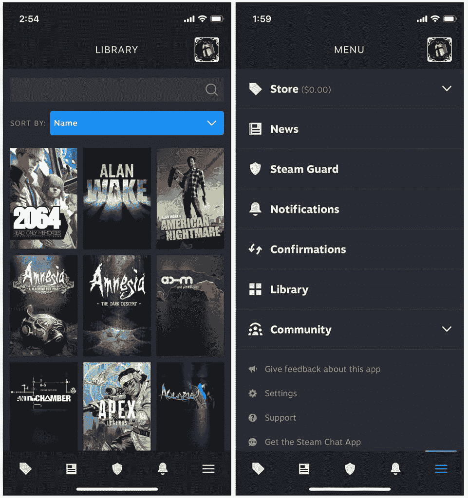

# Steam 记得它的史前移动应用程序，在最新的测试版中对其进行了全面检查

> 原文：<https://www.xda-developers.com/steam-mobile-app-overhaul-beta/>

如果你是一个活跃的 PC 游戏玩家，你可能对 iOS 和 Android 上古老的 Steam 应用程序很熟悉。作为参考，这款手机应用允许用户浏览 Steam 商店、与朋友聊天、使用 Steam Guard 等。在某个时候，Valve 推出了一款专用的(也更现代的)与朋友聊天的应用。然而不幸的是，新应用从未支持双重认证(2FA)的 Steam Guard。这意味着用户仍然需要依赖这个史前应用程序来进行身份验证，这个程序已经两年没有更新了。Valve 最终承认了主要的移动应用程序是多么过时，并为 iOS 和 Android 用户推出了一个测试程序，以测试它的大修版本。

> 今天，我们开始了更新的 Steam 移动应用程序的有限测试。我们在一个新的框架上重建了应用程序，并对设计进行了现代化。(2015 打电话想要回他们的 app。)你仍然可以浏览商店，获得 Steam Guard 代码，并确认交易，但现在该应用程序带有二维码登录，更智能的通知，改进的库和多帐户支持。

 <picture></picture> 

Credit: *The Verge*

测试版应用不仅更新了用户界面，还引入了新功能——比如二维码签到。此外，Valve 已经在新的框架上重建了它，以提供更好的性能。要加入测试计划并利用现代变化，你可以关注 iOS 上的这个 [TestFlight 链接](https://testflight.apple.com/join/8BOPXsGz)和 Android 上的这个 [Google Play 链接](https://play.google.com/apps/testing/com.valvesoftware.android.steam.community)。

在撰写本文时，试飞程序没有插槽。因此，你必须时刻注意有人离开去接替他们的位置。与此同时，新用户仍可使用 Android 程序。考虑到这是一个测试版，预计将面临潜在的不稳定性和意想不到的行为。最后，如果你对体验不满意，你总是可以回滚到 Steam 应用程序的古老的、*稳定的*版本——直到重新设计的测试版出来。

您会加入 Steam 移动测试计划吗？为什么或为什么不？请在下面的评论区告诉我们。

* * *

**来源:** [蒸汽](https://steamcommunity.com/games/593110/announcements/detail/3335498663100828299)

**Via:** [濒临绝境](https://www.theverge.com/2022/8/24/23320795/valve-steam-mobile-app-new-redesign-ios-android-beta)