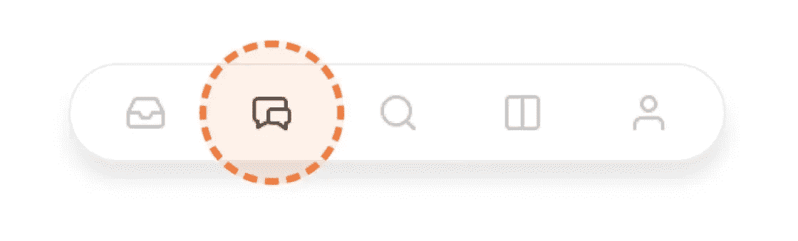

# Substack Chat 的到来正值 Twitter 开始崩溃之际

> 原文：<https://www.xda-developers.com/substack-chat-arrives-on-ios/>

# Substack Chat 的到来正值 Twitter 开始崩溃之际

随着 Twitter 上发生的一切，许多人都在寻找新的。这就是 Substack 聊天成为一个好选择的原因。

Substack 为创作者创造了一种接触观众的新方式。在其声明中，Substack Chat 被想象为作家或创作者的“私人社交网络”。创作者或作者可以设置主题，也将能够设置规则和适度。

这种互动并不是什么新鲜事，平台上的许多创作者都在为他们的观众创造自己的懈怠和不和谐的渠道。虽然它不是最方便的，因为它需要使用第三方解决方案，但它确实允许创建者和订阅者以不同的方式进行连接。当然，Substack 认为这是一个机会，创建了自己的空间，它将做许多与其他平台相同的事情。

 <picture></picture> 

Substack Chat icon

通过启用子栈上的聊天，创建者和订阅者现在将能够留在子栈系统内。创建者可以选择向所有读者开放聊天，或者通过向付费用户提供聊天来使事情变得更具排他性。目前，用户将能够通过下载 iOS 的 Substack 应用程序并点击菜单栏中朝向底部的聊天图标来进行聊天互动。

对于 Substack 来说，这可能是一个很好的时机，因为自从埃隆·马斯克[收购平台](https://www.xda-developers.com/twitter-blue-price-hike-for-verified/)以来，Twitter 上的用户一直在寻找新的对话场所。随着推特蓝[涨价](https://www.xda-developers.com/twitter-blue-will-cost-8/)和其他变化的报道，Substack Chat 可能成为许多人的新家。遗憾的是，暂时只对 iOS 用户开放。但是，Substack 确实有计划在未来向 Android 用户提供这一功能，同时将这一功能推向其网络界面。如果你渴望写出自己的作品，并希望获得读者，你或许应该试试 [Substack](https://substack.com) 。

* * *

**来源** : [子栈](https://on.substack.com/p/chat)

**经** : [濒临](https://www.theverge.com/2022/11/4/23440207/substack-chat-feature-announcement-creators-twitter)