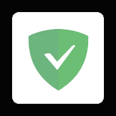
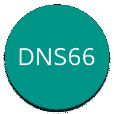

# 如何屏蔽 Android 上的广告，有 root 和无 root

> 原文：<https://www.xda-developers.com/sunday-debate-are-push-notification-ads-ever-okay/>

没有人喜欢广告，包括你自己，你的生活依赖于广告支持的互联网体验。然而，很难想象一个没有广告的世界。广告是我们无需支付一分钱就能访问许多最受欢迎的网站、服务和应用的原因。这并不是说广告从根本上就是不好的——如果做得好，广告可以是有趣的、吸引人的、真正有用的。只是许多网站和应用程序有时可能会目光短浅，并从事可疑的广告活动来增加收入。

我们都遇到过令人讨厌的网站，它们未经我们同意就把我们带进了颠簸的重定向过山车之旅。那些应用内广告覆盖了你的手机或电脑的整个显示屏，基本上是通过禁用后退按钮来劫持我们，这尤其令人讨厌。正是这些做法给广告带来了坏名声。

虽然我们不能从地球表面清除这些讨厌的广告，但我们肯定可以从你的安卓设备上把它们清除干净。让我们向你展示 Android 用户拥有的一些最强大的工具，它们将确保你永远看不到广告。

移除广告会影响互联网生态系统和许多企业的盈利能力。如果您经常使用某些应用程序、网站和服务，请考虑订阅它们的付费服务或将它们添加到白名单中。帮助他们继续对你有用。

其中一些工具需要 root 权限，但是在大多数情况下你根本不需要。Android 广告拦截工具有各种形状和大小，每种工具都有不同程度的有效性和使用案例。让我们逐一回顾一下，帮助您找到最适合您的方法。

## 更改 DNS 以阻止 Android 上的广告

在 Android 智能手机上屏蔽广告的最简单的方法之一是转向广告屏蔽服务的私人 DNS 提供商。这种方法不需要应用程序，但它只适用于 Android 9 Pie 和更高版本的 Android 手机，因为这个版本的操作系统引入了私有 DNS 设置。

要更改 DNS，请转到**设置>网络和互联网>高级>专用 DNS** 。选择*私有 DNS 提供商主机名*选项，输入“【dns.adguard.com】的或“[us.adhole.org](https://adhole.org/dns-servers/setup-guide/)”，点击*保存*。就是这样。您将不再看到任何应用内广告横幅，也不会在网络浏览器上看到任何广告。

在某些电话上，更改专用 DNS 的路径可能不同。如果你的手机 UX 有搜索栏，只需搜索*私有 DNS* 就可以进入相关的设置页面。

## AdLock

[AdLock](https://adlock.com/) 是一个阻塞解决方案，有 PC 和 Android 选项。这是一种在使用手机时阻止游戏内广告或浏览器广告的简单方法。您甚至可以选择阻止特定的网站，并通过 HTTPS 安全过滤过滤您的所有流量。

感谢 AdLock 赞助本文的这一部分。

## 阿达韦

如果你有根权限，没有比 AdAway 更好的解决方案了。它也有一个非根模式，但是它最适合根模式。AdAway 使用主机文件来阻止广告服务主机名。它本质上做的是保持一个更新的广告网络列表，并将它们重定向到 127.0.0.1(你自己的手机)，因此这些请求无处可去，没有广告可以提供。最棒的是，它屏蔽了浏览器和应用内的广告。设置服务非常简单。

The service comes with three sources with over 90,000 user-verified hosts, with new hosts regularly being added to the list. If some ads still seep through, you can use the DNS logging feature to record the outgoing DNS requests and manually add them to the "hosts" file. But even without touching any of these or getting too technical, AdAway effectively blocks out most ads, if not all, across apps and websites.

AdAway 是免费和开源的，正在积极开发中。如果你想尝试一下，可以去该项目的 GitHub 或者从下面链接的 XDA 官方线程中获取最新的 APK。

 <picture></picture> 

AdAway

##### 阿达韦

一个强大的和高度定制的广告拦截器，使用主机文件阻止讨厌的广告。

## AdGuard

AdGuard 是桌面上最受欢迎的广告拦截器之一，它也有一个 Android 客户端。手机版的 AdGuard 不如桌面版强大或复杂，但它能很好地完成任务。AdGuard 设置了一个本地 VPN 来过滤广告和跟踪器。免费版只能让你屏蔽浏览器广告。如果你也想摆脱应用内广告，你需要购买高级版本。AdGuard 在浏览器上工作得非常好，虽然它在应用程序上工作，但它显著降低了一些应用程序的内容加载速度。

 <picture></picture> 

AdGuard

##### AdGuard

一个非根广告拦截器，用于清除应用程序和浏览器中的讨厌广告

## Blokada

一个合适的 AdAway 的非根竞争对手是 Blokada。就像 AdAway 一样，它也是开源的，适用于应用内广告和网站。Blokada 提供了一个全面的阻止列表供您选择，包括 DuckDuckGo Tracker Radar、AdAway、Energized 等等。每个主机列表都有不同的使用案例和攻击性，可以有效地阻挡广告、跟踪器、钓鱼网站、恶意软件服务器等。

除了阻止广告，Blokada 还通过加密 DNS 查询来加强你的隐私。您可以创建自己的主机列表，并控制哪些域应该被阻止或列入白名单。Blokada 在 Play Store 上有售，但由于 Google Play 的严格政策，它缺少几个关键功能。为了获得最佳体验，请从 Blokada 的官方网站下载完全版。

 <picture></picture> 

Blokada

##### Blokada

一个开源的，非根广告拦截器，具有直观的用户界面，注重隐私。

## dns66 adblock

又一个不需要 root 的基于 VPN 的广告拦截器。DNS66 是完全免费和开源的。与 AdGuard 和 Blokada 相比，DNS66 的用户界面有些不直观和过时，但它工作得很好。它建立 VPN 服务并将 DNS 服务器流量重定向到该服务。VPN 服务拦截并过滤掉黑名单上的 DNS 查询，同时允许未列入黑名单的查询通过。DNS66 提供系统范围的广告拦截，因此它也可以过滤应用程序内的广告。您也可以从应用程序中配置自定义 DNS 服务器。

 <picture></picture> 

DNS66

##### DNS66

基于 DNS 的主机拦截器，具有一套全面的功能。

## Android 的激活保护广告拦截器[Magisk]

[Energized Protection](https://forum.xda-developers.com/t/module-energized-9889-protection-eacute-clairs-magisk.3806865/) 是一个 Magisk 模块，它使用主机文件来过滤应用程序和网站中的广告服务域、跟踪器、pornware、脚本和恶意软件。安装模块后，需要从终端模拟器进行配置。通电保护没有应用程序或用户界面，因此只建议高级用户和熟悉 Magisk 的用户使用。

如果这是你第一次遇到单词 Magisk 和 root，这个选项可能不适合你。对于一步一步的安装说明和更多的细节，检查通电的 XDA 线程。

## Android 内置广告拦截器的浏览器

如果你的目标只是清除网站上的广告，那么具有广告拦截功能的浏览器将是更好的选择。有这么多的选择，但为了节省你的时间，我们汇编了一个最好的广告拦截浏览器的列表，这些浏览器正在积极开发，并保证有效。

### 勇敢的

Brave 是一款基于 Chromium 的浏览器，内置隐私保护功能。广告拦截是开箱即用的，不需要任何配置。只需安装该应用程序，它就会开始在你访问的每个网站上阻止广告、跨网站跟踪器和 cookies、指纹识别等。您可以禁用您最喜爱的网站上的拦截器。

Brave 还允许您使用其 Brave 奖励计划支持网站和出版商。在这个项目下，Brave 将为你提供非侵入性的“尊重隐私的广告”对于您观看的每一个广告，您都可以获得代币，您可以将代币作为小费发送，以支持您最喜爱的网站或购买数字内容。广告是作为普通通知发出的，您可以控制接收广告的频率。

### 三星互联网

三星互联网是最好的安卓浏览器之一，其广告拦截功能使其更具吸引力。浏览器本身不会像 Brave 那样开箱屏蔽广告。你必须安装一个支持的第三方广告拦截器，并将其配置为与三星互联网。您可以从多达七种广告拦截器中进行选择，包括 Adblock Plus、AdGuard 和 Unicorn。一旦你安装并打开你选择的广告拦截器，浏览器就会开始拦截你在安卓手机上访问的所有网页上的广告和追踪器。

### Adblock 浏览器

Adblock Plus 是一款 Chromium 浏览器，其界面与谷歌 Chrome 极其相似。默认情况下，广告拦截是打开的，因此您只需安装该应用程序，就可以立即开始无广告互联网冲浪。可以从广告拦截页面访问自定义过滤器、白名单、语言过滤器和其他高级选项。

Adblock Plus 还有一个默认开启的可接受广告功能。这项功能不会过滤掉符合严格广告标准的广告，也不会干扰您正在查看的内容，让您在支持合法网站的同时，仍能免受不良网站的影响，这是一项双赢的交易。

这些服务大多数都是免费的，除了少数几个，所有的都不需要 root。如果你扎根于此，AdAway 是最好的选择。与此同时，AdGuard 和 Blokada 提出了一个坚实的非根替代方案。