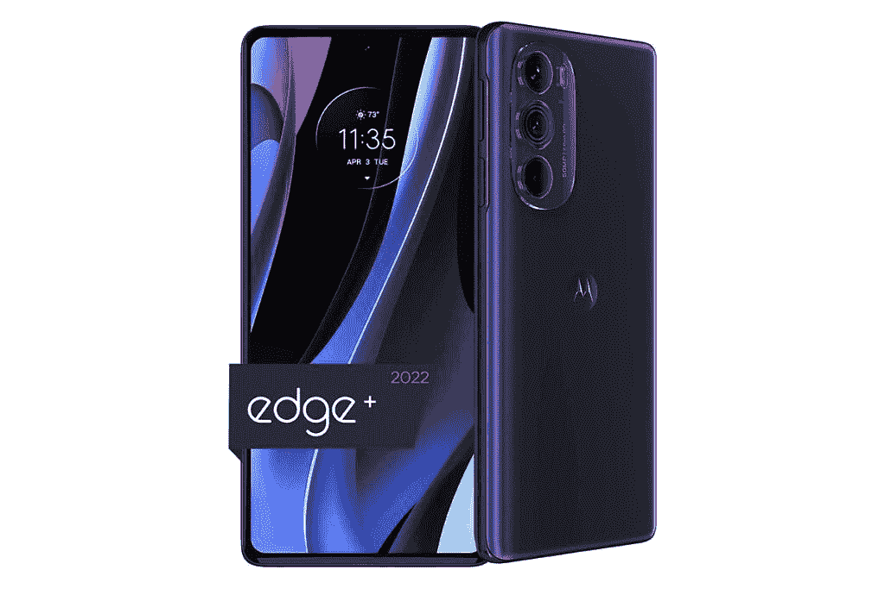
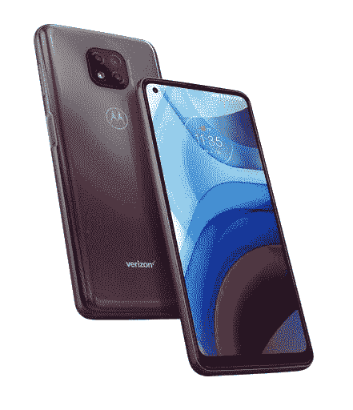
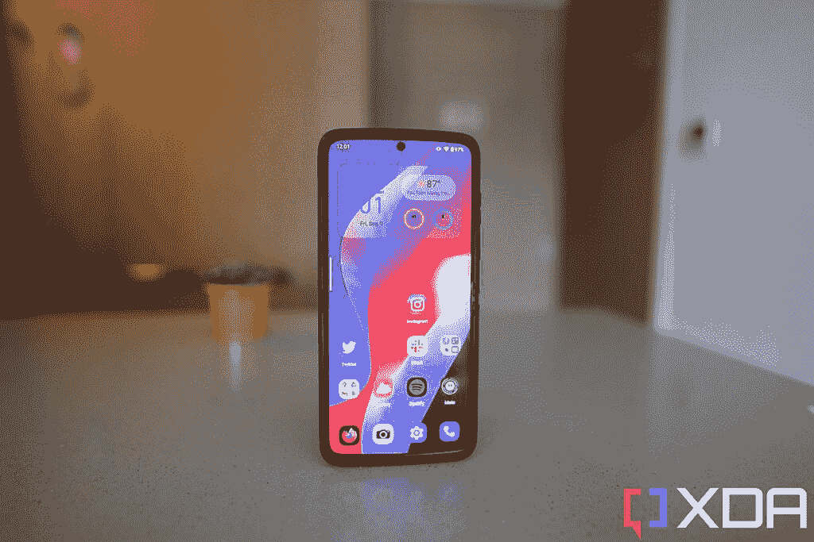
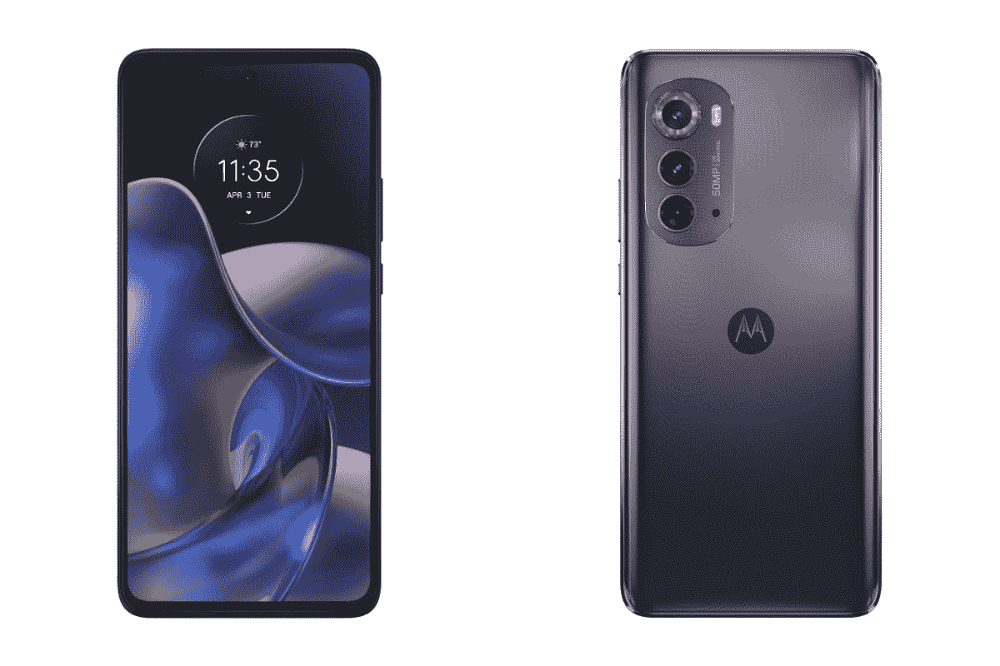

# 2023 年最佳摩托罗拉手机

> 原文：<https://www.xda-developers.com/sunday-debate-how-will-lenovo-affect-motorolas-future/>

作为“哑”手机时代为数不多的手机品牌之一，摩托罗拉在一些消费者心中仍然有着特殊的地位。虽然北美智能手机市场基本上仍是苹果和三星的双头垄断，但第三品牌也有一个利基但利润丰厚的空间，这就是摩托罗拉的目标。

为此，摩托罗拉有一个多样化的产品组合，包括一套坚实的预算选项，打破了我们的最佳廉价手机名单，但它仍然着眼于旗舰和可折叠空间。最好的手机也能和大男孩们一起登上[最佳安卓手机、](https://www.xda-developers.com/best-android-phones/) [最佳手机、](https://www.xda-developers.com/best-phones/)和[最佳可折叠手机](https://www.xda-developers.com/best-foldable-phones/)榜单。

以下是 XDA 根据你的需求(或预算)推荐的最佳摩托罗拉手机。

## 最佳可折叠摩托罗拉手机:摩托罗拉 Razr 5G

如果你到了一定的年龄，你可能还记得最初的摩托罗拉·拉兹，以及它如何在 21 世纪初至 21 世纪中期席卷移动行业。摩托罗拉将这款手机恢复为可折叠手机，专门迎合了这一群体，以及想要一款更便携手机的可折叠爱好者，因为其 91.7 x 72.6 x 16mm 毫米的尺寸和 192 克的重量使其非常紧凑。

从轻薄的机身(打开时)到四四方方的外部屏幕，再到棱角分明的边角，Razr 旨在向 Razr 的原始外观和感觉致敬。内部的 6.2 可折叠有机发光二极管屏幕清晰、充满活力，与三星的 Z Flip 系列相比，折痕不太明显。外面的 2.7 英寸屏幕可以显示任何你想要的应用程序，所以理论上你可以使用手机，即使它是折叠的。

即使在发布的时候，骁龙 765G inside 也不是最强大的 SoC，现在它比最好的高通产品低几层。然而，它仍然是一个有能力的芯片，可以毫无问题地处理现代智能手机应用程序。但是，不要期望 2022 年的移动游戏或视频渲染速度是一流的。单个 48MP 相机也意味着你不会获得太多的焦距多功能性，但相机本身非常有能力完成工作。

如果你想要一部将智能手机新技术融入复古、标志性机身的手机，带回温暖模糊的怀旧情绪，摩托罗拉 Razr 5G 是一个值得的选择。然而，有一个警告——这不再是最新的 Razr 可折叠手机，因为摩托罗拉已经发布了 2022 年的更新，目前只在中国销售(见本文中的最后一条)。然而，在这款手机获得更广泛的发行之前，对大多数人来说，这仍然是最好的 Razr。

 <picture></picture> 

Motorola Razr 5G

##### 摩托罗拉 Razr 5G

摩托罗拉 Razr 5G 是一款尖端的可折叠手机，具有复古美学，将为那些拥有或想要原始 Razr 的人带来美好的回忆。它有一个精心制作的铰链和一个没有太多褶皱的屏幕，以及一个用于检查通知的有用的外部屏幕。

## 最佳摩托罗拉旗舰:摩托罗拉 Edge Plus 2022

 <picture></picture> 

Motorola Edge Plus 2022

摩托罗拉 Edge Plus 2022 是这份名单上的最新手机，它提供的一些功能在有限的美国智能手机领域似乎特别诱人(在亚洲，这些功能并不罕见)。Edge Plus 2022 采用 6.7 英寸 FHD+有机发光二极管显示屏，刷新率为 144Hz，采用高通最新的骁龙 8 Plus 第 1 代 soC，以及高达 512GB 的存储和双 50MP 摄像头系统(覆盖宽和超宽)。

主拍摄者的 f/1.8 光圈和像素宁滨的使用意味着即使在黑暗的场景下，照片也是明亮而生动的。超宽相机也受益于像素宁滨和相对较快的 f/2.2 光圈，为 114 度视野提供了大量细节。

如果这些组件还不够华丽，还有一个 6000 万像素的自拍相机，用于拍摄像素像素为 1500 万像素的自拍，图像信息是平时的四倍。

There's also a 4,800 mAh battery, which when paired with the Snapdragon 8 Plus Gen 1, provides excellent battery life. However, the 144Hz display can be a bit power-hungry. Still, you can expect the phone to last an entire day out unless you're really pushing it.

虽然 IP52 防水防尘等级低于典型的旗舰产品，但 Edge Plus 202 有一个很好的借口——它的价格不像旗舰手机，仅为 665 美元。

 <picture></picture> 

Motorola Edge Plus 2022

##### 摩托罗拉边缘加 2022

摩托罗拉 Edge Plus 2022 配备了骁龙 8 Plus Gen 1、50MP 主摄像头和充满活力的 6.7 英寸有机发光二极管显示屏。

## 也是伟大的摩托罗拉旗舰:摩托罗拉边缘 30 超

摩托罗拉 Edge 30 Ultra 乍一看与摩托罗拉 Edge Plus 2022 非常相似:两款手机都采用 144Hz，6.7 英寸有机发光二极管显示屏，并运行在相同的高通骁龙 8 Plus Gen 1 芯片上。然而，如果你关心光学，Edge 30 Ultra 是一款明显更出色的手机——它配备了一个 200MP 主摄像头(相比之下，Edge Plus 2022 为 50MP)和一个专用的 12MP 远摄变焦镜头(而 Edge Plus 2022 根本没有变焦镜头)。像素密度更高的 200 万像素相机可以让你拍摄一张照片，然后以数字方式放大到比平时更远的地方。

在其他地方，Edge 30 Ultra 也有一个更大的 5，000 mAh 电池，可以使用附带的充电器以高达 120W 的速度充电。Edge Plus 2022 最大功率为 30W。

Edge 30 Ultra 获得亚军的原因是它没有在美国正式销售。然而，它可以通过亚马逊购买，可以在 T-Mobile 和 AT&T 上使用。请注意，这款手机缺少 CDMA 频段，因此它不能在威瑞森或 Sprint 上使用。

摩托罗拉 Edge 30 Ultra 是摩托罗拉最好的平板手机，但它没有在美国正式销售，所以这款手机在 Sprint 或威瑞森上不能用(但在美国电话电报公司和 T-Mobile 上可以用)。

## 最佳摩托罗拉中后卫:摩托罗拉边缘 2022

摩托罗拉 Edge 与上面列出的 Edge Plus 有很多相似之处，它们都提供 144Hz 有机发光二极管显示屏，这种标准 Edge 甚至没有 Plus 小很多，因为显示屏仍然是 6.6 英寸。Edge 还包装了相同的 50MP 主摄像头，具有 f/1.8 光圈。软件体验也将类似，因为两款手机都运行 Android 12，上面是摩托罗拉的用户界面。

这款设备与 Plus 型号的主要区别在于处理器 Edge 运行在联发科天玑 1050 上。虽然仍然是一个有能力的芯片，但它与运行在 Plus 版本中的高通骁龙 8 Plus Gen 1 不相上下。此外，这里的超宽摄像头只是一个 1300 万像素的摄像头，而不是更大设备中的 5000 万像素摄像头。

否则，你仍然可以获得 IP52 防水防尘等级，令人惊讶的是，较小的 Edge 拥有略大的 5,000 mAh 电池。你应该可以用这个设备获得全天的电池寿命，即使显示器是 144 赫兹。

摩托罗拉 Edge 2022 应该是一款不错的媒体消费设备，配有支持杜比全景声的立体声扬声器，加上薄边框的全屏设计。但最重要的是，对于这种规格来说，价格是合理的，为 499 美元。

## 最佳摩托罗拉手写笔手机:摩托罗拉 G 手写笔 2022

有一句古老的英语谚语，“笔比剑更有力量。”嗯，对于一些计算任务，我们认为笔也比手指更有力量。如果你发现自己在制作精确的照片或在手机上涂鸦数字签名时因为手指太粗而感到沮丧，手写笔可以让事情变得容易得多。摩托罗拉的 G Stylus 2022 是更可信的触控笔手机之一，仅次于三星的标志性产品 Note，当然还有现在的 Galaxy S Ultra 系列。

公平地说，将这款设备与 Galaxy Note 或 S Ultra 进行比较并不太公平，因为这是一款定价为 199 美元的入门级手机。因此，当然，手写笔将缺少 S Pen 的一些智能功能。摩托罗拉的手写笔握起来仍然很舒服，延迟程度可以接受，这使它适合做笔记和小涂鸦。任何带有小按钮的应用程序用手写笔比用指尖更容易操作。

在其他地方，这款手机只有塑料机身、联发科 Helio G88 和 90Hz 液晶显示屏等中端部件。但至少你有一个耳机插孔，一个 6.8 英寸的大屏幕，以及不会妨碍核心 Android 性能的干净软件。还有一个 5000 毫安的大电池和一个 5000 万像素的主摄像头，它使用像素宁滨技巧来产生比平常更多细节的 1250 万像素的照片。超宽摄像头，8MP，有点弱，但是这个价位，真的很难抱怨。如果你想要一个手写笔，但又不想付出昂贵的代价，这就是你想要的。

 <picture></picture> 

Motorola G Stylus 2021

##### 摩托罗拉 G 手写笔(2021)

摩托罗拉 G Stylus 2021 是市场上极少数配有触控笔的手机之一，所以如果你需要那个更精细的点来编辑照片或记笔记，这是更好的选择之一。在这个实惠的价格点，G 手写笔可以被认为是一个很好的价值购买。

## 最佳摩托罗拉手机续航:摩托罗拉 G Power 2021

摩托罗拉 G Power 2021 是一款适合那些经常为电池焦虑的人的手机。这款手机配有 5000 毫安时的电池和 60Hz，720 x 1600 的显示屏，对于大多数人来说，一次充电肯定可以持续到第二天或第三天。

这款手机的其他一切都很坚固，但并不壮观，从骁龙 662 SoC 到 3GB 的 RAM 到 8MP 自拍相机，但这也是美国最便宜的手机之一，所以很难挑剔太多。公平地说，骁龙 662 对于使用智能手机的普通用户来说仍然非常好，他们的智能手机包括 Instagram、短信、电子邮件，或许还有 YouTube 和网飞。6.6 英寸的面板很大，除了下巴之外，边框足够薄，所以你可以获得一个身临其境的画布，用于消费媒体。您还可以获得 3.5 毫米耳机插孔和可扩展存储空间。

最终，摩托罗拉 G Power 2021 拥有特定的受众——那些希望自己的手机经久耐用的人——它兑现了这一承诺。

 <picture></picture> 

Motorola G Power 2021

##### 摩托罗拉电力公司(2021)

摩托罗拉 G Power 配有 5000 毫安时的电池，对大多数人来说应该可以使用两天，轻度用户甚至可以使用三天。这也是 2021 年的智能手机，和你现在在美国能找到的一样便宜。

## 未在美国销售的最佳摩托罗拉手机:摩托罗拉 Razr 2022

你知道我们列在最佳可折叠部分的摩托罗拉 Razr 吗？那不是最新最好的 Razr。摩托罗拉发布了 2022 年更新的新设计，目前只在中国销售。

这款 Razr 将处理器升级到了高通骁龙 8 Plus Gen 1，并配备了 144Hz 的主可折叠显示屏，尺寸也大幅增加到了 6.7 英寸。然而，这款手机仍然很紧凑，因为它可以对折，重量仅为 200 克。

 <picture></picture> 

Motorola Razr 2022

该设计的整体形状与之前的两个 Razr 可折叠设计不同，失去了相对厚实的底部边框，形成了更典型的统一边框外观。主摄像头也升级到了 50MP，f/1.9 传感器，配有更大的 1/1.5 英寸图像传感器。现在还有一个超宽相机，这是以前的 Razrs 所没有的，允许你捕捉全景照片。

2.7 英寸的外盖屏幕仍然一如既往地有用，能够显示任何应用程序，尽管许多应用程序在那个狭窄的空间看起来很奇怪。但它仍然是一个有用的选择，比如说，在一个特定的应用程序中跟踪体育比分或工作聊天，即使当设备折叠时，你也想显示它。

骁龙 8 Plus Gen 1 的升级以及电池容量增加到 3500 毫安时，电池续航时间有所延长。这款手机仍然不能被称为耐力王，但它应该能够在更随意的一天使用一整天——比如工作日。周六，如果你要出去探险，一定要带一个充电器，这款手机的包装里还包括充电器。

现在，Razr 2022 目前只在中国销售，但它很有可能最终会到达美国，所以如果你感兴趣，请耐心等待。

 <picture></picture> 

Motorola Razr 2022

##### 摩托罗拉 RAZR 2022

这款手机目前只在中国销售，但如果它真的到达美国，它将立即给三星 Galaxy Z Flip 4 带来一些急需的竞争。

* * *

你最喜欢哪一款摩托罗拉手机？我们倾向于认为摩托罗拉 Razr(5G 机型或 2022 年中国专用机型)是所有手机中最独特和最具未来感的，但 499 美元的摩托罗拉 Edge 2022 是一个非常超值的产品。如果电池寿命是你一直关心的问题，那么考虑摩托罗拉 G Power 2021。

 <picture></picture> 

Motorola Edge 2022

##### 摩托罗拉边缘 2022

摩托罗拉 Edge 运行在功能较弱的 Dimensity 1050 SoC 上，但它仍然以较低的价格提供了许多使 Edge Plus 如此优秀的功能。