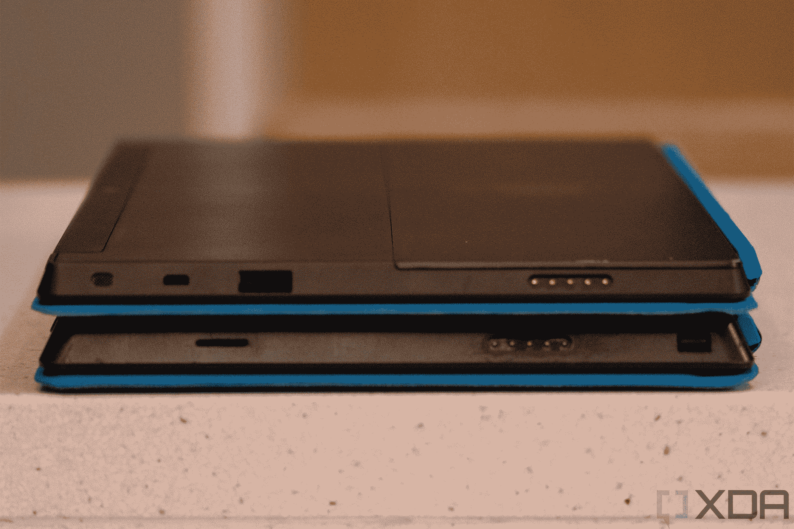
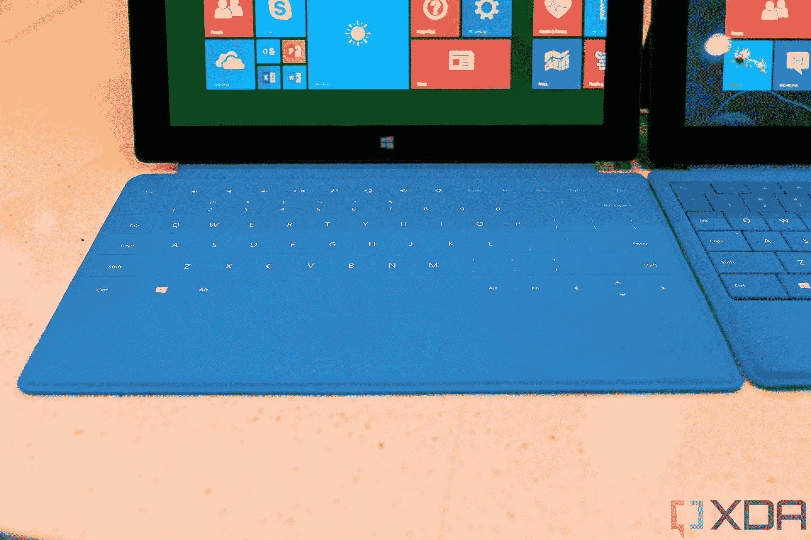
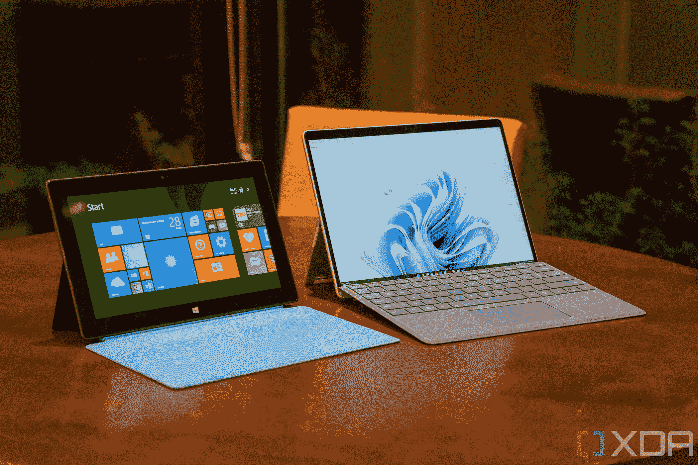
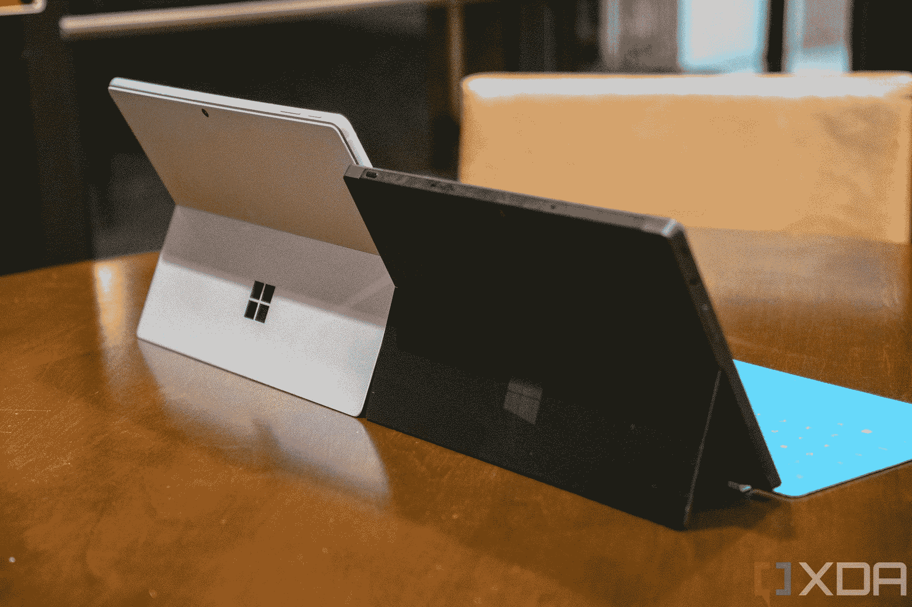

# Surface RT 实际上很好——Windows RT 出了问题

> 原文：<https://www.xda-developers.com/surface-rt-good-windows-rt-bad/>

2012 年 10 月 26 日对微软来说是一个具有纪念意义的日子。到了 Windows，一切都发生了变化，直到今天我们仍能感受到它的影响。那是该公司发布其首款个人电脑 Surface RT 的日子，也是 Windows RT 和 Windows 8 的发布日期。几个月后，Surface Pro 来了。

它们发行后一周内我都买了。我经常讲述我的邻居如何被飓风桑迪袭击的故事，我仍然买了我的 Surface RT，尽管我知道我不会有能力给它充电。不过没关系。我一生都是 Windows 爱好者，这是一个新的 Windows。

Windows RT 是为 Arm 处理器设计的操作系统版本，特别是 Surface RT 的 Nvidia Tegra 3。为了不把英特尔排除在外，Surface Pro 也在同一时间发布，尽管它更厚更重。它的优势是运行 Windows 8 Pro(这些产品是以操作系统命名的)，所以虽然 Windows RT 只能运行预装应用程序和商店中的应用程序，但 Surface Pro 有完整的 Windows。

我上面提到的所有产品都是可怕的失败，而且几乎都是因为不同的原因。Surface Pro 最终成为了一个成功的产品线，Windows 8 中的许多元素以更加精致的形式延续至今。

但是 Surface RT 和它的 Windows RT 操作系统将永远被认为是微软最大的两个败笔。虽然微软确实生产了 Surface 2，诺基亚生产了搭载 Windows RT 的 Lumia 2520 平板电脑，但你很难找到另一款运行该操作系统的设备。其他所有 OEM 厂商要么取消其 Windows RT 产品，要么在发布后迅速停产。

至于 Surface RT 本身，它最终为微软减记了 9 亿美元。之后，大甩卖开始了。微软刚刚开始以极低的价格出售这些东西，以清理未售出的库存。很明显，它认为它能卖出比现在多得多的产品。

## Surface RT 其实还不错

直到今天，我还留着 2013 年买回来的 Surface Pro 原厂。这是一个我可以一直依赖的老黄牛，但作为一个产品，它从来没有什么意义。作为一台笔记本电脑，它太小了，只有 10.6 英寸的显示屏。作为一款平板电脑，它又厚又重，而且体积庞大。最重要的是，你会花 1000 美元买到第三代酷睿 i5、4GB 内存和 128GB 存储空间，不包括键盘(那时候，笔通常在盒子里)。

我没有十年前购买的原版 Surface RT，但 XDA 在 10 周年纪念时买了一台，当我开始摆弄它时，我想起了一些事情:它其实很不错。它的价格只有 Surface Pro 的一半，配备了 Nvidia Tegra 3 处理器、2GB 内存和 32GB 或 64GB 存储空间。它重 1.5 磅，仍然比任何 Surface Pro 都轻。

它还有一个 USB Type-A 端口，这是微软真正试图在其平板电脑中展示的价值主张，一直到 Surface Pro 7。当时，许多消费者正在决定他们是否真的需要一台新的笔记本电脑，或者他们是否可以只买一台苹果的新款 iPads。微软试图提供一个解决方案，既能解决这两个问题，当然，也能让你继续使用 Windows。

 <picture></picture> 

Surface RT on top, Surface Pro on the bottom

当然，USB Type-A 端口总是突显出，当微软的竞争对手专注于现代化时，它是多么执着于传统。Surface RT 的讽刺之处在于，Windows RT 无法运行传统应用。但这不是平板电脑的错。

作为 2012 年的一名 iPad 用户，我记得当时感觉用起来更舒服，因为它的边缘更柔软、更弯曲。微软更倾向于尖锐的角度，它几乎感觉有点不和谐。不过，时间快进了十年。现在什么都有尖角，突然 Surface RT 用起来感觉很舒服。

 <picture></picture> 

Surface Touch Cover

它并不完美。平板电脑总是有点动力不足，这在下一代产品中得到了解决。此外，触摸封面是绝对的垃圾。当我购买我的产品时，我在 14 天内就把它退了回来，并得到了 Type Cover，这是实际上在第二代产品之后继续存在的产品。

尽管如此，在今天使用它，并把它放在十年前的东西的角度来看，我真的不得不说，硬件真的很好。

## Windows RT 太可怕了

我之前提到过，微软正试图提供一种独一无二的产品，以回应人们在笔记本电脑和 iPads 之间做出的选择。这是在 Windows RT 和 Windows 8 上完成的。Windows RT 适用于 Arm 处理器，只能运行商店中的应用程序。有一个明显的问题:Windows RT 的外观和行为与 Windows 8 完全一样，所以如果你有一台全新的 Surface RT 和一台全新的 Windows 8 笔记本电脑，它们的行为相同，但做的事情不同。

这是一次非常令人困惑的经历。像谷歌 Chrome 和 iTunes 这样的应用程序会说它们适用于特定版本的 Windows 和更新版本，所以如果你有 Windows RT，Windows 的最新版本，你会认为它可以工作，对吗？不对。用户期望事情可以工作，但是却不能工作，这是一个主要的痛点。

但这还不是全部。正如理查德·迪瓦恩最近写的那样，Windows 8 实际上有一个非常好的平板用户界面。不幸的是，不是每个人都有平板电脑，所以这个奇怪的混合操作系统没有意义。当使用 Windows RT 或 Windows 8 时，你会从开始屏幕开始；没错,“开始”菜单消失了，取而代之的是水平滚动的全屏平铺阵列。如果你启动一个来自商店的应用程序，它会在 Metro 环境中全屏打开。当时你甚至没有把它放在橱窗里的选择。

如果你启动一个不是来自商店的应用程序，它会在一个完全独立的桌面环境中打开，这更像是你在以前版本的 Windows 中已经习惯的。

如果没有桌面环境，Windows RT 会更有意义，因为你不能从商店外安装应用程序，但它做到了。原因是因为一些预装的应用程序确实可以在桌面上打开。最大的例子是 Office RT 应用程序，这是在 Arm 上运行的 Office 2013 套件的免费版本。

因此，对于这个针对平板电脑优化的操作系统，你仍然有一个桌面环境。不仅如此，商店也很贫瘠，所以当整个当前的窗户设计似乎失败时，没有太多的事情可做。

Windows RT 8.1 今天仍受支持(还有几个月)，修复了最初操作系统的许多问题。当 Windows 10 出现时，没有升级路径，这说明了很多问题，因为即使是 Windows Phone 也有升级路径。它最终登陆了 Windows RT 8.1 Update 3，这是一个主要是装饰性的更新，带回了开始菜单。

## 它是如何开始的，以及它的进展如何

Surface RT 是微软的第一台电脑，也是 Arm Windows PC 的首次尝试。虽然 Windows RT 立即明显失败，但它再次尝试了 Surface 2，用 Tegra 4 取代了 Nvidia Tegra 3，并引入了一种新的银色，这种银色成为了 Surface 家族的主要产品。Surface 3 采用英特尔技术，算是对最初平板电脑的一种救赎。

 <picture></picture> 

Surface RT and Surface Pro 9 with 5G

直到 2016 年 12 月，Arm PCs 的想法才重新出现。那时高通和微软宣布了基于 Arm 的 Windows 10，与 Windows RT 不同，它将包括 x86 应用的模拟。这个想法至今仍存在于 Windows 11 中，那就是体验只是 Windows。

2019 年底，微软推出了 Surface Pro X，它采用了高通骁龙 8cx 的更名版本，称为微软 SQ1 处理器。这是自 Surface 2 以来的第一款 Arm Surface，但当然，这一次它运行了完整的 Windows。

 <picture></picture> 

Surface Pro 9 with 5G and Surface RT

快进到今天。在 Surface RT 上市 10 周年前夕，Surface Pro 9 开始上市，这标志着采用 Ar 处理器的 Windows 首次被认为足够成熟，可以与采用英特尔技术的 Windows 共享相同的品牌。

Surface Pro 9 看起来和 Surface RT 完全不一样，从那以后显示器长宽比变成了 3:2，Surface Connect 端口也换了，现在还有带触觉的笔支持。

尽管如此，Surface RT 在当时还是很不错的。如果不是因为糟糕的软件，微软可能不会被减记 9 亿美元。当然，我们永远不会知道。