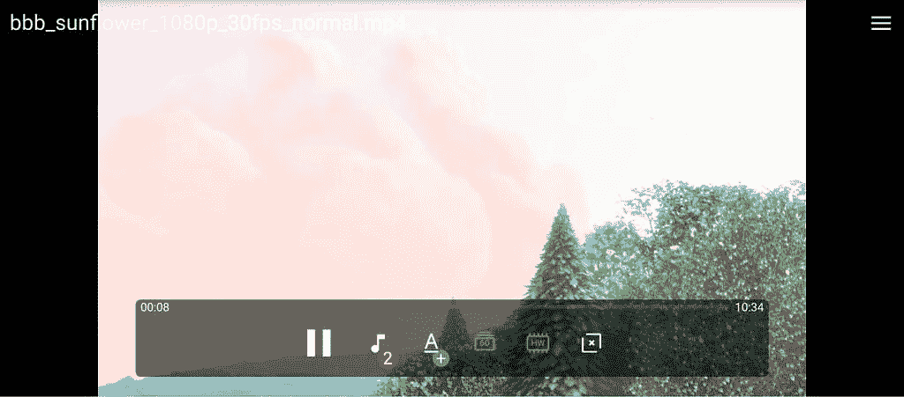

# SVP 是一款新的安卓视频播放器，可以让视频看起来更流畅

> 原文：<https://www.xda-developers.com/svp-android-memc-boost-framerate/>

几乎每个电视节目或电影都是以 24 fps 拍摄的，尽管如果你有一台现代高清电视，这可能不是你观看内容的帧率。这是因为目前大多数电视都附带了一项名为运动平滑的功能，默认情况下是启用的。运动平滑会插入源素材中不存在的帧，使视频看起来比实际更平滑。插值帧是棘手的，好莱坞绝对讨厌这种做法，但运动平滑在如此多的电视上出现是有原因的:人们喜欢它。另一方面，大多数移动设备不支持运动平滑，不过多亏了一款名为 SVPlayer 的 Android 新视频播放器，你可以在智能手机或平板电脑上以更高的帧率观看视频。

 <picture></picture> 

SVP for Android, converting a 1080p30 video to 1080p60\. Source video is Big Buck Bunny.

SVPlayer 代表 SmoothVideo Player，它使用一种称为运动估计运动补偿(MEMC)的技术，实时将您正在观看的任何视频转换为 60 fps 或更高。该视频播放器可以播放本地存储的文件或从互联网上下载文件，但不支持网飞等流媒体服务上的内容。SVP 建立在 MPV T1 的基础上，这是一个强大、免费和开源的跨平台视频播放器应用程序，也可以在 Android T3 上使用 T2。这意味着 SVP 支持广泛的视频格式和其他功能，如改变音频/字幕轨道，但另一方面，用户界面是非常基本的。

虽然 SVP 支持硬件加速视频解码，但实际的帧速率转换非常耗费 CPU 资源。该团队建议使用至少 4GB 内存和高通骁龙 855 级性能或更好的设备，该应用程序甚至有一个内置的基准测试工具，可以告诉你你的设备是否足够强大。我一直在为骁龙知情者测试[高通智能手机上的视频播放器，该手机装有该公司的旗舰产品骁龙 888 芯片组，在将 1080p24/30 内容转换为 1080p60 时没有任何问题(我还没有尝试过任何 4K 内容，尽管应该注意的是，该应用程序默认情况下会将 4K 内容缩小到 1080p)。](https://www.xda-developers.com/qualcomm-launches-smartphone-for-snapdragon-insiders/)

虽然视频播放器在旗舰硬件上表现良好，但有一个大问题:它会疯狂地消耗你设备的电池。该应用程序使用 Android 的[持续性能模式](https://source.android.com/devices/tech/power/performance)来提高视频期间的 CPU 性能，最终会消耗大量电力。在将近半个小时的播放后，SVP 似乎为骁龙内部人士耗尽了智能手机 4000 毫安时电池的大约 10%，设备摸起来变得非常温暖。

即使你的设备足够强大，能够处理 SVP 的帧速率转换，它仍然有可能无法工作。视频播放器有一些硬性要求:你的设备必须运行 Android 10 或更新版本，并且必须提供对 OpenCL API 的访问。开发人员表示，所有 Pixel 手机都不符合后一个要求，NVIDIA 的 SHIELD TV 产品也不符合，尽管 SHIELD 的 CPU 无论如何都不足以处理帧率转换。

说到这里，现在还没有 Android 电视端口的计划，因为没有 Android 电视设备有足够强大的 CPU 来处理 SVP 扔给它的东西。就原始性能而言，苹果产品中的 CPU 远远领先于大多数安卓设备，但目前也没有支持 iOS 的计划，可能是因为移植软件有困难。

SVP 已经在台式电脑上运行了很多年，我已经使用这个程序一年多了。在桌面上，SVP 支持 NVIDIA GPUs 上的 GPU 加速，可以集成多个视频播放器，而不仅仅是 mpv。我用 [Anime4K](https://github.com/bloc97/Anime4K) 滤镜来运行 SVP，以提升和向上转换动画内容，我个人很喜欢大多数时候的效果，尽管我肯定会不时地注意到肥皂剧效果和伪像。不过，在更小的智能手机屏幕上，这些问题可能不会那么突出，因为所有东西都更小了。前几天，在我用 Android 版 SVP 观看一个小时视频的过程中，我没有太多抱怨。

如果你有一个[一加 8 Pro](https://www.xda-developers.com/oneplus-8-pro-review-never-settle-on-hardware/) 、[一加 9 Pro](https://www.xda-developers.com/oneplus-9-pro-review/#oneplus9prodisplayfeatures) 、 [OPPO Find X2 Pro](https://www.xda-developers.com/oppo-find-x2-pro-display-review/) 、[小米 Mi 11X](https://www.xda-developers.com/xiaomi-mi-11x-pro-review/) ，或者少数其他带有 [Pixelworks X5](https://www.xda-developers.com/pixelworks-iris-5-visual-processor-android-display-experience-oppo-find-x2/) 芯片的设备，你的手机实际上内置了运动平滑支持，而且它也是硬件加速的。在其他硬件足够强大的设备上，你可以尝试 Android out 的 SVP，现在可以在 Google Play 上使用。虽然该应用程序是免费试用的，但需要 12 美元的应用内购买才能解锁帧率转换。这款应用程序可以让你在它让你付费之前玩几分钟帧速率转换，所以你可以在购买之前随时尝试一下，看看它在你的设备上的表现如何，以及你是否喜欢它。SVP 在安卓系统上的售价为 12 美元，比在台式机上便宜，这是有道理的，因为目前安卓系统的功能要少得多。桌面版本带有一个内置 [YouTube-DL](https://www.xda-developers.com/github-reinstates-youtube-dl-changes-dmca-review-process/) 的插件，这样你就可以以更高的帧速率播放 YouTube 视频，它还支持 Google Cast 和 Apple TV 等功能。

正如我之前提到的，帧插值是一种有争议的做法。我在这里不是要告诉你这是对还是错:如果你像我一样喜欢它，那么不要让任何人让你为此感到难过。只要知道你没有按照创作者的意图观看内容，MEMC 是不完美的，经常充满错误。关于插值内容的负面影响，已经有足够多的笔墨了，这尤其给动画内容带来了一系列[独特的挑战。如果你想让你的视频看起来更流畅，批评者见鬼去吧，那么 SVP 可能是能实现这一点的最好的视频播放器应用之一。](https://www.youtube.com/watch?v=_KRb_qV9P4g)