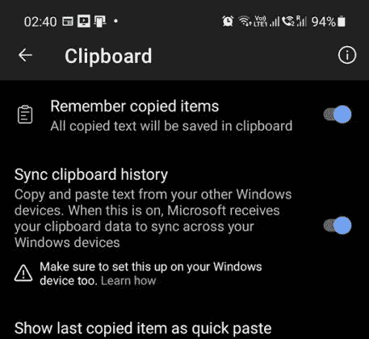
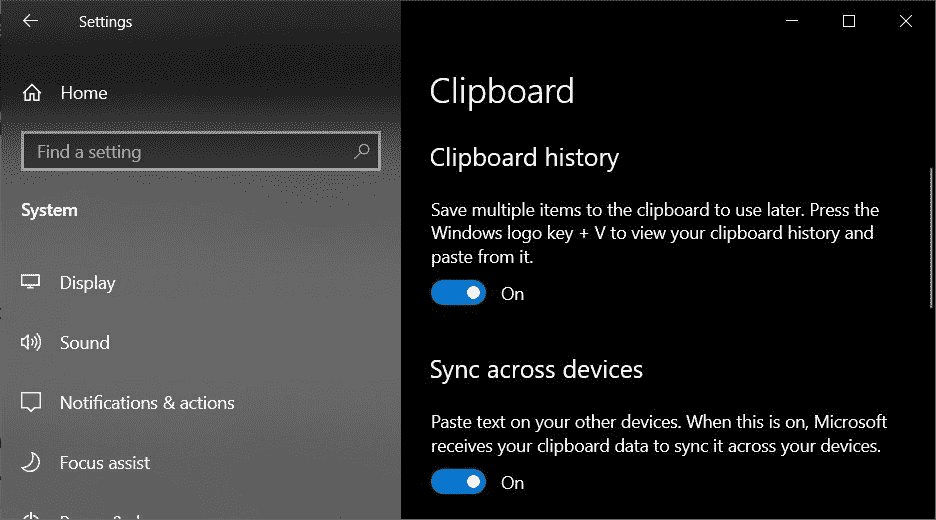

# SwiftKey 现在可以将您的 Android 剪贴板与您的 Windows PC 同步

> 原文：<https://www.xda-developers.com/swiftkey-android-clipboard-sync-windows/>

微软拥有的键盘应用 Swiftkey 正在测试频道获得更新。此次更新引入了一项新功能，让你可以将 Android 手机的剪贴板与 Windows PC 同步。我们[早在去年 10 月就首次发现了](https://www.xda-developers.com/swiftkey-android-share-clipboard-windows-10/)这一功能，现在终于向用户推出了。

如前所述，该功能在最新的 Swiftkey beta 更新中可用(通过 [*Windows 最新的*](https://www.windowslatest.com/2021/08/03/microsoft-swiftkey-on-android-gets-windows-10-clipboard-sync-feature/) )。您可以从下面的 Play Store 链接下载最新的测试版来试用。将它安装到你的设备上后，进入应用程序的设置，点击“丰富输入”，然后选择“剪贴板”选项。在下面的窗口中，启用“同步剪贴板历史到云”切换。

 <picture></picture> 

(Screenshot: Windows Latest)

完成后，打开 Windows 10 电脑上的设置，导航到剪贴板部分。然后，打开“剪贴板历史”和“跨设备同步”选项。你现在应该可以在你的 Windows 10 电脑上访问你手机的剪贴板历史，反之亦然。您可以使用“windows+V”键盘快捷键在设备上访问手机的剪贴板历史记录。

 <picture></picture> 

(Screenshot: Windows Latest)

请注意，云剪贴板功能只会保留一个小时的剪贴板历史，并且只会在 Swiftkey 应用程序的预测栏上显示最后复制的剪辑。值得一提的是，所有剪贴板数据都将被加密，并且不会链接到您的 Microsoft 帐户。

目前，Swiftkey 尚未透露该功能将于何时在稳定频道推出。我们会在未来更新时尽快更新这篇文章。

如果你是三星用户，你已经可以使用“[链接到 Windows](https://www.xda-developers.com/link-to-windows-1-5-allows-drag-drop-between-samsung-galaxy-phones-pc/) ”功能将手机的剪贴板历史与 Windows 10 PC 同步。iOS [也有类似的功能](https://support.apple.com/en-us/HT209460)，但它只适用于其他苹果设备。