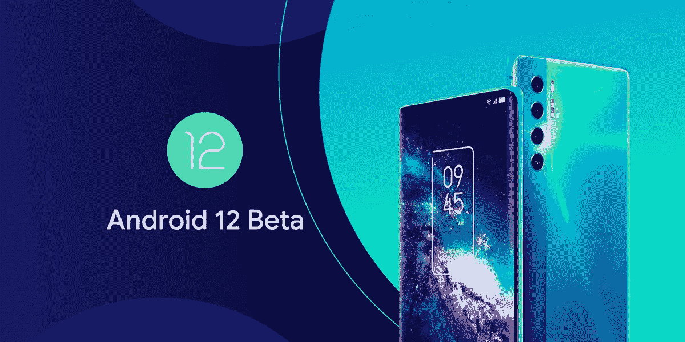

# TCL 20 Pro 5G 加入 Android 12 Beta 发布会

> 原文：<https://www.xda-developers.com/tcl-20-pro-5g-android-12-beta/>

# TCL 20 Pro 5G 加入 Android 12 Beta 发布会

TCL 宣布了 TCL 20 Pro 5G 的 Android 12 开发者预览计划，让用户有机会体验第一个 Android 12 测试版。

 <picture></picture> 

TCL 20 Pro 5G Android 12 Beta

谷歌昨天发布了其 Pixel 系列的第一个 Android 12 测试版。此后不久，几家原始设备制造商宣布为他们的旗舰设备推出 [Android 12](https://www.xda-developers.com/android-12/) 测试版。目前， [Vivo](https://www.xda-developers.com/vivo-iqoo-7-legend-android-12-beta/) ，[小米](https://www.xda-developers.com/xiaomi-mi-11-series-android-12-beta/)， [OPPO](https://www.xda-developers.com/oppo-find-x3-pro-android-12-beta/) ， [Realme](https://www.xda-developers.com/realme-gt-android-12-beta/) ，[华硕](https://www.xda-developers.com/asus-zenfone-8-android-12-beta/)，[一加](https://www.xda-developers.com/oneplus-9-9-pro-android-12-beta/)，[诺基亚](https://www.xda-developers.com/hmd-global-android-12-developer-preview-nokia-x20/)已经宣布将为少数设备发布 Android 12 beta 版本。现在，中国 OEM 厂商 TCL 也加入了 Android 12 测试版的发布会，推出了 TCL 20 Pro 5G 的早期版本。

在最近的一份声明中，TCL 宣布将为 TCL 20 Pro 5G 提供 Android 12 开发者预览计划。该计划将让开发者和早期用户有机会在最终发布之前体验 Android 12 的所有重大变化。

在谈到 Android 12 开发者预览计划时，TCL 首席执行官 Aaron Zhang 表示，*“Android 社区对 TCL 品牌非常重要，我们知道为我们的用户提供可靠、无缝的移动体验是多么重要。DPP 让我们有更多机会探索增强稳定性、兼容性和连接性的新功能，并从开发人员社区获得重要反馈。”*

第一个 Android 12 测试版带来了大量我们在之前的开发者预览版中没有看到的新功能。这些包括新的隐私和安全功能，[改进的小工具](https://www.xda-developers.com/google-android-12-widgets-overhaul/)，快速设置的全面设计，以及[更多的](https://www.xda-developers.com/android-12-car-unlock-key/)。你可以通过查看我们正在进行的报道[这里](https://www.xda-developers.com/tag/android-12/)来了解更多关于 Android 12 Beta 1 的变化。关于我们目前所知的关于 Android 12 的所有信息，请查看[这篇文章](https://www.xda-developers.com/android-12/)。