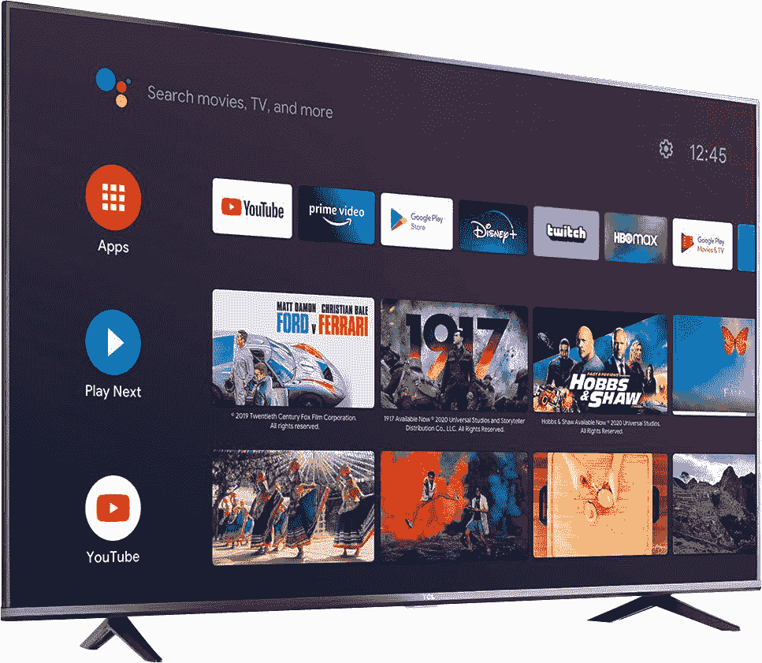
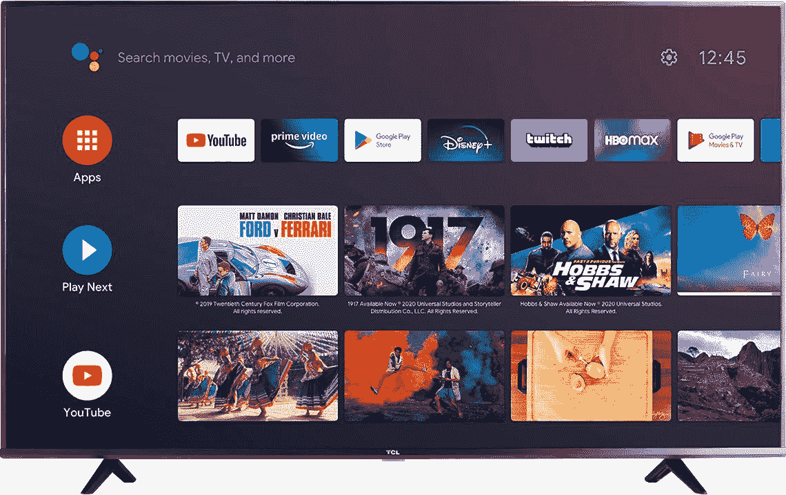
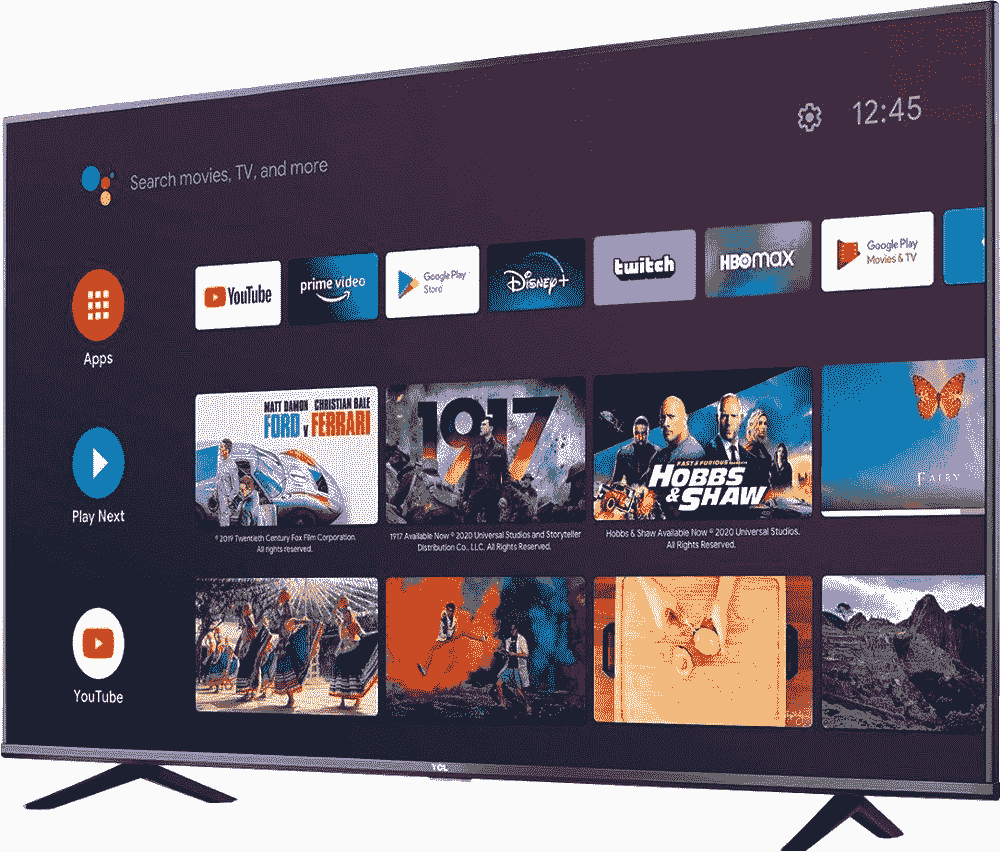

# TCL 的 4K 安卓电视各种尺寸都降价 300 美元

> 原文：<https://www.xda-developers.com/tcl-4k-android-tv-black-friday-sale-best-buy/>

TCL 正在参与这个黑色星期五销售季节，其 4K 安卓电视提供高达 300 美元的折扣。这些交易延伸到 50 英寸、55 英寸和 75 英寸电视。奇怪的是，55 英寸的电视是所有电视中最便宜的，而 75 英寸的折扣最大，这是可以理解的。本质上，你得到的是 230 美元而不是 350 美元的 50 英寸电视，200 美元而不是 400 美元的 55 英寸电视，500 美元而不是 800 美元的 75 英寸电视。查看百思买的所有交易！

 <picture></picture> 

TCL 50 inch 4K LED TV

##### TCL 4 系列 4K LED 电视

TCL 英寸 4K LED 电视对于那些寻找这个尺寸的基本电视的人来说是一个很好的选择，因为这个尺寸在原始设备制造商中不是一个非常受欢迎的选择。看看吧！

 <picture></picture> 

TCL 55 inch 4K LED TV

##### TCL 4 系列 4K LED 电视

对于那些寻找基本电视的人来说，the 55 英寸 4K LED 电视是一个很好的选择，但它与 55 英寸电视的众多选择形成了竞争。你理所当然地得到最大的折扣。

 <picture></picture> 

TCL 75 inch 4K LED TV

##### TCL 4 系列 4K LED 电视

对于那些寻找大电视的人来说，TCL 英寸 4K LED 电视是一个很好的选择，具有竞争力的价格和功能，值得考虑。

这三款智能电视都是 TCL 4 系列安卓电视的一部分，采用不同尺寸的 4K UHD 分辨率面板，即 50 英寸、55 英寸和 75 英寸。出于我们不太理解的原因，TCL 以最低的价格提供中间的 55 英寸，确保这成为大多数用户的选择。除非你有一个尖锐的空间约束，限制你选择任何高于 50”，你会得到一个更低的价格和更好的处理与 55”的变种。

除了尺寸之外，这三款电视的规格和功能都非常相似。您可以获得相当清晰和详细的信息，以及对谷歌助手和 Chromecast 内置的 Android 电视应用广告支持的熟悉存储库的访问。4 系列中的 TCL 4K 安卓电视还提供 HDR 支持，以增强兼容内容的清晰度和细节。这些设备还配有语音遥控器、3 个 HDMI 端口(1 个 ARC)以及双频 Wi-Fi 和以太网支持。

请记住，如果你打算用 [Xbox Series X](https://www.xda-developers.com/xbox-series-x-restocks/) 或[索尼 Playstation 5](https://www.xda-developers.com/playstation-5-restocks/) 玩大量游戏，这些电视并不是最佳选择。对于这些新的游戏机，你需要一台带 HDMI 2.1 的电视，能够提供 4K 120fps 的游戏体验，而这些电视不能。但是，这种支持需要额外的费用，所以请评估您的预算是否能够承受。我们游戏使用的首选是[索尼 Bravia X900H](https://www.xda-developers.com/sony-65-bravia-x900h-led-android-tv-black-friday-sale-best-buy/) ，你可以在这个黑色星期五销售季节以 1000 美元的价格买到它。