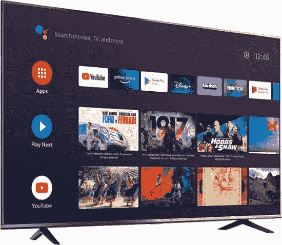
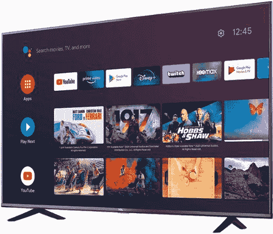

# TCL 安卓电视现已在美国百思买打折出售

> 原文：<https://www.xda-developers.com/tcl-android-tv-us-release-deals/>

# TCL 的 4K 安卓电视现已在美国上市，而且已经打折

TCL Android 电视现已在美国百思买独家发售，50 和 55 英寸型号已经开始销售！

4K 电视风靡一时，但很难找到一些价格合理、质量仍然不错的电视。TCL 是在这两者之间提供完美中间点的公司之一，但他们并不总是在市场上发布他们的新电视。但是，在今年早些时候将他们的 Roku 电视带到美国后，该公司正在对他们的一些 Android 电视型号做同样的事情。

TCL 对美国电视市场并不陌生，他们已经有多种 Roku 电视型号上市。然而，这些新电视配有安卓电视。Android TV 已经成为 Roku TV 和 Fire TV 等服务的热门替代品(谷歌甚至将 Android TV 用作他们新的[谷歌 TV](https://www.xda-developers.com/new-google-tv-interface-replace-android-tv-ui/) 的基础)，谁能对智能电视的更多选择提出异议？

50 英寸、55 英寸和 75 英寸的 TCL 安卓电视现在在美国百思买独家发售，但这还不是全部——作为百思买黑色星期五销售活动的一部分(该活动于周二开始，与 Prime Day 竞争)，50 英寸和 55 英寸的型号已经看到了不错的折扣。通常售价 350 美元的 50 英寸 TCL 安卓电视仅售 280 美元。 [55 英寸 TCL 安卓电视](https://shop-links.co/1721061968398280812)的折扣更大，从 400 美元降至 300 美元。

 <picture></picture> 

TCL Android TV (50-inch)

##### TCL 4 系列 4K LED 电视

不用花很多钱，就能买到一台高质量的 4K 智能电视！TCL 50 英寸 4K 智能电视现在在美国百思买独家发售，你只需花 280 美元，比建议零售价低 70 美元。

 <picture></picture> 

TCL Android TV (75-inch)

##### TCL 4 系列 4K LED 电视

不用花很多钱，就能买到一台高质量的 4K 智能电视！TCL 55 英寸 4K 智能电视现已在美国百思买独家发售，售价仅为 300 美元，比建议零售价低 100 美元。