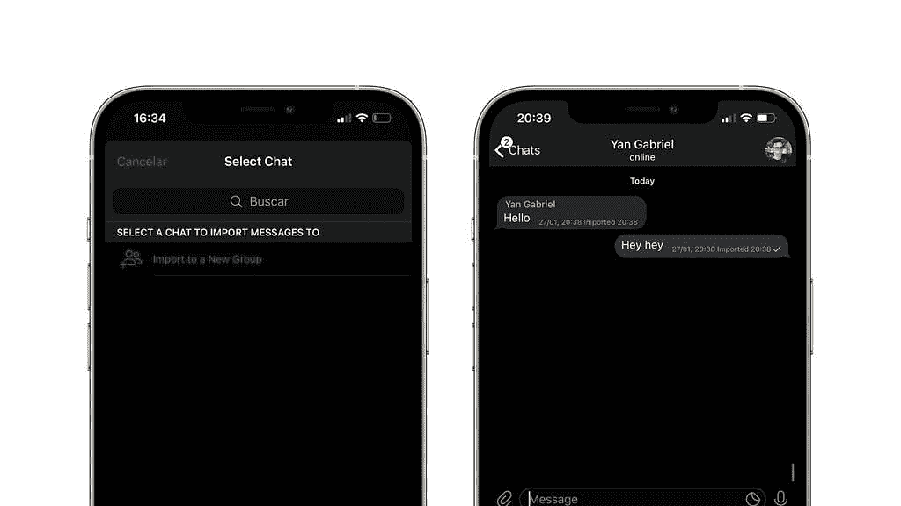

# Telegram 7.4 可以轻松迁移您的 WhatsApp 聊天记录

> 原文：<https://www.xda-developers.com/telegram-7-4-makes-easy-migrate-whatsapp-chat-history/>

Telegram 和 Signal 正在从最近针对 WhatsApp 的反弹中获益。在过去的几周里，这些应用程序已经获得了几十万用户，而且他们的增长似乎不会很快停止。为了吸引更多 WhatsApp 用户，这些应用一直在努力引入新功能，以与脸书旗下的 messenger 相媲美。例如，Signal 最近在应用程序中添加了[定制壁纸和动画贴纸支持](https://www.xda-developers.com/signal-custom-wallpapers-animated-stickers/)，为新用户提供更熟悉的体验。现在，Telegram 在 7.4 版本中添加了一个新工具，可以帮助用户轻松地将他们的 WhatsApp 聊天记录迁移到该应用程序。

根据来自 *Macerkopf* 的[最新报道](https://www.macerkopf.de/2021/01/27/telegram-7-4-whatsapp-chats-lassen-sich-importieren/)，Telegram v7.4 现已通过苹果应用商店向 iOS 用户推出。此次更新带来了一个新的导入功能，可以帮助用户将他们的聊天记录从其他应用程序迁移到 Telegram，包括 WhatsApp、Line 和 KakaoTalk。然而，该迁移工具目前还不适用于所有 iPhone 用户。正如 *9to5Mac* [指出的](https://9to5mac.com/2021/01/27/amid-whatsapp-privacy-backlash-telegram-building-new-tool-for-importing-chats-from-other-apps/)，Telegram 似乎在随后的更新中删除了对移植工具的提及，这表明它仍然是一项正在进行中的工作。尽管如此，该出版物还是尝试了一下，以下是它的工作原理:

要将你的聊天记录从 WhatsApp 迁移到 Telegram，你必须首先打开前者，然后导航到你想要迁移的聊天。然后，你必须打开聊天中的“更多”菜单，选择“导出聊天”选项。WhatsApp 随后会以 ZIP 文件的形式创建整个对话的备份。

 <picture></picture> 

Telegram import tool (Image: 9to5Mac)

然后，您将能够通过 iOS 共享表在 Telegram 中导入这个 ZIP 文件。当您这样做时，Telegram 会询问您想要将该聊天与哪个联系人或群组相关联，然后您和您的联系人的信息将会同步。所有导入的邮件都将被标记，以表明它们是从不同的服务导入的。

虽然 Telegram 尚未正式宣布新的迁移工具，但一些用户可以在最新版本的应用程序上访问它。如果你想尝试一下，你可以从 App Store 下载最新的更新。我们预计 messenger 将在未来几天更广泛地发布该工具。截至目前，Telegram 还没有谈到为 Android 用户提供类似的选项。

* * *

## 更新:Telegram 宣布 v7.4 更新

Telegram 已经正式宣布了 v7.4 更新。此次更新正式带来了即时消息迁移工具、删除群组和双方通话记录的能力、语音聊天中单个参与者的音量调整、改进的音频播放器、Android 上的新动画、改进的可访问性等等。可以阅读公告中的[官方更新说明。](https://telegram.org/blog/move-history)