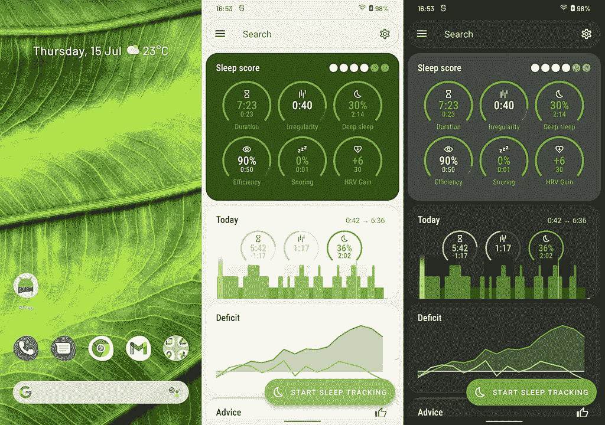

# 第一批使用你设计的 Android 12 材料的应用在这里

> 原文：<https://www.xda-developers.com/the-first-apps-using-material-you-theming-are-here/>

虽然 Android 上的原生主题化是谷歌多年来一直在考虑的一个概念，甚至还增加了对全系统黑暗主题的支持，但完全的原生主题化在 Substratum 和其他主题化引擎等其他服务中几乎还是闻所未闻的，至少在普通 Android 上是这样。然而，随着 Android 12 和谷歌的新材料 You design language 的推出，他们离这个目标越来越近了。使用 Material You，谷歌的设计语言变得更加多样化和可定制化，但我们还需要一段时间才能看到它在应用程序中被广泛采用。不过，好消息是，它正在实现。一些 Android 应用程序现在支持你为第三个 Android 12 测试版在[制作的主题。](https://www.xda-developers.com/android-12-beta-3-features/)

### 包包包包包包包包包包包包包包包包包包包包包包包包包包包包包包包包包包包包包包包

上个月，Tasker 的开发者[在他的应用](https://www.xda-developers.com/tasker-android-12-material-you/)中展示了 You theming 的材料，但是直到前几天 Android 12 Beta 3 发布之前，他还不能向[提交 API level 31](https://www.reddit.com/r/tasker/comments/oku45v/dev_tasker_5130beta_material_you_is_here/) (Android 12)的测试版。现在，Tasker 的新测试版，完全支持你的动态主题化，现在可以使用了。

### 像机器人一样睡觉

据 [*Android Police*](https://www.androidpolice.com/2021/07/15/sleep-as-android-picks-up-beta-material-you-support-and-android-12-isnt-even-out-yet/) 报道，Sleep as Android 是另一款现在支持 Material You 动态颜色的应用。众所周知，作为 Android 的开发者，Sleep 实现了 Android 对应用程序的最新变化和改进，并保持了领先地位，Android 12 和 Material You 也不例外。

 <picture></picture> 

Sleep as Android's Material You dynamic theming. Image credits: Android Police

### 快速墙

最后但同样重要的是， [SwiftWalls](https://play.google.com/store/apps/details?id=it.folgore95.mywall) 是该列表中第三个添加动态主题支持的应用。开发者联系了 XDA，告诉我们他的应用目前的测试版已经支持动态主题化。

*您在最新版本的 Swift Walls 上支持的材料。*

* * *

开发者增加对你主题化的材料的支持，对于那些期待一旦拥有 Android 12 就用它来定制手机的人来说是一个好消息，甚至对于那些已经在手机上使用它的人来说也是如此。如果你需要一个更新的材料，你可以从你的设备的壁纸中提取颜色，并将它们应用到你的用户界面上，围绕这个特定的概念以及定制的概念来设计语言。然而，不是所有的应用程序都可能在短期内增加对它的支持:可能有几个应用程序会想把自己的设计语言强加在 Android 之上。但是，一旦应用程序开发者开始实现它，它将极大地有助于设计的一致性。

说到这里，Google 还没有为 Material You 发布文档或支持库，所以这些开发者都在以他们自己的方式实现动态主题化。有些，比如 Tasker，只是在运行时从适当的 R.color 值中获取颜色，而其他人则在过渡期间使用第三方库(或者自己制作)来获取颜色。