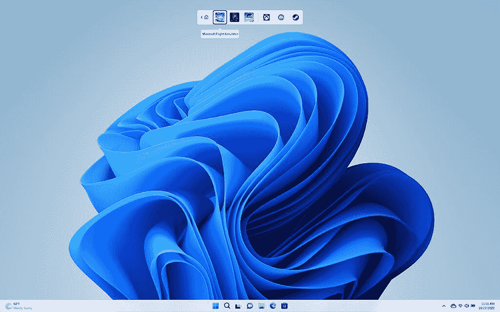

# Windows 11 2022 更新(版本 22H2)现已推出

> 原文：<https://www.xda-developers.com/the-windows-11-2022-update-version-22h2-is-available-now/>

今天，微软发布了 [Windows 11 2022 更新](https://www.xda-developers.com/windows-11/)，也被称为 Windows 11 版本 22H2。新的更新包含许多新功能，如开始菜单中的文件夹，任务栏中的拖放，触摸改进，等等。

这个更新已经测试了一段时间。由于微软在 Windows 11 上切换到了年度更新节奏，它在一年前就开始测试其中的一些功能。自春季以来，它基本上已经被功能锁定，Windows 内部人员只测试服务更新。

旧的又是新的。你可以重新排列开始菜单中的图标来创建文件夹，就像在 Windows 10 中一样。事实上，有许多 Windows 10 的关键功能没有进入最初的 Windows 11 版本，主要是因为新的操作系统只花了大约九个月的时间就组装好了。

也有更多的定制选项。“开始”菜单当前显示选定的固定应用程序，以及您最近访问过的推荐文件。您可以在默认设置、更多固定应用和更多推荐之间进行选择。当然，你仍然可以完全关闭推荐，但是现在，你至少可以最小化那个曾经是空白的区域。

## 触摸和快照改进

如果你在平板电脑或敞篷车上使用 Windows，你会很高兴地知道体验越来越好。以前，为了访问快照布局，允许您为窗口应用程序选择布局，您必须将鼠标悬停在最大化按钮上。现在，你可以将一个应用拖到屏幕顶部来访问它，这将使触摸屏用户更容易使用。

也有新的手势。从底部向上滑动会调出开始菜单，向下滑动可以解除。在开始菜单上向右滑动会将你带到所有应用列表。如果你从右上角向上滑动，你会得到快速设置，如果你用三个手指向左或向右滑动，你会得到你最近使用的应用程序。

## 游戏改进

像往常一样，微软正在努力改进 Windows 的游戏。其中之一就是控制器栏。这是 Xbox 游戏条的一个自定义功能，是为使用控制器的人设计的。要到达那里，你只需按下控制器上的 Xbox 按钮。

 <picture></picture> 

Controller Bar

微软还承诺更好的图形，包括减少使用 DirectX 10 或 11 的窗口应用程序的延迟。汽车 HDR 和 VRR 也应该得到改善。还有一个新的 HDR 校准应用程序，它完全按照它说的做。

它不是 Windows 11 版本 22H2 的特定功能，甚至不是 Windows 11 的功能，但微软在其 Edge 浏览器中喊出了新的游戏主页。它显示你最近玩过的游戏、Xbox 成就、微软奖励等等。

## 一个新的文件浏览器

文件浏览器正在进行改版，虽然实际上是在 11 月份。有一个全新的设计，这意味着让您可以快速访问所有最重要和最常用的文件。

当然，文件浏览器也有了标签。这意味着您可以轻松地打开不同文件夹的多个标签，在它们之间导航，就像 web 浏览器中的页面一样。

## 更多

当然，这还不是全部。幸运的是，我们有 Windows 11 版本 22H2 中新增的 [*一切*的综述。](https://www.xda-developers.com/windows-11-22h2/)