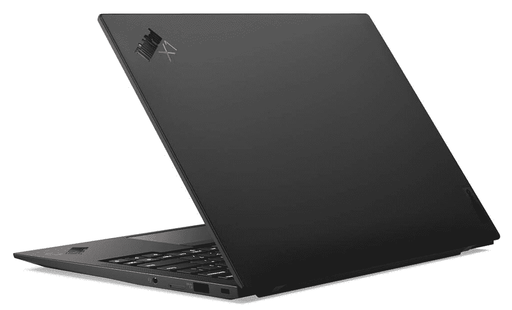

# 联想 ThinkPad X1 Carbon 有 5G 吗？这是为了什么？

> 原文：<https://www.xda-developers.com/thinkpad-x1-carbon-5g/>

联想的 ThinkPad X1 Carbon 在许多方面都是一款出色的商务笔记本电脑。在我们对最新一代的评测中，我们对它[赞不绝口，这不是没有道理的。它不仅是](https://www.xda-developers.com/lenovo-thinkpad-x1-carbon-review/)[联想最好的笔记本电脑](https://www.xda-developers.com/best-lenovo-laptops/)之一，也是[最好的笔记本电脑](https://www.xda-developers.com/best-laptops/)之一，仅此而已。它提供了出色的性能和舒适的键盘，这已经是一个杀手级的组合。但如今，在旅途中保持联系比以往任何时候都更加重要，那么这方面的进展如何呢？ThinkPad X1 Carbon 有蜂窝连接功能吗，特别是 5G？答案是肯定的——只要你愿意为此买单。

## 5G 是什么，我需要它吗？

5G 是蜂窝通信技术的最新主要版本，在手机上最为突出。当然，蜂窝网络对于手机的工作是必不可少的，但这些年来，我们已经看到一些笔记本电脑也实现了这一点。最大的好处是，有了蜂窝网络，无论你在哪里，你都可以连接到互联网。你并不总是需要 Wi-Fi 来访问云中的工作文件或查看电子邮件。

5G 网络主要有两种:sub-6GHz 和 mmWave。第一个更接近我们今天已经知道的网络。它提供了更广泛的覆盖面，但速度的提高并不明显。毫米波可以获得疯狂的高速，但信号很容易被阻挡，你基本上需要在天线的视线范围内，中间没有任何东西。5G 仍处于早期阶段。你现在会发现覆盖不均匀，连接会消耗大量电池。

不过，这并不是说你应该放弃 5G。毕竟，这是蜂窝网络的未来，但它还没有完全准备好。网络仍在建设和扩展，覆盖范围将会改善，速度也会提高。能源效率最终也会提高，所以你不会注意到太多的电池消耗。今天购买 5G 设备更多的是为未来做准备，而不是你现在需要的东西。

## ThinkPad X1 Carbon 支持 5G 吗？

正如我们已经提到的，是的，最新版本的 ThinkPad X1 Carbon Gen 9 提供了 5G 选项。多亏了高通骁龙 X55 调制解调器，你可以获得高达 7Gbps 的理论速度。但这也不是它提供的全部。如果你想要蜂窝连接，而不必购买 5G，也可以使用 LTE 配置。这意味着你将无法获得最快的速度，但 LTE 对于大多数日常任务来说仍然足够快。当然，这取决于你在哪里，但这句话对 5G 来说更是如此。

拥有这两个选项非常重要，因为 5G 附加功能将比只有 Wi-Fi 多花 462 美元。与此同时，LTE 版本只增加了 164 美元的价格。这是 5G 现在的另一个问题——它很贵，特别是对于你所得到的回报来说。但正如我们提到的，购买 5G 设备不是现在。这是为了三四年后你仍在使用这款笔记本电脑，而 5G 几乎无处不在。

 <picture></picture> 

ThinkPad X1 Carbon Gen-9 (Black top cover)

归根结底，5G 升级是否值得取决于你。如果你打算在几年后再次升级你的电脑，那么你现在不需要为 5G 支付额外的费用。你可以等待技术变得更好、更实惠，等你准备好了再买一台新电脑。但如果你倾向于长时间持有你的个人电脑，那么 5G 绝对是你应该考虑的东西。

幸运的是，联想 ThinkPad X1 Carbon Gen 9 可以满足您的任何需求。无论你是愿意购买 5G 还是现在想坚持使用 LTE，联想最新的商务笔记本电脑都可以满足你的需求。

 <picture></picture> 

Lenovo ThinkPad X1 Carbon Gen 9

##### 联想 ThinkPad X1 Carbon Gen 9

联想 Thinkpad X1 Carbon 是一款出色的商务笔记本电脑，具有出色的性能和用于打字的键盘。它有 LTE 和 5G 两种版本，因此您可以在任何地方保持连接。

如果你还在考虑蜂窝连接的其他选项，有几个可供选择。我们收集了[最佳 5G 笔记本电脑](https://www.xda-developers.com/best-5g-laptops/)和[最佳 LTE 笔记本电脑](https://www.xda-developers.com/best-4g-lte-laptops/)，所以你可以选择适合你的。