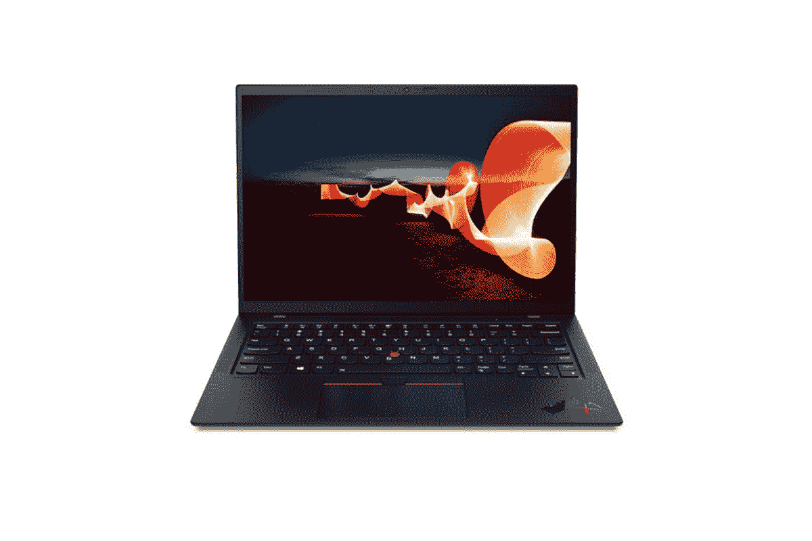

# 应该选择哪些联想 ThinkPad X1 Carbon 配置？

> 原文：<https://www.xda-developers.com/thinkpad-x1-carbon-configuration/>

如果你四处寻找最好的笔记本电脑，你肯定会注意到,[联想 ThinkPad X1 Carbon](https://www.xda-developers.com/lenovo-thinkpad-x1-carbon-review/) 经常被提起。这是一款重量轻、价格高的设备，配有高端规格和 16:10 显示屏，有助于提高工作效率。它也承载了 ThinkPad 品牌的遗产。它采用经典的黑色外观，带有红色点缀，还有可以用作鼠标的小块。但是，即使像 ThinkPad X1 Carbon 这样优秀的电脑也有不同的配置选项，你必须选择适合自己的配置。

选择符合您需求的配置非常重要，因为即使是高级计算机也可能以不符合您期望的方式进行配置。联想在 ThinkPad X1 Carbon 中提供了许多可以更换的选项，因此您可以平衡付出的代价和得到的东西。在本指南中，我们将介绍主要的配置选项，以帮助您选择最适合您的配置。

## ThinkPad X1 Carbon 的处理器配置

选择处理器主要取决于您想要的性能。有几大因素会影响处理器的性能——内核数量、时钟速度和集成显卡。谢天谢地，联想让我们很难在这里做出错误的选择。ThinkPad X1 Carbon 的所有处理器都是四核、八线程单元。

可用的选项有:

*   英特尔酷睿 i5-1135G7
*   Intel Core i5-1145G7 vPro
*   英特尔酷睿 i7-1165G7
*   Intel Core i7-1185G7 vPro

差异归结为时钟速度和显卡，以及专为企业用户设计的博锐安全特性。更高的时钟速度意味着处理器可以在一个周期内执行更多的任务，本质上，这意味着它更快。当您使用编号较大的处理器时，基本时钟速度和提升时钟速度都会较高。这意味着英特尔酷睿 i7-1185G7 博锐是最快的选项，但也是最贵的。

这里你要考虑的是你是否需要额外的性能。如果您主要是浏览网页和用 Microsoft Word 编写文档，您可能不需要英特尔酷睿 i7 处理器。但是，如果您正在处理非常大的 Excel 电子表格，或者如果您正在使用笔记本电脑进行图像或视频编辑等工作，您肯定希望获得额外的性能。

这一点尤其正确，因为你还必须考虑集成 GPU 的图形能力。联想只提供采用英特尔 Iris Xe 显卡的处理器(名称中用 G7 表示)，但它们并不完全相同。英特尔酷睿 i5 中的集成 GPU 有 80 个执行单元，而酷睿 i7 有 96 个。对于那些与图像和视频相关的工作负载，或者如果您想在 PC 上玩一些轻度游戏，英特尔酷睿 i7 选项更具吸引力。

## ThinkPad X1 Carbon 上的 RAM 配置

RAM 是影响电脑性能的下一个重要因素。这是一种非常快速的内存类型，您的计算机使用它来存储需要快速访问的信息。更多的 RAM 通常对多任务处理帮助最大，尽管一些工作负载如管理大型数据库、电子表格、编码项目或游戏也可以从中受益。

ThinkPad X1 Carbon 的基本配置提供 8GB 内存，如今许多人认为这是获得良好整体体验的最低要求。不过，如果你想让电脑真的感觉很快，你至少需要 16GB。

如果您选择英特尔酷睿 i7 处理器，您可以获得高达 32GB 的内存，这是一个很大的数字。最有可能的是，如果你的工作需要那么多内存，你可能已经知道你需要它。同样，如果您处理非常大的数据库和需要加载到 RAM 中的文件，这将是最重要的。对于大多数日常使用，16GB 的内存应该就可以了。

## 固态硬盘(存储)

存储可能是最基本的配置方面，这完全取决于您希望在 PC 上存储多少文件。如果你经常使用云存储，你可能不需要太多的存储空间。此外，如果您主要处理基于文本的文档，即使是 256GB 的 SSD 也可能需要一段时间才能填满。但是，如果您正在下载视频和电影、大量音乐或图像，或者您主要使用本地存储来存储所有内容，您将需要升级。

512GB 的固态硬盘已经是一个可靠的选择，但如果你知道你需要那么大的存储空间，你可以选择 1TB 的型号。如果需要额外存储，您可以随时选择使用外部存储进行扩展。

## ThinkPad X1 Carbon 的显示配置

联想提供了一些不同的显示器选项，有一点你需要考虑。基本型号包括一个全高清+ 14 英寸显示屏，分辨率为 1920 x 1200。对于笔记本电脑显示器来说，全高清已经相当清晰，在大多数情况下看起来也足够好。你能得到的第一个升级是触摸屏。这主要是个人偏好的问题，如果你不认为你会使用触摸屏，那就没有理由去买它。

下一步是增加隐私保护，这是联想的技术，以防止其他人看到你的屏幕。Privacy Guard 使只有直接盯着电脑的人(也就是你)才能正确地看到正在显示的内容。它非常适合在公共场合隐藏敏感信息，以免被周围的人窥探。这次升级还使显示屏更亮，并且还增加了一个红外摄像头——稍后会详细介绍。

最后，你可以选择 UHD+显示屏，分辨率为 3840 x 2400。这使得它的显示非常清晰，它的另一个好处是你可以在屏幕上显示更多。由于有更多的像素，Windows 可以以更小的尺寸呈现某些元素，同时仍然保持它们看起来清晰。

这对于生产力来说是一大福音，因为你可以一次在屏幕上看到更多的元素。如果你想看 4K 分辨率的电影或节目，效果会更好。然而，这个选项确实牺牲了触摸输入和隐私保护，加上它使用更多的电力，所以你必须权衡利弊。

## 摄像机和人体存在检测

联想 ThinkPad X1 Carbon 配置了 720p 网络摄像头，你真的无法改变这一点。但是，您可以添加一个红外摄像头，从而为 Windows Hello 启用面部识别。是否需要由您决定，但面部识别是登录 Windows PC 最快捷、最简单的方式。你只需打开笔记本电脑或按下电源按钮，一旦它看到你的脸，它就会让你登录 Windows，你就可以开始工作了。正如我们提到的，一些显示选项默认添加了红外摄像头。

如果你有红外摄像头，联想还会给你一个选项，让你也能探测到人的存在。这意味着，当你的电脑看到你时，它不仅可以识别你的脸，还可以检测到有人在它面前，即使电脑正在睡觉。假设你离开办公桌去买咖啡——你的电脑可以检测到你离开并进入睡眠状态，然后在你一回来就醒来，而你什么都不用做。纯粹是为了方便，需要的话完全由你自己决定。

## 4G/5G 移动宽带

ThinkPad X1 Carbon 还可以配置蜂窝网络，这是目前最好的 4G 笔记本电脑之一。我们已经有了[指南](https://www.xda-developers.com/thinkpad-x1-carbon-5g/)解释你应该在你的 ThinkPad X1 碳配置中获得 4G 还是 5G，所以我们现在不会太深入。简而言之，这些选项可以让您随时随地保持互联网连接，因此您并不总是需要 Wi-Fi。

4G 更便宜，4G 网络现在更普及，更可靠。与此同时，5G 更新，更经得起未来考验，但它成本更高，目前还不能完美工作。您是否需要移动连接取决于您在旅途中对互联网的需求程度，而在 4G 或 5G 之间的选择主要取决于您希望保留 PC 多长时间。如果你打算在未来许多年使用它，5G 将是长期最有用的。

## Windows 10 版和其他软件

除了 ThinkPad X1 Carbon 的硬件配置，联想还让你选择你想要的 Windows 10 的哪个版本。Windows 10 家庭版和专业版在许多方面都很相似，但也有一些显著的差异。

Windows 10 Pro 附带了额外的功能，如支持微软远程桌面和 Hyper-V 虚拟化，这对企业用户非常有用。您还可以获得 BitLocker 加密，以帮助保护您的文件免受攻击者的攻击，此外，Windows 10 Pro 用户可以更轻松地使用本地帐户而不是 Microsoft 帐户设置 PC。除此之外，没有太大的区别。当 Windows 11 向公众发布时，这两个版本都可以升级到各自的版本。

至于其他软件，这完全是可选的，由每个用户决定，但你可以获得像微软 365 订阅或永久微软 Office 许可这样的东西。你也可以获得一些第三方软件，如杀毒软件或 Adobe 软件。这完全是可选的，你可能不需要任何东西。Windows 提供内置的恶意软件保护，如果你想要专用软件，可能有比 McAfee 或 Norton 更有效的选择，这是联想提供的唯一选择。

* * *

以上内容涵盖了为您选择合适的 ThinkPad X1 碳纤维配置所需了解的所有信息。最终，这一切都是为了选择最符合您需求的产品。联想让你很难选择不好的配置，所以无论如何，你都会得到一台好的笔记本电脑。然而，选择正确的配置很重要，这样你就可以在未来几年拥有满意的产品。我们最推荐的升级之一可能是 16GB 的内存。如果你正在做任何类型的多任务处理，这将非常有帮助，我们很多人都在做。甚至在你的浏览器中打开多个标签页也会因此受益匪浅。

除此之外，这主要取决于您的使用模式。当然，更高的价值通常更好，但你必须决定你为这些升级支付的价格是否值得你从中获得的使用。任何设备都是如此。您可以使用以下链接开始配置您的 ThinkPad X1 Carbon。

 <picture></picture> 

Lenovo ThinkPad X1 Carbon Gen 9

##### 联想 ThinkPad X1 Carbon Gen 9

联想 ThinkPad X1 Carbon 是一款高端商务笔记本电脑，在经典设计中融入了现代功能。它提供顶级的性能、可选的蜂窝连接，以及一些定制选项，让它完全适合您。