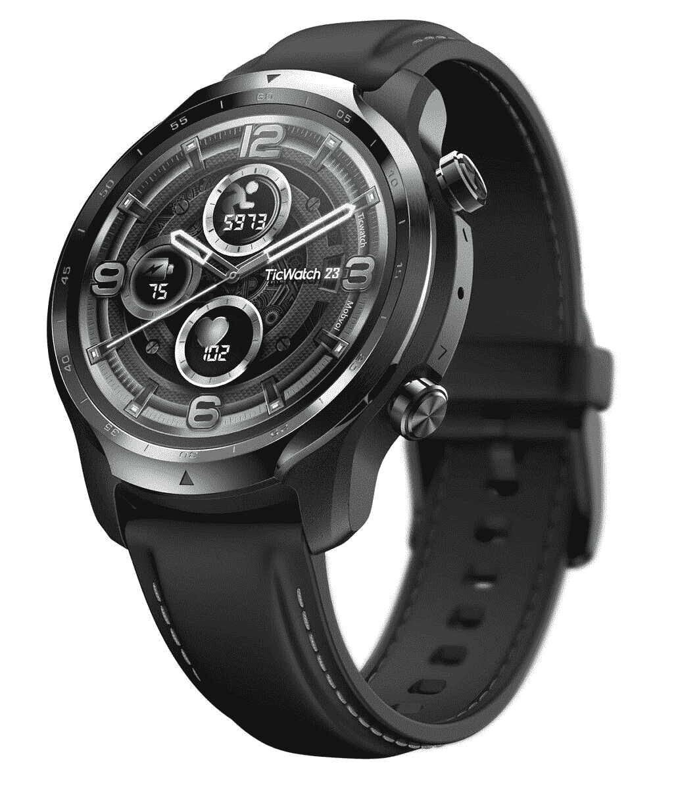

# TicWatch Pro 3 降至有史以来最低价格，将获得 Wear OS 3

> 原文：<https://www.xda-developers.com/ticwatch-pro-3-drops-to-its-lowest-price-yet-and-it-will-get-wear-os-3/>

三星刚刚发布了搭载 Wear OS 3.0 的 [Galaxy Watch 4](https://www.xda-developers.com/samsung-galaxy-watch-4/) ，这是一个更新的软件平台，拥有三星 Tizen 操作系统和 Wear OS 2 的最佳功能。谷歌已经证实，一些现有的 Wear OS 手表最终将获得新的更新，其中之一是 Mobvoi TicWatch Pro 3 GPS。这款手表现在以 239.99 美元的价格出售，这是有记录以来的最低价格，比亚马逊[之前的一天销售高出 10 美元](https://www.xda-developers.com/today-only-ticwatch-pro-3-now-on-sale-for-80-off-and-it-will-get-wear-os-3/)。

TicWatch Pro 3 由骁龙 Wear 4100 芯片组提供支持，该芯片组提供了与 Fossil 全新智能手表系列中的[4100+芯片类似的性能。你还可以获得 1.4 英寸的圆形 AMOLED 屏幕，Wi-Fi 5，蓝牙 4.2，扬声器和麦克风(有助于语音通话和谷歌助手)，Google Pay 的 NFC，IP68 防水/防尘保护，以及各种健康传感器。查看](https://www.xda-developers.com/fossil-gen-6-launch/)[我们的全面评论](https://www.xda-developers.com/mobvoi-ticwatch-pro-3-review/)了解所有细节。

 <picture></picture> 

TicWatch Pro 3 GPS

##### TicWatch Pro 3 GPS

这是目前最好的 Wear OS 智能手表之一，Mobvoi 表示将在明年获得 Wear OS 3 更新。B&H 周四才会接受订单，但你可以稍后再把它加入你的购物车。

谷歌表示，TicWatch Pro 3 将获得即将到来的 Wear OS 3 更新，但要等到“2022 年中至下半年”这意味着你将*最终*获得升级，但如果你现在想要最新的软件(即使三星进行了大量修改)，请查看 [Galaxy Watch 4 和 Galaxy Watch 4 Classic](https://www.xda-developers.com/samsung-galaxy-watch-4/) 。