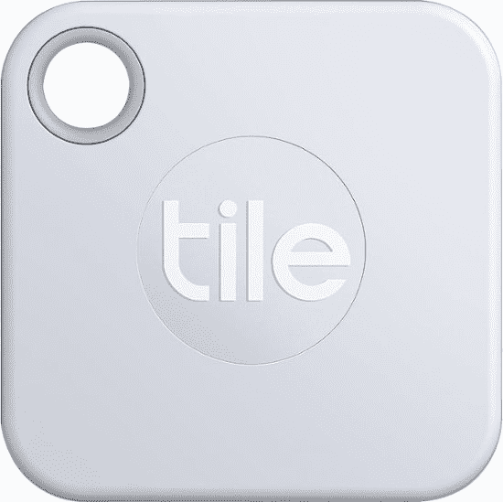

# 瓷砖智能跟踪器销售将确保您再也不会丢失您的东西

> 原文：<https://www.xda-developers.com/tile-smart-tracker-cyber-monday-sale/>

我似乎总是把钱包放错地方。这有点可笑，考虑到我捡了一个有带子的颜色鲜艳的钱包，只是为了不丢失它。谢天谢地，我远远不是唯一的一个，瓷砖智能追踪器被创造出来了。与“查找你的手机”应用程序的概念相同，磁贴可以附着在钥匙和钱包等非智能物体上，这样你就可以通过蓝牙跟踪它们。挺有用的！对网络星期一来说，[百思买正在出售整条瓷砖生产线](https://shop-links.co/1725149282321175016?u1=9958cd9d-d8b6-4d4a-b363-21bba34ce5e4)，所以现在你有机会挑选一条。

 <picture></picture> 

Tile Smart Tracker Sale

##### 瓷砖伴侣(2020)

丢东西有困难吗？瓷砖可以帮忙！百思买正在为网络星期一销售瓷砖系列产品，所以现在你有机会为你的钱包或钥匙圈买一个。

不确定买什么瓷砖产品？这实际上取决于您想要跟踪的项目。 [Tile Mate](https://shop-links.co/1725149282406581546?u1=510a1a1b-0120-461b-99ad-967d2cd55edc) 是原装产品，最适合你的钥匙。有一个对你的钥匙圈很有帮助的洞，它也很小，所以伴侣不会增加体积。一根 Mater 才 18 块！

如果你像我一样，需要一些东西来跟踪钱包，那么另一款智能跟踪器会更适合你——超薄磁贴。这基本上是一个信用卡形状的瓷砖，所以它可以很容易地滑入一个空槽。它也非常适合其他重要物品，如护照夹等有袖子的物品。

最后还有[瓷砖贴](https://shop-links.co/1725149283823496017?u1=55c6e212-ac12-4e5b-a7ac-9d62884cdd7b)。如果 Mate 或 Slim 不适合你的需求，贴纸一定能解决你的问题。你可以轻松而谨慎地在任何你有丢失倾向的物体上贴上标签(比如雨伞，我经常丢失)，突然你就有了一个容易追踪的物体。四个装的特价 40 美元！

寻找更多优惠？我们的[黑色星期五科技综合报道](https://www.xda-developers.com/best-black-friday-tech-deals/)仍在现场直播，在我们前往网络星期一的途中展示一些最好的交易！