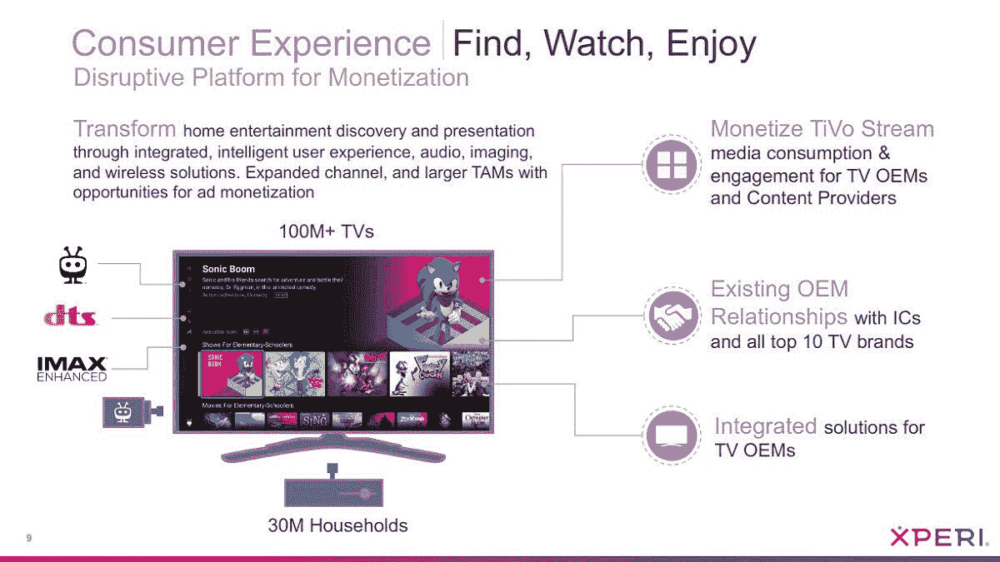
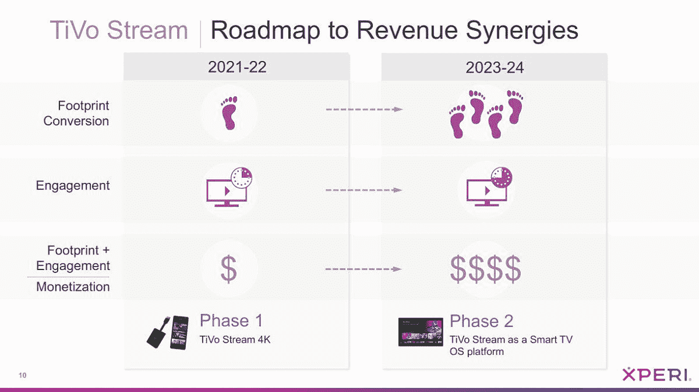

# 谷歌正在把 TiVo 从安卓电视上吓跑

> 原文：<https://www.xda-developers.com/tivo-ditching-android-tv/>

TiVo 最初是一个用于无线电视的 DVR 盒子，但这个品牌现在在其当前所有者 Xperi 的领导下用于各种电视产品。TiVo Stream 4K 去年以 50 美元的安卓电视播放器发布，尽管在该年晚些时候谷歌电视的 Chromecast 发布后，围绕该产品的大多数兴奋都消退了。根据最近的 Xperi 投资者会议，现在 TiVo 似乎已经在寻求放弃这个平台。

TiVo Stream 4K 或多或少是你的标准流媒体棒——你把它插到你的电视上，使用附带的遥控器来播放各种流媒体服务的内容。该播放器基于 Android TV，因此可以安装谷歌 Play 商店的电视应用程序，但该棒也有一个“TiVo Stream”应用程序，旨在成为直播电视(通过 Sling TV)和一些点播内容的主要目的地。

然而，Xperi 对 Android TV 的兴趣似乎已经结束了。该公司于 5 月 6 日与投资者举行了一次[收益电话会议，Xperi 在会上提到了将 TiVo 流接口转变为“一个智能电视操作系统平台”的计划(通过](https://seekingalpha.com/article/4424831-xperi-holding-corporation-xper-ceo-jon-kirchner-on-q1-2021-results-earnings-call-transcript) [*ZatzNotFunny*](https://zatznotfunny.com/2021-05/tivo-to-leave-android-tv/) )。

 <picture></picture> 

Credit: Xperi

 <picture></picture> 

Credit: Xperi

Xperi 最初计划为 TiVo Stream 体验使用 Android TV 作为核心操作系统，类似于 Stream 4K 棒的软件，但现在该公司正在寻求摆脱谷歌的平台。Xperi 首席执行官 Jon Kirchner 在被问及流媒体路线图时说道:

> 我们围绕一种三阶段方法做了很多规划，从 Stream 4K 产品开始，这是一种连接到电视的加密狗，到嵌入式应用，我们将成为更广泛平台上的首选用户界面，但最初是围绕它将存在于 Android 电视之上的概念。
> 
> 第三，深入到更深层次的嵌入式解决方案，嵌入式操作系统，我们是更大的提供商，我们是更广泛的内容搜索、发现和参与的唯一主要界面。发生变化的是，去年秋天，谷歌出来说他们打算超越他们的核心操作系统级别的产品，真正进入 UX 业务，这样做使一个人的能力黯然失色，我认为这是一个合理的选择，否则可能会生活在他们较低级别的平台上。
> 
> 因此，我们真的从第 1 阶段开始，直接将 4K 流投入到更深层次的电视嵌入式解决方案中。

在去年谷歌电视的 Chromecast 发布后不久，[谷歌透露其定制界面最终将提供给其他制造商。更重要的是，谷歌表示，所有 Android 电视设备将在 2023 年左右的某个时候被要求使用谷歌电视 UI。由于 TiVo Stream 应用程序本质上是在与谷歌电视界面(以及 Fire TV OS 和 Roku OS 等)竞争，Xperi 现在寻求跳槽是有道理的。](https://www.xda-developers.com/new-google-tv-interface-replace-android-tv-ui/)

谷歌可能不会因为只有 Xperi 放弃 Android TV 而受到太大影响，但 Xperi 可能会成为许多公司中的一员，在谷歌未来的要求下建立自己的智能电视平台。一加也在销售基于安卓电视的产品，上面有定制软件，尽管一加还没有透露其长期电视计划。