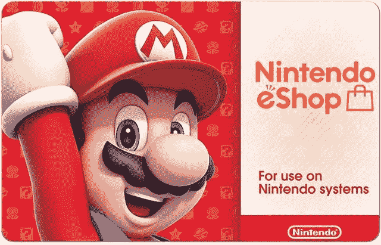

# 仅今天:花 45 美元买一张价值 50 美元的任天堂电子商店卡

> 原文：<https://www.xda-developers.com/today-only-get-a-50-nintendo-eshop-card-for-45/>

# 仅今天:花 45 美元买一张价值 50 美元的任天堂电子商店卡

新蛋以 45 美元的价格出售 50 美元的任天堂 eShop 数字卡，实际上是给你 5 美元免费购买 Switch/Wii U/3DS 游戏。

任天堂 Switch 是目前最受欢迎的游戏机之一(尽管蒸汽甲板令人兴奋不已)，有数以千计的优秀游戏可供选择。然而，其中许多游戏可能价格不菲，尤其是考虑到任天堂自有游戏的销量如此之少。新蛋现在以 45 美元的价格出售 50 美元的任天堂 eShop 卡，实际上是免费给你 5 美元用于数字游戏。

eShop 卡可以用来从任天堂 eShop 购买任何数字游戏，从第三方游戏如*托尼·霍克的职业滑手 1 + 2* 和【我们当中的 到任天堂自己的*动物穿越:新视野*。这些卡不仅可以在任天堂 Switch 上使用，还可以兼容 Wii U 和 3DS 游戏机。如果你还在玩 3DS 或 Wii U，现在是时候拿起你错过的数字游戏或 DLC 了。

 <picture></picture> 

Nintendo eShop $50 Gift Card

##### 任天堂 eShop 礼品卡

这张价值 50 美元的电子购物卡会以数字代码的形式发送到您的电子邮件中。在收银台输入代码 **93XRL72** 以 45 美元的价格购买。减价只在今天有效。

您还可以使用 eShop 点数购买任天堂 Switch 在线的订阅，这使您可以在大多数游戏中进行多人游戏(一些游戏，如《堡垒之夜》，允许您在没有订阅的情况下进行在线游戏)。你还可以通过 Switch Online 玩几十款 NES 和 SNES 游戏，不过如果你几年前就已经在虚拟主机上买了你最喜欢的游戏(或者下载了光盘)，那就没那么刺激了。