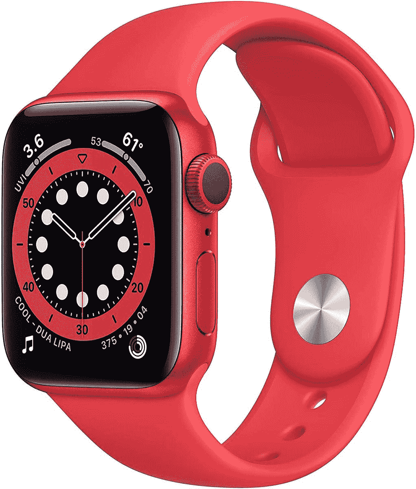

# 只限今天:花 300 美元(优惠 100 美元)买一个红色的苹果手表系列 6

> 原文：<https://www.xda-developers.com/today-only-get-a-red-apple-watch-series-6-for-300-100-off/>

# 只限今天:花 300 美元(优惠 100 美元)买一个红色的苹果手表系列 6

亚马逊旗下的 Woot.com 正在以 299.99 美元的价格出售 40 毫米红色苹果手表系列，比原价低 100 美元。

Apple Watch 是目前最好的可穿戴设备之一，但它只能与 iPhone 配对。Series 6 是最新一代的硬件，具有持续显示和血氧监测支持，并且“产品红”颜色在过去几个月中频繁上市。它在 5 月和 7 月分别降到了 70 美元，现在又以 300 美元的价格上市了。这比原价低了 100 美元。

这是入门级的 40 毫米 Apple Watch，没有专用的蜂窝调制解调器——你需要保持紧密的蓝牙连接，才能接收来自 iPhone 的通知。然而，它仍然有一个专用的 GPS 传感器，所以你可以在没有手机的情况下进行户外跑步，并且仍然有位置/路径数据。除非你强烈希望大部分时间把手机留在家里，否则没有必要购买价格更高的支持 LTE 的苹果手表。

 <picture></picture> 

Apple Watch Series 6

##### Apple Watch 系列 6

亚马逊旗下的 Woot 正在以 299.99 美元的价格出售红色的 40 毫米苹果手表，比最初的建议零售价低 100 美元。Prime 订户获得免费标准运费。销售在今天(8/7)结束，或者在任何存货用完的时候结束。

Apple Watch Series 6 提供了所有常见的智能手表功能，包括身体活动跟踪、手机通知镜像以及运行基本应用程序的能力。最新一代硬件增加了持续显示、血氧监测、更快的性能和心律测试。根据最近的传言，似乎 7 系列的阵容并不太遥远[，但 6 系列的手表仍然值得购买，尤其是在这些价格上。](https://www.xda-developers.com/apple-watch-series-7-flat-edge-design/)