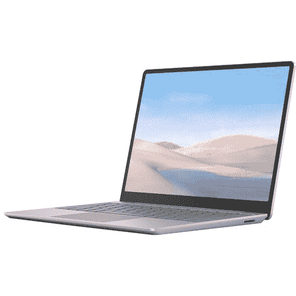

# 仅限今天:570 美元起，买一台 8GB 内存的 Surface 笔记本电脑 Go

> 原文：<https://www.xda-developers.com/today-only-get-a-surface-laptop-go-with-8gb-ram-starting-at-570-130-220-off/>

# 仅限今天:买一台 8GB 内存的 Surface 笔记本电脑 Go，起价 570 美元(优惠 130-220 美元)

128GB 和 256GB 的 Surface Laptop Go 型号正在销售，价格分别降至 569 美元和 679 美元。

Surface Laptop Go 是微软的中端笔记本电脑系列，将 Surface 系列的软件和硬件更紧密地集成到了传统的笔记本电脑设计中。本月早些时候，配有酷睿 i5 处理器、8GB 内存和 256GB 存储空间的型号降到了 700 美元，比通常价格节省了 200 美元。现在同款更是降到了 679 美元，128GB 存储型号也打折了。

Surface Laptop Go 配备了[英特尔酷睿 i5-1035G1 处理器](https://ark.intel.com/content/www/us/en/ark/products/196603/intel-core-i5-1035g1-processor-6m-cache-up-to-3-60-ghz.html)，拥有 4 个内核，8 个线程，时钟速度提高到 3.6GHz。你还可以获得 1536×1024 的 12.4 英寸液晶显示屏，USB Type-A 和 Type-C 端口，耳机插孔，电源按钮上的指纹识别器，以及支持 Windows Hello 的 720p 网络摄像头。有三种颜色可供选择:铂金色、冰蓝色和砂岩色。

 <picture></picture> 

Surface Laptop Go (8GB RAM + 128GB)

##### 微软 Surface Laptop Go

这是中端 Surface 笔记本电脑 Go，也是在售的最便宜的型号。它有 8GB 内存和 128GB 内部存储空间，价格从 699 美元降到 569 美元。

 <picture></picture> 

Surface Laptop Go (8GB RAM + 128GB)

##### 微软 Surface Laptop Go

这是更高端的 Surface Laptop Go，存储容量增加了一倍，但内存量相同。从 899 美元降到了 679 美元。

微软 Surface Laptop Go 有一些缺点。第一，RAM 是[焊在主板](https://www.youtube.com/watch?v=jzRb_3U2vs0)上的，所以不能升级。这款笔记本电脑还配备了 Windows 10 S 模式，只能运行从微软商店安装的软件。谢天谢地，你可以通过系统设置关闭 S 模式，不需要额外的费用。与 RAM 不同，内部 SSD 存储也是可更换的。