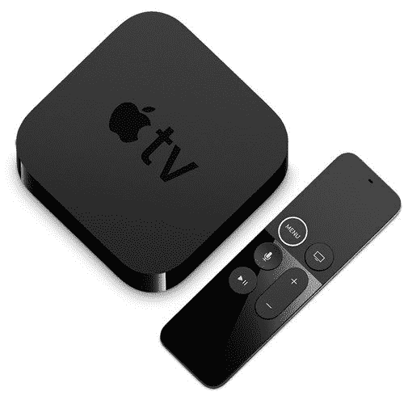

# 仅今天:只需 120 美元(折 60 美元)就能买到苹果电视 4K

> 原文：<https://www.xda-developers.com/today-only-get-an-apple-tv-4k-for-just-120-60-off/>

# 仅今天:只需 120 美元(折 60 美元)就能买到苹果电视 4K

新款苹果电视 4K 起价 180 美元，但就在今天，你只需花 120 美元就能买到上一代产品。

苹果电视几个月前刚刚更新了 A12 芯片，这使得流媒体机顶盒的性能比大多数竞争对手都要快。新机型 32GB 的起价为 180 美元，64GB 的起价为 200 美元，但如果你不需要所有最新的功能，上一代机型现在就有很多。最新一代苹果电视 4K 目前售价为 119.99 美元，比原价节省了 60 美元。

这是第五代苹果电视(也是第一款 4K 型号)，最初于 2017 年 9 月发布。它有一个苹果 A10X 芯片组，32GB 的内部存储空间，3GB 的内存，以及一个带 Siri 语音控制的遥控器。就像所有其他最近的苹果电视一样，你可以从 App Store 向它安装应用程序，或者使用 AirPlay 从其他苹果设备流化内容。它可以连接到任何 Wi-Fi 网络，但如果你的电视周围的无线连接不稳定，这款电视还有一个内置的以太网连接器。

 <picture></picture> 

Apple TV 4K (last-gen)

##### 苹果电视 4K (2017)

上一代苹果电视 4K 现在比原价低 60 美元。

与最新的苹果电视 4K 相比，这款机型不支持 Wi-Fi 6、第二代 Siri 遥控器、HDMI 2.1(只有 HDMI 2.0a)，也不支持高帧率 HDR 视频。苹果以 59 美元的价格单独出售新款遥控器[，这款遥控器确实适用于旧款，但在这种情况下，你还不如买最新款的苹果电视。](https://www.apple.com/shop/product/MJFM3LL/A/siri-remote)