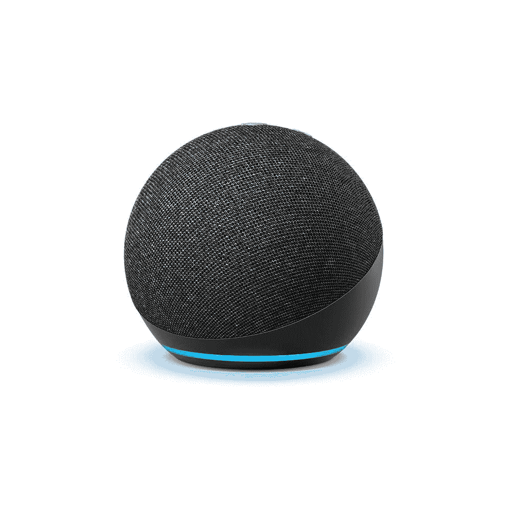

# 你现在可以用多个短语触发 Alexa 程序

> 原文：<https://www.xda-developers.com/trigger-alexa-routines-multiple-phrases/>

亚马逊的虚拟助手 Alexa 支持多种命令。你可以用它来播放你最喜欢的歌曲，获取天气更新，回答问题，阅读新闻，等等。此外，你可以使用 Alexa 来控制智能家居设备。最重要的是，Alexa 提供了一个名为 Routines 的功能，让你根据预定义的因素或命令自动完成任务。

 <picture></picture> 

Amazon Echo Dot (4th Gen)

Alexa 例程可以让您使用预定义的命令或动作自动执行一项或多项任务。例如，如果你想在说“这里太暗了”或类似的话时打开灯，你可以设置这个短语来触发一个例程。例行程序是每当 Alexa 检测到这个短语时就打开你的灯泡。

虽然这不是什么新鲜事，但亚马逊现在增加了设置多个短语来触发同一个 Alexa 例程的能力(通过 [*AFTVnews*](https://www.aftvnews.com/alexa-routines-can-now-be-launched-with-multiple-phrases/) )。在这次更新之前，你只能设置一个短语来触发一个特定的例程。但是现在，你可以添加多达 7 个不同的短语来触发相同的程序。如果您不记得您设置的短语的确切单词，或者您倾向于经常使用这些单词的同义词，这可能是有益的。

例如，如果您有一个由短语“将灯光改为最大亮度”触发的例程，您现在可以添加类似“将灯光改为最大亮度”的变化你现在可以直接从 Alexa 应用程序的*例程*部分添加多个短语。如果您已经启用了一些例程，您可以编辑它们以添加新短语。如果你没有任何预先存在的套路，你可以创建一个新的和多个短语。

除了支持多种短语，Alexa 最近还收到了一个新的男性声音。如果你想尝试一下，你可以按照[这篇文章](https://www.xda-developers.com/how-to-enable-male-voice-amazon-echo-speakers/)中给出的说明去做。