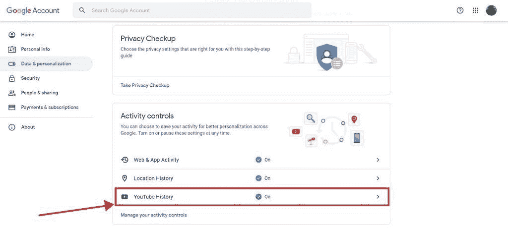
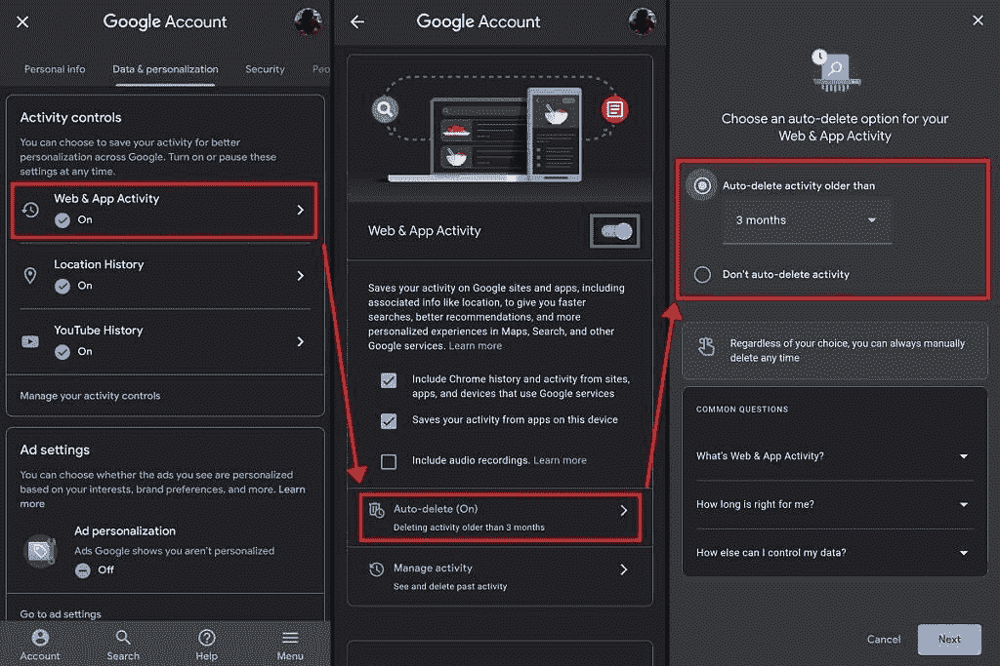
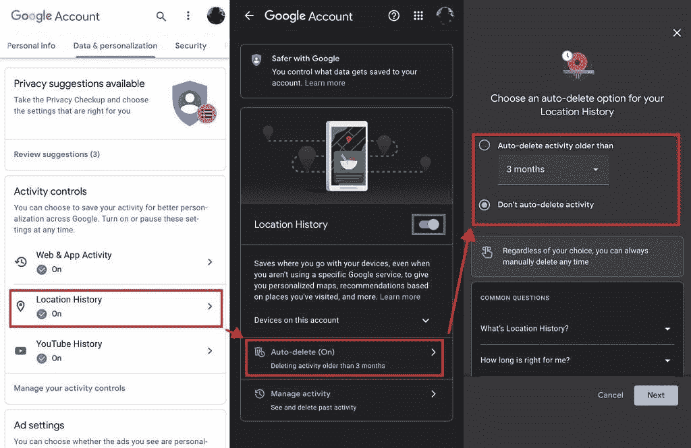

# 如何打开自动删除，让谷歌自动删除您的旧数据

> 原文：<https://www.xda-developers.com/turn-on-auto-delete-google/>

自 2019 年 6 月首次为记录的位置历史、搜索、语音和 YouTube 活动推出自动删除功能以来，谷歌的默认数据保留做法一直在变化。一开始，用户必须手动访问他们的[我的活动页面](https://myactivity.google.com/)并配置新的设置。一年后，2020 年 6 月，它被更改为每当新用户加入平台时，自动删除将默认开启 。

不幸的是，老用户不会自动激活该功能。本指南列出了通过[电脑](https://www.xda-developers.com/best-gaming-laptops/)或[智能手机](https://www.xda-developers.com/best-android-phones/) 打开谷歌账户自动删除功能所需遵循的步骤。

## 在 Windows 或 macOS 上配置自动删除

要开始自动删除设置过程，请打开谷歌浏览器或您选择的浏览器，并访问[Google.com](https://www.google.com/)。然后按照下面列出的步骤操作:

*   点击右上角的人形图标，登录您的谷歌账户。

*   登录后，您将看到您的个人资料图片或您姓名的首字母。现在，点击你的个人资料图片，然后 *管理你的谷歌账户* 。

*   在此页面上，点击 *管理您的数据&个性化。*

*   下 *活动控件* ，点击 *Web & App 活动、位置历史、YouTube 历史、* 或 *管理您的活动控件* 。

 <picture></picture> 

*For representative purposes, we have chosen YouTube History. You can choose either of the three.*

*   现在点击自动删除。 或者，您也可以点击 *管理活动* 手动删除信息。

**请注意:**如果您关闭切换开关(以绿色标记)，将不会有数据保存到您的帐户。

*   选择你是否希望谷歌删除你的数据，并点击蓝色的“下一步”按钮——你可以选择 3 个月、18 个月或 36 个月。

我们建议将您的数据设置为至少在 18 个月内删除，尽管更明智的用户可能会将此设置为 3 个月，或者完全关闭收集数据的选项。

* * *

## 在手机上配置自动删除功能

接下来，您将找到在智能手机上配置自动删除所需的步骤。

### 安卓

首先，打开谷歌应用程序，按照下列步骤操作:

*   点击右上角的个人资料图片，点击 *管理您的谷歌账户* 。
*   在下一个屏幕上，点击*管理您的数据&个性化* 。

*   在这里，找到 *活动控件* ，点击 *Web & App 活动、位置历史、YouTube 历史、* 或 *管理您的活动控件* 。
*   现在，选择自动删除。或者，您也可以通过点击 *管理活动* 来手动删除信息。
*   选择你是否希望谷歌删除你的数据，并点击蓝色的“下一步”按钮——你可以选择 3 个月、18 个月或 36 个月。

 <picture></picture> 

*For representative purposes, we have chosen Web & App Activity.*

**请注意:**如果您关闭开关(以绿色标记)，将不会有数据保存到您的帐户。

* * *

### ios

要在 iOS 上配置自动删除，请打开 Safari 或您选择的浏览器，然后访问[Google.com](https://www.google.com/)。

*   点击右上角的人形图标，登录您的谷歌账户。登录后，您将看到您的个人资料图片或您姓名的首字母。
*   现在点击右上角的个人资料图片，按 *管理您的谷歌账户* 。
*   在下一个屏幕上，点击 *管理您的数据&个性化* 。

*   在这里，找到 *活动控件* ，点击 *Web & App 活动、位置历史、YouTube 历史、* 或 *管理您的活动控件* 。
*   现在，选择自动删除。或者，您也可以通过点击 *管理活动* 来手动删除信息。
*   选择你是否希望谷歌删除你的数据，并点击蓝色的“下一步”按钮——你可以选择 3 个月、18 个月或 36 个月。

 <picture></picture> 

*For representative purposes, we have chosen Location History.*

**请注意:**如果您关闭开关(以绿色标记)，将不会有数据保存到您的帐户。

* * *

随着[应用](https://www.xda-developers.com/best-android-apps/)收集的大量数据，无论是[游戏](https://www.xda-developers.com/best-android-games/)还是社交媒体服务，将控制权交还给用户是正确的一步。虽然谷歌应该为所有账户实现这一点，但我们希望更多的技术巨头能够得到启示，加入进来，提供自动删除等功能，同时牢记相关双方的利益。