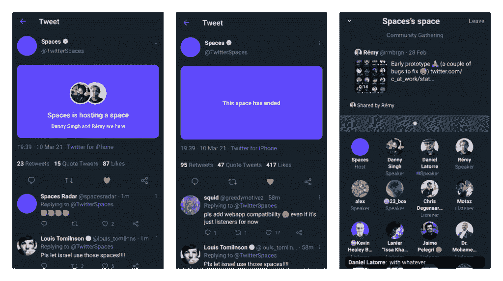

# Twitter 空间链接现在在移动应用程序上显示为可点击的卡片

> 原文：<https://www.xda-developers.com/twitter-spaces-links-cards-ios-android-apps-tip-jar/>

Twitter 通常不以模仿其他社交媒体应用的功能而闻名。甚至对于 Twitter 确实复制或在过去已经复制的功能——例如[车队](https://www.xda-developers.com/twitter-fleets-now-available-clubhouse-voice-chat-rooms/),它也没有像脸书那样迅速。[然而，Twitter Spaces](https://www.xda-developers.com/twitter-spaces-announced-for-select-test-group/) 是一个例外，该公司没有浪费任何时间，就抢先推出了这个类似于病毒式语音网络应用的功能 [Clubhouse](https://www.xda-developers.com/clubhouse-making-android-app/) 。在克隆俱乐部会所方面，它甚至打败了脸书。虽然 Spaces 正式限于 iOS，并在 Android 上进行测试，但 Twitter 正在增加新的方式来吸引更多用户。这些新的方式包括一个新的卡片风格的空间链接布局和一个即将到来的创建者小费罐。

Android 和 iOS 的 Twitter 应用程序现在可以自动将 Twitter Spaces 对话的链接转换为交互式卡片预览，首先由 [*TestingCatalog*](https://www.testingcatalog.com/twitter-spaces-got-new-clickable-cards-along-with-a-new-layout-that-can-show-a-certain-tweet/) 发现。有权访问空间的 Twitter 用户，即那些使用 iOS 应用程序或[安卓测试版](https://www.xda-developers.com/twitter-seems-to-be-finally-testing-spaces-on-android/)的用户，将能够点击卡片，查看该空间的主持人、演讲者和听众的信息。这些卡也可以通过全尺寸车队共享。

 <picture></picture> 

Card UI for Twitter Spaces links; Image by TestingCatalog

除了新的卡片视图，空间窗口的上半部分是为现场互动期间演讲者的推文保留的。点击这条分享的推文，会最小化空间窗口，正常打开推文。

虽然目前托管共享空间的能力仅限于少数幸运用户，但据《The Verge》报道，从 4 月份开始，每个人都将被允许托管共享空间。尽管没有书面交流，但在最近由官方 Twitter Spaces handle 主办的[空间综述讲座](https://twitter.com/TwitterSpaces/status/1369719689958592520)上，该公司的开发者直接宣布了这一消息，这很有意义。

与此同时，应用研究员兼逆向工程师简·满春·王也发现 Twitter 正在努力为空间启用“小费罐”功能。该功能将允许主持人在空间对话期间接受提示。Wong 还指出，用户可以使用流行的支付服务，如 Bandcamp、Cash App、Patreon、PayPal 和 Venmo 支付小费。该功能尚未上线。