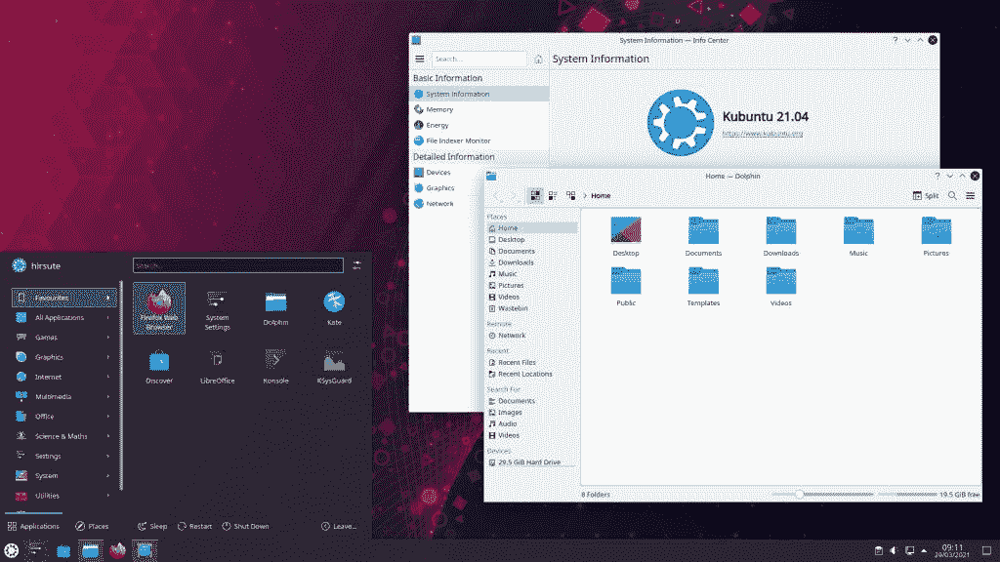

# Ubuntu 21.04 随 Linux 内核 5.11 和 Wayland graphics 一起发布

> 原文：<https://www.xda-developers.com/ubuntu-linux-21-04-features/>

Ubuntu 是最受欢迎的桌面 Linux 发行版之一，它是无数其他桌面操作系统的基础，如 [Linux Mint](https://linuxmint.com/) 和[elemental OS](https://elementary.io/)。Ubuntu 每年有两个主要版本，按照计划，Ubuntu 21.04“多毛的河马”刚刚发布。

Ubuntu 21.04 不是一个长期支持(LTS)版本，所以它只会在接下来的九个月内更新。如果你不想定期升级或者更喜欢稳定性而不是新功能， [Ubuntu 20.04](https://wiki.ubuntu.com/FocalFossa/ReleaseNotes) 是当前的 LTS 版本，将在 2025 年 4 月前接收更新。在这个[新更新](https://ubuntu.com/blog/ubuntu-21-04-is-here)中的一些变化，比如改进的企业性能，已经被反向移植到 20.04。

## Ubuntu 桌面

首先，Ubuntu 21.04 包括 [Linux 内核 5.11](https://kernelnewbies.org/Linux_5.11) ，它有一些有趣的软件功能和对较新硬件的支持。AMD 为其 Vangogh、Green Sardine 和 Dimgrey Cavefish APUs 实现了更好的支持，并且[英特尔的 DG1 桌面显卡](https://arstechnica.com/gadgets/2021/01/intel-releases-dg1-discrete-graphics-cards-to-oems-and-integrators/)现在无需额外的驱动程序或补丁即可工作。BTRFS 和 NFS 文件系统的性能已经得到改善，并且还支持[英特尔 SGX](https://www.kernel.org/doc/html/latest/x86/sgx.html) ，这是一些英特尔 CPU 上的一项功能，为应用数据提供安全区域。

这一版本也标志着期待已久的向韦兰合成器的转变，取代了几十年来一直是大多数 Linux 环境核心组件的 T2 X 桌面服务器。Wayland 通常比 X 有更快的性能和更平滑的图形效果，以及与高级显示功能如[分数缩放](https://wiki.gnome.org/Initiatives/FracionalScaling)的更好兼容性。Canonical 在声明中说:“Firefox，OBS Studio 和许多用 Electron 和 Flutter 构建的应用程序自动利用 Wayland，以获得更平滑的图形和更好的分数缩放。”

一些其他发行版(如 Fedora)已经使用 Wayland 有一段时间了，但 Ubuntu 一直犹豫要不要切换——尽管它在 2017 年曾尝试过[。如果你使用的是 NVIDIA 显卡，操作系统仍然默认为 X11。](https://www.omgubuntu.co.uk/2017/08/ubuntu-confirm-wayland-default-17-10)

Ubuntu 21.04 还有一个更新的主题 Yaru，它将一些桌面元素切换为深色主题，同时保持操作系统的其余部分为浅色。十多年来，Ubuntu 一直有明暗主题的选择，但现在默认的外观是两种风格的混合。

遗憾的是，Ubuntu 21.04 没有搭载最新的 [GNOME 40 桌面环境](https://help.gnome.org/misc/release-notes/stable/)，该环境拥有重新设计的活动屏幕、设置改进和更新的默认应用。Ubuntu 在 GNOME 桌面上添加了一些额外的扩展，所以 Canonical 可能需要更多的时间来更新它们，然后才能迁移到 GNOME 40。这也意味着 [GTK 4.0](https://blog.gtk.org/2020/12/16/gtk-4-0/) 失踪了，至少现在是这样。

## Ubuntu 风味

主要的 Ubuntu 操作系统有几个官方的“版本”,它们取代了 GNOME 桌面环境和一些应用程序。大多数口味也收到了 21.04 更新(或将在未来几天内)，有自己的一套新功能。

 <picture></picture> 

Kubuntu 21.04

**Kubuntu 21.04** ，使用 KDE 桌面环境和应用，[已经更新](https://kubuntu.org/news/kubuntu-21-04-hirsute-hippo-released/)使用 KDE 等离子 5.21 和 KDE 框架 5.80。那个版本的[等离子](https://kde.org/announcements/plasma/5/5.21.0/)包括一个新的应用程序启动器，主题改进，一个结合黑暗和光明元素的新“微风暮光”主题(类似于常规 Ubuntu 21.04 的更新主题)，一个新的系统监视器，以及*更多*。Plasma 5.21 也改进了对 Wayland 的支持，尽管[在最近的测试版](https://wiki.ubuntu.com/HirsuteHippo/Beta/Kubuntu)中，Wayland 并没有像常规 Ubuntu 21.04 那样默认启用。您仍然可以在登录屏幕上选择 Wayland。

**Lubuntu 21.04** 是[现已上市的](https://lubuntu.me/hirsute-released/)，基于轻量级 LXQt 0.16.0 桌面环境。它还附带了 Qt 5.15.2、新的更新通知程序、Discover 软件中心 5.21 以及其他更新的应用程序和框架。还有 **Ubuntu MATE 21.04** ，基于 MATE 桌面(GNOME 2.x 的延续)，有[新的系统主题和更新的指示器](https://ubuntu-mate.org/blog/ubuntu-mate-hirsute-hippo-final-release/)。

其他已经收到更新的版本包括[乌班图虎皮鹦鹉](https://ubuntubudgie.org/2021/04/ubuntu-budgie-21-04-released/)、[乌班图工作室](https://ubuntustudio.org/21-04-release-notes)和 [Xubuntu](https://xubuntu.org/release/21-04/) 。其他非官方衍生产品可能会很快获得更新，或者继续使用 Ubuntu 20.04 LTS 作为其核心。

Ubuntu 21.04[可从 Canonical 为 64 位 x86 PCs 免费下载](https://ubuntu.com/download/desktop)。还有树莓 Pi 的[系统镜像。](https://ubuntu.com/download/raspberry-pi)