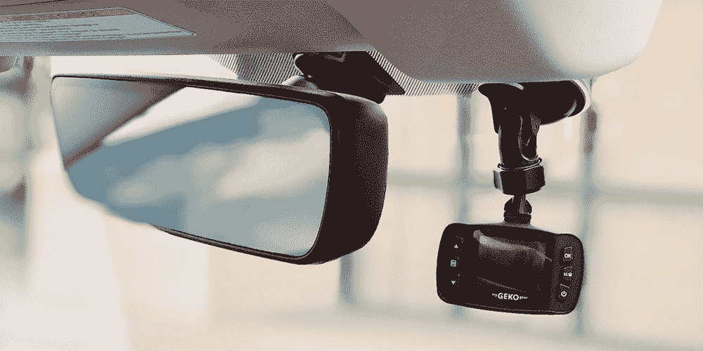
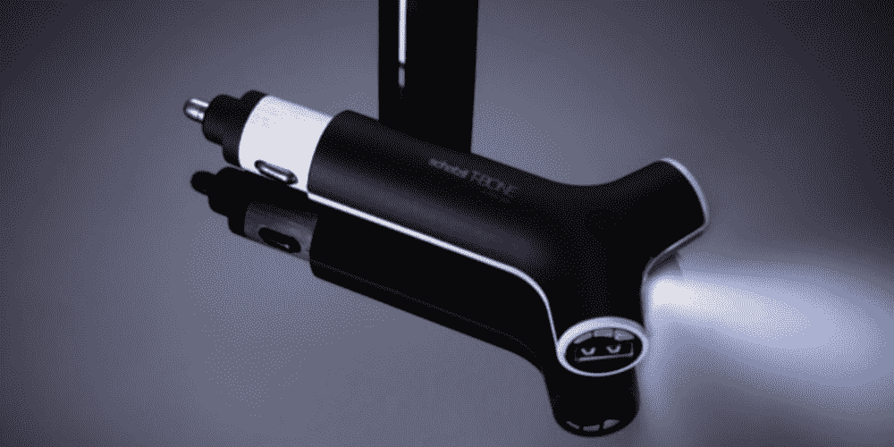
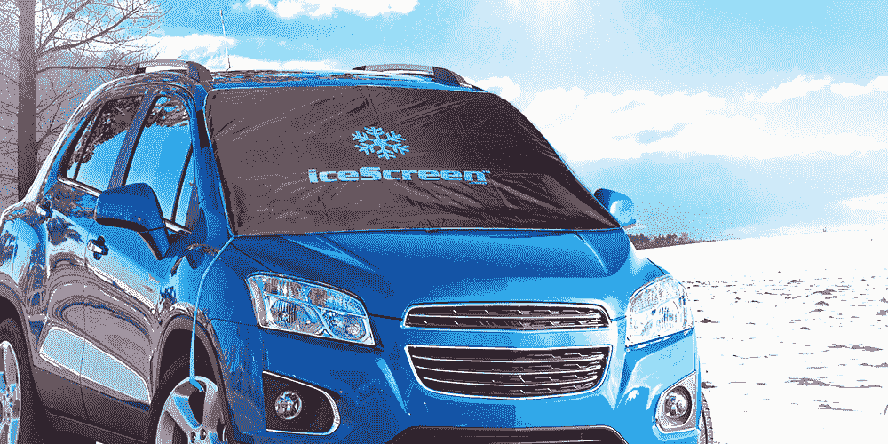
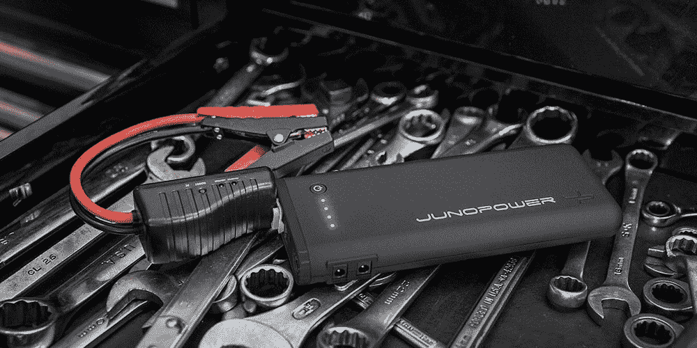
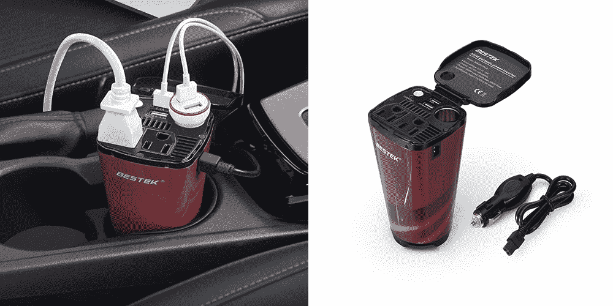
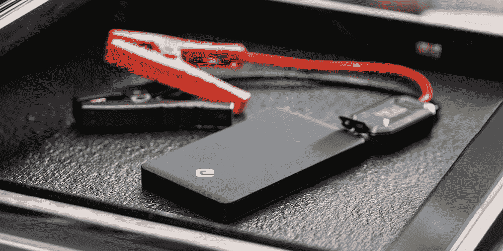
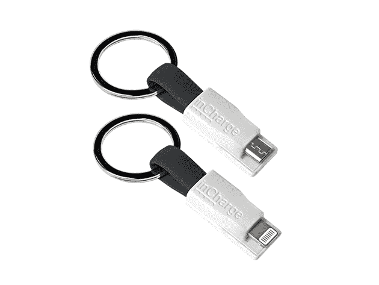

# 升级您的座驾，享受这些汽车附件八五折优惠

> 原文：<https://www.xda-developers.com/upgrade-your-ride-with-15-off-these-auto-accessories/>

大多数人一周的大部分时间都在路上度过。如果你想改善你的家外之家，XDA Developers Depot 的这些汽车配件绝对值得一看。在有限的时间内，当您使用代码 **MerrySave15** 时，以下所有商品均可额外享受 15%的优惠。

配备 120°广角镜头和强大的弱光传感器，[Orbit 110 dash cam](https://depot.xda-developers.com/sales/mygekogear-orbit-110-full-hd-dashcam?utm_source=xda-developers.com&utm_medium=referral&utm_campaign=mygekogear-orbit-110-full-hd-dashcam&utm_term=scsf-360935&utm_content=a0x1P000004N4fG&scsonar=1)在旅途中捕捉更多细节。视频以 1080p 分辨率存储，相机对急刹车和碰撞做出反应。正常情况下 99.99 美元，轨道 110 是 [现在只要 42.49 美元](https://depot.xda-developers.com/sales/mygekogear-orbit-110-full-hd-dashcam?utm_source=xda-developers.com&utm_medium=referral&utm_campaign=mygekogear-orbit-110-full-hd-dashcam&utm_term=scsf-360935&utm_content=a0x1P000004N4fG&scsonar=1) 带码。

这款多功能设备在旅途中可用作双端口 USB 充电器，在您的包中可用作 2，600 毫安时的电源。这款 [T 型骨](https://depot.xda-developers.com/sales/t-bone-car-charger-light-battery-pack-black?utm_source=xda-developers.com&utm_medium=referral&utm_campaign=t-bone-car-charger-light-battery-pack-black&utm_term=scsf-360987&utm_content=a0x1P000004N4fG&scsonar=1) 的电量足以为你的手机充电两次以上，而且它还配有一个明亮的 LED 手电筒。价值 50 美元，设备是 [现在 30.59 美元](https://depot.xda-developers.com/sales/t-bone-car-charger-light-battery-pack-black?utm_source=xda-developers.com&utm_medium=referral&utm_campaign=t-bone-car-charger-light-battery-pack-black&utm_term=scsf-360987&utm_content=a0x1P000004N4fG&scsonar=1) 带代码。

与其每天早上清除挡风玻璃上的冰雪，不如试试。这种封面是由防水和加强牛津聚酯，凝胶填充磁铁和风暴带。它的零售价为 34.99 美元，但你现在可以通过代码 [以 25.46 美元](https://depot.xda-developers.com/sales/deluxe-magnetic-icescreen?utm_source=xda-developers.com&utm_medium=referral&utm_campaign=deluxe-magnetic-icescreen&utm_term=scsf-360988&utm_content=a0x1P000004N4fG&scsonar=1) 的价格获得它。

这款 [电源组](https://depot.xda-developers.com/sales/junojumper-pro?utm_source=xda-developers.com&utm_medium=referral&utm_campaign=junojumper-pro&utm_term=scsf-360992&utm_content=a0x1P000004N4fG&scsonar=1) 具有 12V-600A 的输出，可以让你快速启动汽车，并在移动中为你的设备充电。它有五种不同的输出和一个内置手电筒，但 JunoJumper PRO 只有一磅重。原来是 189.99 美元， [现在是 148.75 美元](https://depot.xda-developers.com/sales/junojumper-pro?utm_source=xda-developers.com&utm_medium=referral&utm_campaign=junojumper-pro&utm_term=scsf-360992&utm_content=a0x1P000004N4fG&scsonar=1) 带代码。

结合交流电源插座、点烟器插座和 USB 充电， [BESTEK 功率逆变器](https://depot.xda-developers.com/sales/200w-car-power-inverter?utm_source=xda-developers.com&utm_medium=referral&utm_campaign=200w-car-power-inverter&utm_term=scsf-360993&utm_content=a0x1P000004N4fG&scsonar=1) 让你在车内运行多种电器。它的峰值功率为 400 瓦，内置安全功能来保护您的汽车。 [价值 27.99 美元，变频器现为 21.24 美元](https://depot.xda-developers.com/sales/200w-car-power-inverter?utm_source=xda-developers.com&utm_medium=referral&utm_campaign=200w-car-power-inverter&utm_term=scsf-360993&utm_content=a0x1P000004N4fG&scsonar=1) 带代码。

尽管只有 7.5 盎司重，[Juno jumper v2](https://depot.xda-developers.com/sales/junojumper-v2?utm_source=xda-developers.com&utm_medium=referral&utm_campaign=junojumper-v2&utm_term=scsf-360994&utm_content=a0x1P000004N4fG&scsonar=1)储存的能量足以启动你的汽车或摩托车。它可以兼作 2.1A USB 充电器，采用日本精工集成电路技术提供可靠的电源。正常 99.99 美元，电池是 [现在 78.99 美元](https://depot.xda-developers.com/sales/junojumper-v2?utm_source=xda-developers.com&utm_medium=referral&utm_campaign=junojumper-v2&utm_term=scsf-360994&utm_content=a0x1P000004N4fG&scsonar=1) 。

专为钥匙链设计， [充电线缆](https://depot.xda-developers.com/sales/2-pack-incharge-cables-1-microusb-1-lightning-black?utm_source=xda-developers.com&utm_medium=referral&utm_campaign=2-pack-incharge-cables-1-microusb-1-lightning-black&utm_term=scsf-360995&utm_content=a0x1P000004N4fG&scsonar=1) 让您随时随地为设备充电并同步。这个包包括两个版本:用于 iOS 设备的 Lightning 电缆和用于 Android 的 microUSB 电缆。价值 23.80 美元，这个有用的二人组现在 [只需 16.99 美元](https://depot.xda-developers.com/sales/2-pack-incharge-cables-1-microusb-1-lightning-black?utm_source=xda-developers.com&utm_medium=referral&utm_campaign=2-pack-incharge-cables-1-microusb-1-lightning-black&utm_term=scsf-360995&utm_content=a0x1P000004N4fG&scsonar=1) 。

*价格随时变化*