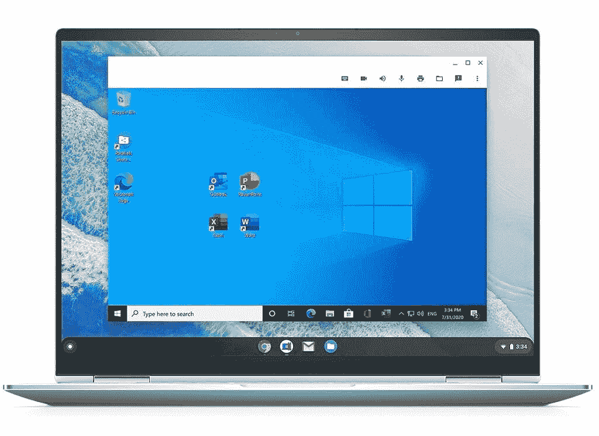

# 我能在 Chromebook 上运行 iTunes 吗？

> 原文：<https://www.xda-developers.com/use-itunes-chromebook/>

随着 Chromebooks 的出现，谷歌改变了平价计算的格局。这些运行 ChromeOS 的经济实惠的笔记本电脑在整个教育领域无处不在。许多用户也更喜欢在家里使用 Chromebook 进行个人计算。当然，这些人中有很大一部分也将 iPhone 作为他们的日常移动设备。想知道你最喜欢的 Chromebook 与你的 iPhone 的匹配程度当然是很自然的。对于许多 iPhone 用户来说，iTunes 仍然是他们日常音乐管理中不可或缺的一部分。那么，你能在 Chromebook 上运行 iTunes 吗？让我们把事情弄清楚。

## 在装有 Linux 和 Wine 的 Chromebook 上安装 iTunes

利用 Chromebook 上的 Linux 环境，在 Chromebook 设备上安装 iTunes 软件和 Wine 在技术上是可行的。ChromeOS 基于 Linux，提供了在各种硬件上运行的多功能性。Wine 是一个开源工具，允许 Windows 应用程序在 Linux 或 macOS 上运行。由于 ChromeOS 是基于 Linux 的，所以你可以用这个在 Chromebook 上安装 Windows 版本的 iTunes。

这个安装过程的细节是技术性的，需要一些终端命令。然而，事实证明，在 Chromebook 上安装 Windows 版 iTunes 并不值得。

## 在 Chromebook 上运行和使用 iTunes

互联网上的一些用户已经使用上述过程安装了 iTunes。最终，他们得到的回报是一个非常落后且不可用的 iTunes 版本。考虑到 iTunes 程序同时运行在 Linux 和 Windows 容器中，这种缓慢并不意外。虽然对一些人来说速度慢是可以忍受的，但也不可能将 iPhone 与 Chromebook 上运行的 iTunes 同步。

最后，许多用户报告说，如果 iTunes 不崩溃，他们甚至无法登录他们的苹果账户。总的来说，这些问题表明 iTunes 安装在 Chromebook 设备上几乎没有用。的确，有些事情可以做，并不意味着就应该做！

## Linux 和 Wine 的可能替代品:Parallels Desktop

 <picture></picture> 

Parallels Desktop for Chrome OS

到目前为止，这篇文章似乎主要是坏消息。通过 Linux 和 Wine 安装 iTunes 显然不是一个好主意。如果你愿意为 ChromeOS 购买 [Parallels Desktop，还有一线希望。Parallels Desktop 是在 ChromeOS 上运行的全功能 Windows 容器。这种方法可以让你更流畅地运行 Windows 版本的 iTunes，但是有一些重要的事情需要注意。Parallels Desktop 软件目前仅面向企业客户，因此个人用户很少使用该选项。在 Chromebook 上通过 Parallels Desktop 使用 iTunes 时，在 Linux/Wine 安装中发现的一些错误也可能会持续存在。](https://www.anrdoezrs.net/links/100122946/type/dlg/sid/UUxdaUeUpU2835/https://www.parallels.com/products/desktop/chrome/)

总的来说，iTunes 很难安装，而且几乎不可能在 Chromebook 上流畅运行。然而，如果你想在 Chromebook 上听音乐，所有的希望都没有失去。你仍然可以使用 YouTube 音乐或 Spotify 等其他流媒体平台轻松地将 iTunes 资料库导入 Chromebook。如果你被锁定在苹果生态系统中，在 Chrome 浏览器中运行[苹果音乐网络应用](https://music.apple.com/)很容易。

最重要的一点是，在 Chromebook 上欣赏音乐仍然很容易，但同步 iPhone 或 iPod 是不可能的。尽管缺乏 iTunes 的支持，但 Chromebooks 在游戏和工作效率方面仍然非常出色。ChromeOS 支持 Linux 应用程序，以及完整的 Linux 安装，并且有[几个扩展坞](https://www.xda-developers.com/best-docking-stations-chromebooks/)可以将你的 Chromebook 变成一台出色的工作机。