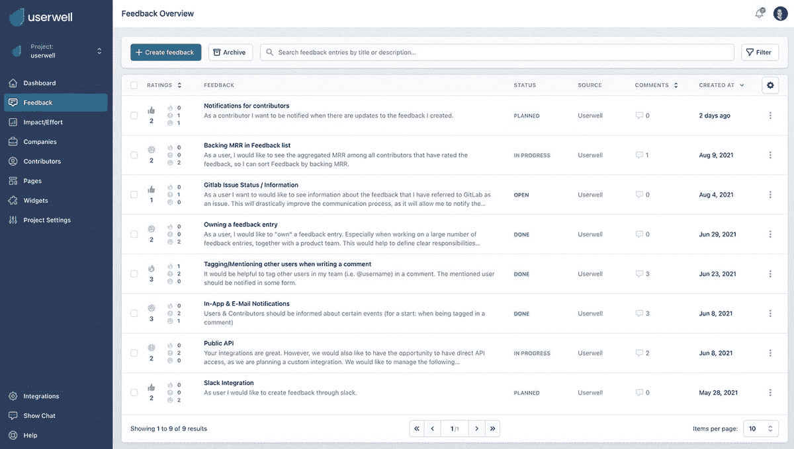
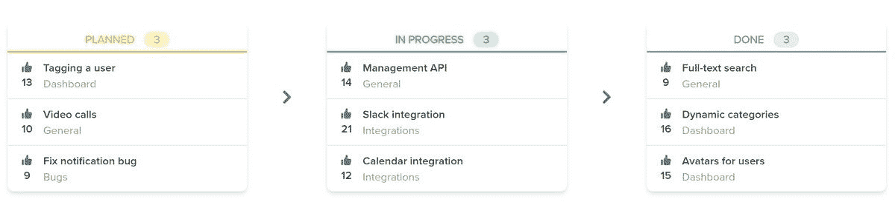

# Userwell 帮助您收集和管理客户反馈

> 原文：<https://www.xda-developers.com/userwell/>

如果您收到了大量的反馈意见，但您正在寻找一种更好的方法来分析这些数据， [Userwell](https://userwell.com/) 有一些强大的工具可以让您受益。通过以更有意义的方式收集和分析用户反馈，做出更好的产品决策。轻松吸引客户，打造他们喜欢的产品。

[Userwell](https://userwell.com/) 是一个可以轻松集成到您当前工作流程中的系统。这意味着你不必改变你目前使用的系统来接受反馈。Userwell 已经准备好集成到现有的工作流软件中，如 Slack、Zapier、Zendesk 和吉拉。连接到 3000 多个不同的应用程序，并将您的反馈汇集到一个地方。

 <picture></picture> 

Userwell Product Feedback Management

## 它是如何工作的

设计并发布反馈页面，供客户作为一个平台来贡献他们的见解、错误或功能请求。这个空间将允许人们参与你的产品，对其他人作出反应，并看到即将推出的功能。这是设置用户井集成的第一步。

在您开始接收提交内容后，您需要通过直接在 Userwell 中与您的用户和团队成员互动来验证和澄清反馈。根据影响和工作分析以及收入洞察，向内部利益相关方证明反馈实施的合理性。

一旦您的反馈得到管理和分析，您就可以使用 Userwell 让您的用户知道您感谢他们的输入，并向他们展示他们的反馈情况。Userwells 为您提供了使这一过程变得非常简单的工具:反馈页面上的路线图、1000 多个集成等等。

[caption align = " align none " width = " 1200 "]

Userwell 路线图示例[/caption]为了帮助您确定 Userwell 是否适合您的企业，您可以利用 14 天的免费试用期。说服自己的产品，没有任何附加条件。选择一个适合你需要的计划。Userwell 为那些喜欢自由的人提供月计划或 20%折扣的年计划。获得 a

[paid plan](https://userwell.com/pricing-plans/)

起价每月 79 美元。试试 Userwell，看看最大化用户反馈的影响有多容易。利用他们的免费试用，并在下面的官方网站上查看更多信息。

[**现在获取用户井**](https://userwell.com/)

###### 我们感谢 Userwell 赞助了这篇文章。我们的赞助商帮助我们支付与运行 XDA 相关的许多费用，包括服务器成本、全职开发人员、新闻撰稿人等等。虽然您可能会在门户内容旁边看到赞助内容(这些内容将始终被标记为赞助内容),但门户团队对这些帖子不承担任何责任。赞助内容、广告和 XDA 仓库完全由一个独立的团队管理。XDA 绝不会通过接受金钱来赞扬一家公司，或以任何方式改变我们的观点或看法，从而损害其新闻诚信。我们的意见不能被收买。