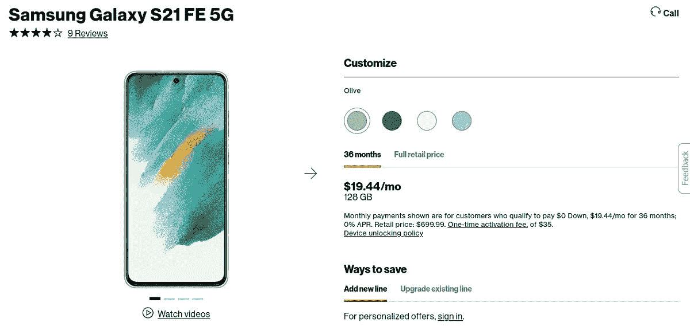

# 威瑞森将所有分期付款计划延长至 36 个月(3 年)

> 原文：<https://www.xda-developers.com/verizon-36-month-plans/>

不久前，美国的运营商将设备购买与服务合同捆绑在一起，将许多人锁定在他们可能不想使用的电话或网络上。设备和手机服务最终被分离，但运营商保留了手机和其他产品的延期分期付款计划。威瑞森现在正在加快步伐。

[*Droid Life* 指出](https://www.droid-life.com/2022/02/03/verizon-36-month-device-payment-contract/)([via*Android Authority*](https://www.androidauthority.com/verizon-three-year-contracts-3102045/))威瑞森已经悄悄停止了其 24 个月和 30 个月的合约选项，用于支付设备，只剩下最长的 36 个月选项。这意味着，如果你想从威瑞森购买手机、平板电脑、移动热点或大多数其他电子产品，你唯一的选择是预付费用或在三年内付清。您还可以选择付清安装计划的余额。

 <picture></picture> 

Verizon product page for the Galaxy S21 FE

这一变化发生在美国电话电报公司去年做出同样的转变之后，但 T-Mobile 似乎仍然以 24 个月的计划销售他们的大部分手机。如果你想从一家主要运营商那里购买一部手机，并在不到三年的时间内付清，并且通过第三方融资不是一个选项，T-Mobile 似乎是唯一的选择。

威瑞森的官方常见问题说，“你的具体条款和付款金额显示在你的第一份账单和你的设备付款分期协议中。如果您在 2012 年 2 月 3 日之前签订了 24 个月或 30 个月的设备支付协议，您的条款将保持不变。”

[威瑞森刚刚在 1 月份](https://www.xda-developers.com/att-verizon-c-band-rollout/)部署了其 C 波段 5G 网络，同时在& T 部署了其 C 波段 5G，给了两家运营商一个对 T-Mobile 的中波段 5G 的回答。然而，首次展示并不是一帆风顺的，因为对飞机设备干扰的担忧导致了国际航空旅行在[的短暂中断。](https://www.xda-developers.com/air-travel-c-band-disrupted/)