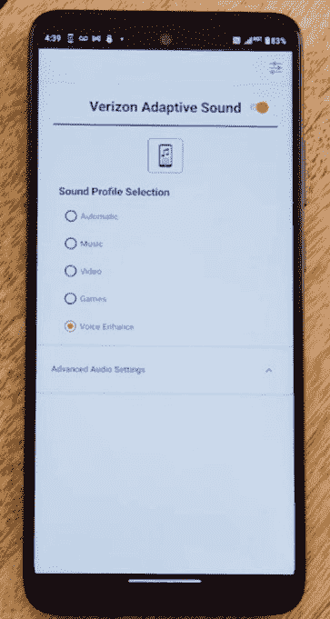
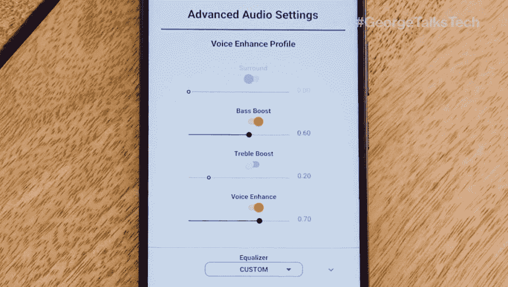

# 威瑞森通过其新的自适应声音功能为更多的手机带来了空间音频

> 原文：<https://www.xda-developers.com/verizon-adaptive-sound-spatial-audio/>

威瑞森宣布了一项新的音频功能，称为威瑞森自适应声音，为更多的手机带来空间音频支持。该运营商正在推出新的摩托罗拉 One 5G UW Ace，并很快推出更多手机。

新的摩托罗拉 One 5G UW 王牌是去年摩托罗拉 One 5G 的升级版。它支持威瑞森的 5G 超宽带网络，该网络在美国 70 多个城市可用。这款手机配备了 6.7 英寸 FHD+液晶面板、48MP 四摄像头系统、[骁龙 750G](https://www.xda-developers.com/qualcomm-snapdragon-750g-processor-specifications-features/) 芯片和 5,000mAh 电池。这是市场上第一款支持威瑞森自适应声音的手机，但该运营商已经[开始通过 OTA 更新将该功能推广到其他支持摩托罗拉的手机，如摩托罗拉 Edge Plus。](https://www.droid-life.com/2021/07/05/motorola-edge-update-adds-something-called-verizon-adaptive-sound/)

 <picture></picture> 

(Image: Verizon)

威瑞森自适应声音集成到支持设备的设置菜单中。它提供了一系列滑块来帮助您根据自己的喜好定制低音、高音、声音增强和空间环绕声。据运营商称，该功能*“使用创新的软件和基于云的解决方案，为客户的所有内容和收听设备提供升级的优质声音体验。”*与其他公司提供的[空间音频功能](https://www.xda-developers.com/apple-will-offer-lossless-audio-in-apple-music-without-a-price-hike/)不同，威瑞森的解决方案适用于任何设备、应用和内容类型。它不限于任何输出设备或内容类型。

 <picture></picture> 

(Image: Verizon)

如果你有兴趣尝试一下这个功能，你可以在威瑞森的网站上购买一款新的摩托罗拉 One 5G UW Ace，或者你可以等待运营商在未来几个月内向更多手机推出它。摩托罗拉 One 5G UW 在威瑞森设备支付上每月 12.49 美元，为期 24 个月，如果你注册一个新的高级无限计划，你也可以免费获得它。更多详情，查看官方公告[这里](https://www.anrdoezrs.net/links/100122946/type/dlg/sid/UUxdaUeUpU3469/https://www.verizon.com/about/news/motorola-one-5g-uw-verizon-adaptive-sound)。