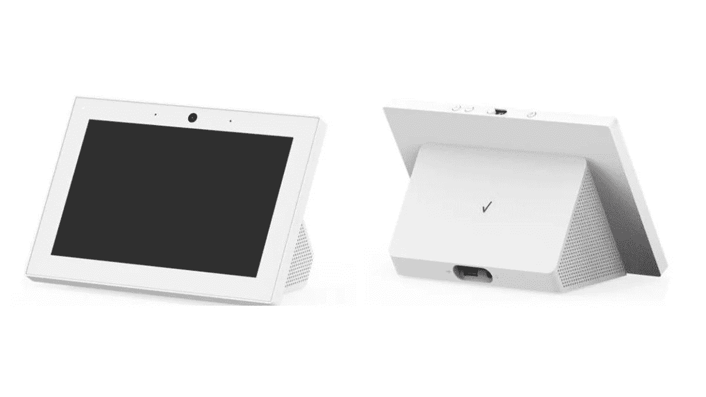

# 威瑞森的 Alexa 智能显示器将于今年秋天推出测试版

> 原文：<https://www.xda-developers.com/verizon-alexa-smart-display-launch-fall/>

威瑞森已经研究了一段时间具有 4G 连接的智能显示器。今年三月早些时候，我们第一次看到了这款设备，当时它获得了 FCC 的认证。当时，我们了解到这款设备将采用 8 英寸 1280x800 显示屏、4GB 内存、带隐私快门的前置摄像头、16GB 板载存储、Wi-Fi、蓝牙和 4G 连接。联邦通信委员会的文件还提到了亚马逊的语音助手 Alexa 和一个“嗨，威瑞森”的语音提示。但没有透露更多细节。现在，威瑞森终于证实了智能显示屏是真的，并将于今年秋天上市。

据 CNET 消息，威瑞森在亚马逊的 Alexa 现场活动中宣布了这款智能显示屏。该公司在活动中确认了该设备的规格，包括 8 英寸 1280x800 显示屏，4GB 内存和 16GB 存储。该公司还证实，威瑞森智能显示屏将配备一个带隐私快门的前置摄像头和一个低功耗的 4G LTE 调制解调器。然而，该调制解调器将仅用于*“确保在互联网中断的情况下，威瑞森智能显示器可以与威瑞森的后端系统通信。*

 <picture></picture> 

Image from the FCC listing

威瑞森进一步证实，智能显示屏是建立在亚马逊的 Alexa 平台上的。因此，它可能会支持 Echo 智能显示器的所有功能。此外，该设备将响应“嗨，威瑞森”的唤醒词，它还将能够帮助用户设置家庭互联网服务或通过视频会议获得技术支持。此外，威瑞森证实，该设备将配备扬声器，并将与多种流媒体平台兼容。但该公司没有透露支持的平台名称。

就可用性而言，威瑞森表示，智能显示器将于今年秋天面向 Fios 客户的*【精选组】*推出*【测试版】*。该公司计划明年为更多用户推出这款设备。目前，威瑞森尚未透露任何定价细节。