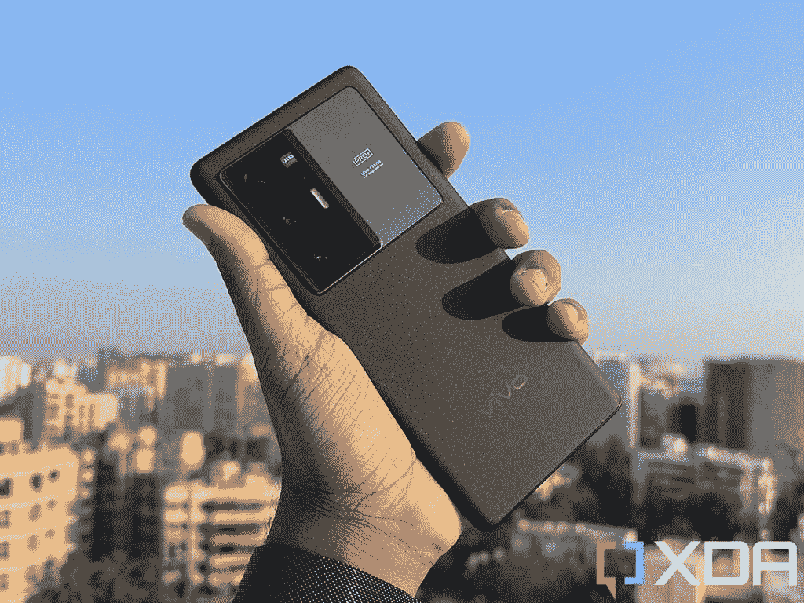
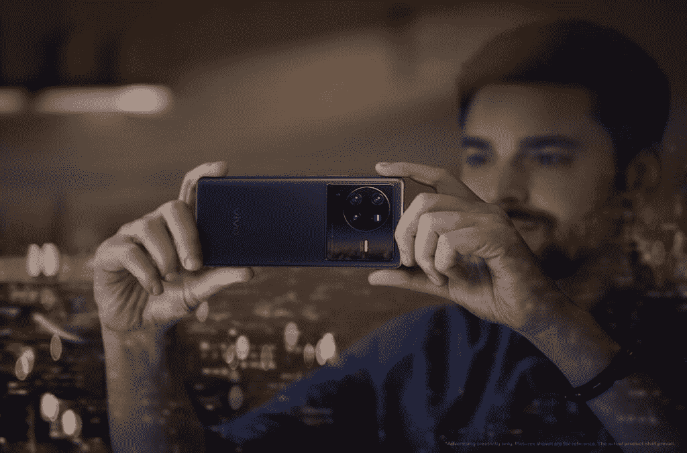
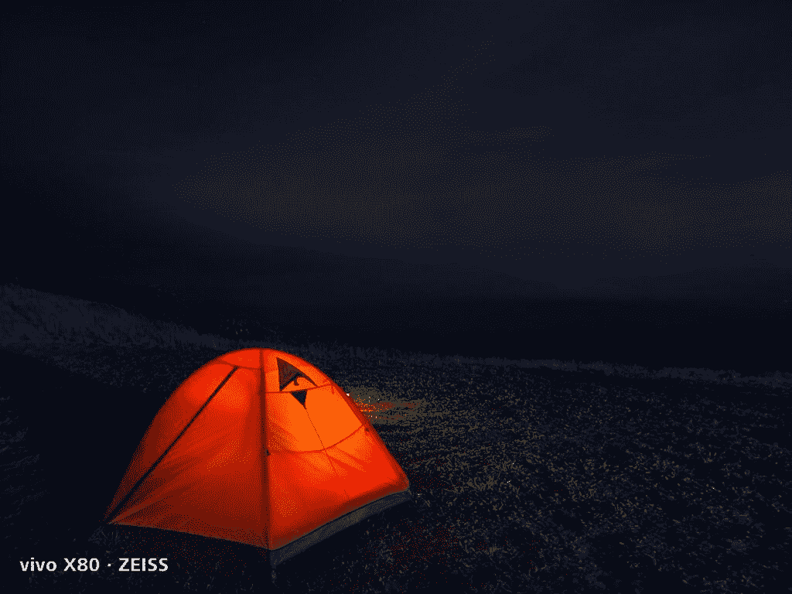
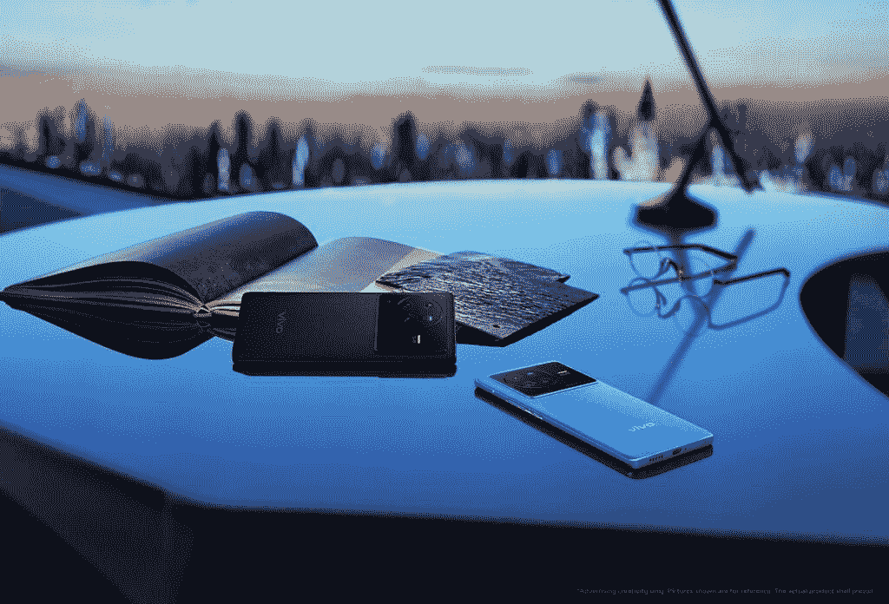

# vivo 的 X80 智能手机系列应该在你的雷达上的六个原因

> 原文：<https://www.xda-developers.com/vivo-x80-smartphone-series/>

很明显，智能手机行业已经从 vivo 对移动摄影技术的大力关注中受益匪浅。他们的 X 系列有一个一致的趋势，即引入新的智能手机相机功能，并成为世界上第一个实现这些功能的产品。vivo X 系列的相机体验是以简单易用的方式将这些新技术带给用户的理想环境。

现在，随着 vivo X80 系列即将在全球推出，我们期待该公司如何推动这一传奇旗舰手机系列向前发展。迄今为止，我们知道 vivo 正在继续与蔡司合作，并计划推出这些带有新的自主设计的成像芯片的新手机。也就是说，这是 vivo X80 系列应该在你的雷达上的六个原因。

## 1.行业领先的移动摄影

vivo X 系列拥有重新定义移动成像的良好记录。此前，随着 vivo X50 系列的推出，vivo 已经推出了万向节相机系统和极端夜视等功能。vivo X60 系列为我们带来了与蔡司的合作以及辉煌的蔡司 Biotar 人像风格(灵感来自蔡司 Contax Biotar 1.5/75)。随着 vivo X70 系列的推出，我们看到了 vivo 首款自主设计的 V1 成像芯片，为更强大的图像处理铺平了道路。

 <picture></picture> 

vivo X70 Pro Plus

这种对成像的强烈关注意味着日常用户在选择 vivo X 系列时有机会使用专业的摄影工具。在 vivo 手机上拍摄的照片可以使用强大的内置编辑工具进行编辑。拍摄高质量照片并准备发布的完整过程变得简单而有趣。

## 2.深化与蔡司的合作

我们知道 vivo 计划加倍与蔡司的合作，蔡司是光学和光电领域的全球领导者，以其独特的视觉风格和高质量的成像技术而闻名。vivo 和蔡司联手，旨在共同塑造移动成像的未来，这是关注 vivo X80 系列的一个很好的理由。

 <picture></picture> 

vivo X80 Pro featured with ZEISS Optics

vivo X70 系列的蔡司风格人像功能将摄影技术提升到了一个新的水平。通过不同的镜头风格散景，用户可以毫不费力地拍摄出真正专业的人像。这些散景效果的灵感来自经典的蔡司镜头，使得这种合作对摄影爱好者来说既有意义又令人兴奋。

在宣布与蔡司合作后，vivo 将 vivo 蔡司合作设计的成像系统引入 X 系列。从 X70 系列开始，所有型号的后置摄像头都通过了蔡司 T*涂层认证，这大大有助于在弱光条件下拍摄。这种专业级的摄影处理水平是我们可以从 X80 系列中期待的。

## 3。人像摄影-创造电影般照片的更多方法

由于用户现在对蔡司风格的人像有很高的期望，vivo 和蔡司旨在通过新功能“蔡司电影风格散景”为我们带来更精彩的人像图像。你可以使用电影般的散景效果重现经典的好莱坞美学。在体验了 vivo X70 系列中的蔡司风格人像后，用户可以期待从 X80 系列中探索更多。

 <picture></picture> 

ZEISS Cinematic Style Bokeh

## 4.动态图像升级-扩展万向节的优势

创新的万向节系统首先在 X50 上推出，然后在 X60 系列中升级为 48MP 超宽万向节摄像头。这继续演变为 X70 系列中的超感测万向节双摄像头设置。vivo 不断为用户带来高性能的稳定技术。X80 系列将继续发扬这一传统，采用新的人像运动跟踪技术，可以减少拍摄中的抖动。

 <picture></picture> 

Photo shot by Gimbal Portrait Camera

由于超稳定的摄影能力，人类背景分割技术可以在分离照片中的背景和人方面做得非常出色。然后，智能散景技术用于产生线性运动模糊，而您照片的主体仍然清晰。

## 5.夜景拍摄-提升夜间拍摄功能

夜景拍摄是 vivo 在 X 系列的前几个版本中特别擅长的。X70 Pro 已被公认为低光拍摄的最佳手机之一，其超感应传感器可在黑暗环境下实现增亮和降噪，X80 系列打算继续取得成功。

 <picture></picture> 

Night Scene shot on vivo X80

有了 vivo X80，我们将期待新的夜间模式继续建立这一声誉。借助顶级色调优化，您将获得令人印象深刻的夜间摄影性能。

## 6.摄像——电影般的镜头触手可及

X 旗舰系列不断提供强大的摄像功能，X60 系列的电影大师功能和 X70 系列的专业电影模式让用户有机会释放他们的专业拍摄潜力。

在 X80 系列中使用新的蔡司电影视频散景，您可以拍摄更具电影效果的视频。人工智能视频增强通过根据场景进行调整，对每个剪辑进行最后的润色。使用 vivo X80 系列，您将能够捕捉精彩视频。

 <picture></picture> 

vivo X80 Series

* * *

因此，请密切关注 XDA 对 vivo X80 系列的进一步报道。这一系列旗舰手机有望再次将手机摄影推向一个新的水平，拥有令人兴奋的功能。预计 vivo 将于 5 月 18 日在全球推出这些新手机。

###### 我们感谢 vivo 赞助这篇文章。我们的赞助商帮助我们支付与运行 XDA 相关的许多费用，包括服务器成本、全职开发人员、新闻撰稿人等等。