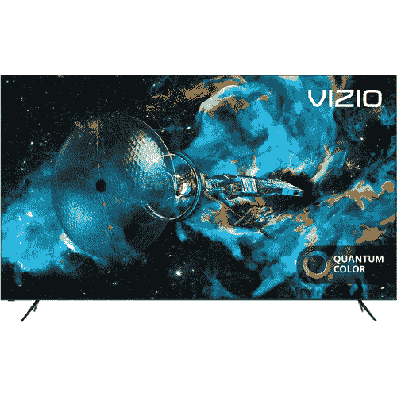
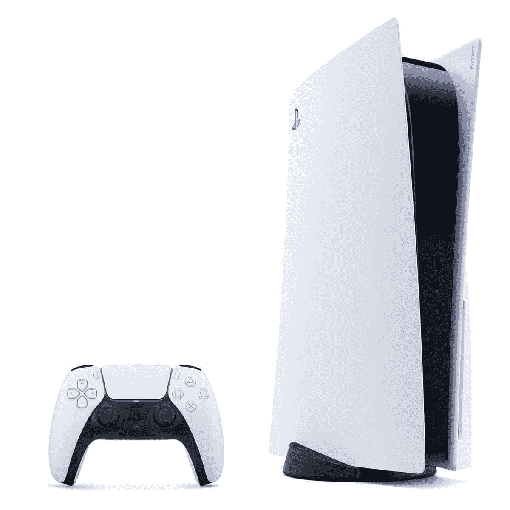
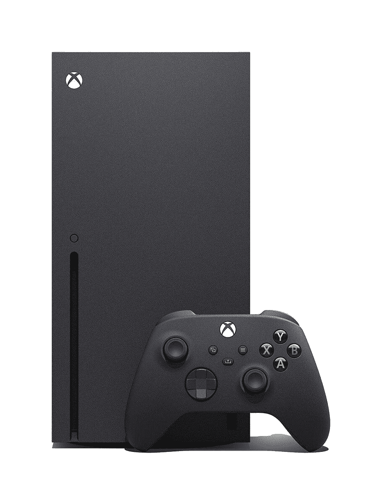

# 你已经有了 PS5，现在再花 430 美元购买 Vizio 4K120 Quantum X 电视

> 原文：<https://www.xda-developers.com/vizio-4k120-quantum-x-tv-bh-deal/>

PlayStation 5 发布日快乐-等等。今天不是发布日？好吧，祝 PlayStation 5 无处不在补货日快乐！事实证明，PlayStation 5s 整天都在缺货，你可能已经为自己买了一台！不过，如果你还在尝试，去看看我们的 [PS5 补货文章](https://www.xda-developers.com/playstation-5-restocks/)，试试零售商列表。说真的，这些游戏机的进货和缺货速度比任何人都要快！无论如何，现在你终于有了你的 PlayStation 5，是时候买一台新电视来充分利用 Vizio 4K120 Quantum X 电视的下一代体验了。

相信我，如果你需要一台能够处理 PlayStation 5 所提供的一切的电视，那么 Vizio 4K120 Quantum X 将是最佳选择之一。这款 4K 65 英寸 UHD 电视具有 48 至 120 赫兹的可变刷新率，因此您将确保始终拥有流畅的游戏体验。除了是一款出色的游戏电视之外，Quantum X 还内置了 Chromecast 和 Apple AirPlay，因此您可以轻松地将苹果和 Android/Windows 的内容传输到您的电视上。这款电视甚至有四个 HDMI 端口——足够所有三个现代游戏机使用，还有空间放其他东西！

Vizio 4K120 Quantum X 目前正在 B&H 图片和视频网站出售！我想这就是他们名字中视频部分的由来，对吧？这款电视只需 1199 美元，比零售价低 430 美元。对于一台能让你的游戏和媒体看起来很棒的 4K 65 英寸电视来说，这个价格再合适不过了。

 <picture></picture> 

Vizio 4K120 Quantum X TV (65-inch)

##### Vizio P 系列 65 英寸 4K QLED 电视

这款 4K 65 英寸电视非常适合最新一代的游戏机！

不过，如果你仍在尝试 PS5 或 Xbox Series X，你可能会在百思买(Best Buy)找到一些运气，他们全天的股价都在飙升。你可能会走运！

 <picture></picture> 

PlayStation 5

##### 索尼游戏机 5

百思买将全天发售 PlayStation 5s 的库存。祝你好运！

 <picture></picture> 

Xbox Series X

##### 微软 Xbox 系列

百思买将在一天内发布 Xbox 系列 x 的库存。祝你好运！