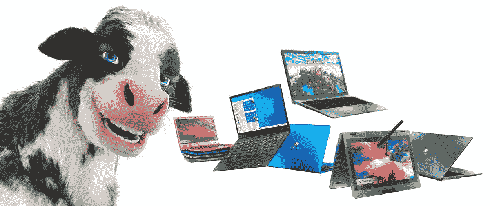

# 沃尔玛开始销售采用第 11 代英特尔处理器的网关笔记本电脑

> 原文：<https://www.xda-developers.com/walmart-gateway-laptops-11th-gen-intel-cpus/>

# 沃尔玛新推出的超廉价网关笔记本电脑采用第 11 代英特尔处理器

沃尔玛刚刚发布了一系列新的网关品牌笔记本电脑，采用了英特尔最新的第 11 代酷睿 CPU。还有一个新的可怕的奶牛吉祥物。

 <picture></picture> 

Gateway's New Spokes-Cow Introduces Notebooks Equipped with 11th Gen Intel Core Processors and Tuned by THX™ Audio

新的网关奶牛。她感觉到恐惧。

Gateway 是 20 世纪 90 年代最知名的电脑制造商之一，最出名的是价格实惠的个人电脑和装运电脑的奶牛图案盒子。沃尔玛最近通过一系列新的经济型笔记本电脑重振了品牌，现在这些笔记本电脑正在更新，采用新的英特尔处理器。还有一个新的可怕的奶牛吉祥物，它几乎保证了我今晚不会睡觉。

[新的网关笔记本电脑系列](https://www.prnewswire.com/news-releases/moo-ving-onto-the-scene-is-the-new-gateway-cow-and-she-has-news-301322112.html)包括八种型号，屏幕从 11.6 英寸到 15.6 英寸不等。最便宜的网关笔记本电脑拥有 4GB 内存和 64-128GB 存储的英特尔赛扬芯片，起价 199.99 美元。另外两款型号采用 15.6 英寸屏幕和奔腾 CPU，其余型号采用第 11 代英特尔酷睿 i3 和 i5 处理器。最高端的型号有一个酷睿 i5-1135G7 处理器，16GB 内存，512GB 固态硬盘和一个指纹传感器——所有这些都是 499 美元的[，这个价格一点也不差。下面是所有的 SKU。](https://www.walmart.com/ip/Gateway-14-1-Ultra-Slim-Notebook-FHD-Intel-Core-i5-1135G7-Quad-Core-Iris-Xe-Graphics-512GB-SSD-16GB-RAM-Tuned-THX-Fingerprint-Scanner-1MP-Webcam-HDMI/654399212)

### 网关笔记本电脑

*   11.6 英寸超薄笔记本电脑(MSRP: $199.99 )，采用 Windows 10、英特尔赛扬、4GB/64GB，含 1 年微软 365 个人版( $69.99 价值)。可选颜色:炭色、蓝色、红色、绿色
*   11.6 英寸 2 合 1 可变形笔记本电脑(MSRP: $229.99 )，采用 Windows 10、英特尔赛扬、4GB/64GB，包含 1 年期微软 365 个人版( $69.99 价值)。可选颜色:黑色、蓝色、绿色、紫色
*   15.6 英寸超薄笔记本电脑(MSRP: $289.99 )，采用 Windows 10、英特尔奔腾银、4GB/128GB 固态硬盘，由 THX 针对音频进行调整，包括 1 年期微软 365 个人版( $69.99 )，可选颜色:炭灰色、蓝色、红色、绿色
*   15.6 英寸超薄笔记本电脑(MSRP: $329.99 )，采用 Windows 10、英特尔奔腾银、4GB/128GB 固态硬盘，由 THX 针对音频进行调整，包括 1 年期微软 365 个人版( $69.99 价值)。《我的世界》版可选颜色:亮绿色
*   14.1 英寸超薄笔记本电脑(MSRP: $459.99 )，采用 Windows 10、第 11 代英特尔酷睿 i3、4GB/128GB 固态硬盘，由 THX 针对音频和指纹扫描仪进行调整。可选颜色:黑色、蓝色、绿色、紫色
*   14.1 英寸超薄笔记本电脑(MSRP: $599.99 )，采用 Windows 10、第 11 代英特尔酷睿 i5、16GB/512GB 固态硬盘，由 THX 针对音频和指纹扫描仪进行了调整。可选颜色:黑色、蓝色、、玫瑰金、绿色、银色
*   15.6 英寸超薄笔记本电脑(MSRP: $499.99 )，采用 Windows 10、第 11 代英特尔酷睿 i3、8GB/256GB 固态硬盘，由 THX 针对音频和指纹扫描仪进行了调整。可选颜色:黑色、蓝色、绿色、紫色
*   15.6 英寸超薄笔记本电脑(MSRP: $699.99 )，采用 Windows 10、第 11 代英特尔酷睿 i5、16GB/512GB 固态硬盘，由 THX 针对音频和指纹扫描仪进行了调整。可选颜色:黑色、蓝色、、玫瑰金、绿色、银色

沃尔玛还非常自豪地为其 Gateway 笔记本电脑创造了一个新的奶牛吉祥物。该公司写道，“Gateway，这个受人喜爱的有着奶牛斑点盒子的电脑品牌，有了一个新的轮辐——奶牛。她厚脸皮，有趣，并闯入现场介绍网关的新系列“乳房”酷笔记本电脑。Gateway Cow 正在讨论该品牌的最新笔记本电脑，这些笔记本电脑配备了第 11 代英特尔酷睿处理器，价格合理，仅在沃尔玛有售。

那头牛太可怕了，看完之后我今晚几乎肯定会睡不着觉。运气好的话，这头牛将继续被束缚在沃尔玛新闻稿的范围内——新笔记本电脑的盒子上似乎有[标准的牛斑点印](https://i5.walmartimages.com/asr/fb835854-6b3b-4fbe-9593-b5dc06b36a2d.58bd668f572abbebed13b40ad65623a1.jpeg)。