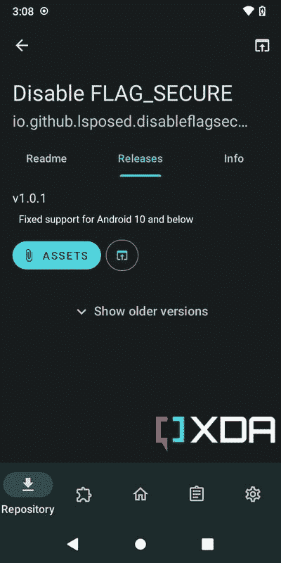

# 这些是 2022 年最好的 Xposed 模块:GravityBox、Pixelify、XPrivacyLua 等等！

> 原文：<https://www.xda-developers.com/wanam-kit-for-android-lollipop-xda-xposed-tuesday/>

如果你最近才开始使用 Android modding，那么你可能并不真正了解 Xposed 框架。通过[根访问](https://www.xda-developers.com/root/)，框架挂钩到 ART(Android 运行时)并让被称为 Xposed 模块的附加组件在目标应用程序的原始方法之前、期间或替代原始方法执行它们自己的方法。因此，您可以自定义手机的外观和行为，而无需安装自定义 ROM。

虽然 Xposed 不像以前那样是 Android 修改场景中的热门话题，但许多用户仍然喜欢它。该框架向您的手机开放了大量的精细定制选择。如果你刚开始使用或者需要一些新的插件，我们有一个很好的列表给你。请随意在本文底部的评论部分添加您的评论和建议。

* * *

## 曝光模块的工作原理

回到过去，在 Magisk 成为一个东西之前，Xposed 被设计用来替换 Android 操作系统的一些核心部分，以支持用户模式挂钩。由于原始项目的开源性质，第三方开发人员主动将 Xposed 框架重写为 Magisk 模块。这意味着 Xposed 现在可以在现代 Android 平台上无系统运行。

EdXposed 和 [LSPosed](https://forum.xda-developers.com/t/4228973/) 是兼容最新 Android 版本的传统 Xposed 框架的两个最受欢迎的分支。如果你不想根你的设备，你仍然可以通过[虚拟曝光](https://forum.xda-developers.com/t/3760313/)项目使用一些曝光模块，但是你的里程可能会有所不同。看一下链接的线程，了解更多关于设置的说明。

正如我们提到的，Xposed 本身只是提供了一个接口，通过这个接口，附加组件(也称为 Xposed 模块)可以动态地挂钩到其他应用程序的执行例程，并动态地修改结果。一些模块有允许你调整设置和定制各种参数的应用程序。其他模块将简单地应用调整，没有额外的东西。

* * *

## 最佳曝光模块

公开的模块总数比 Magisk 的要多得多，但是其中很多都不再维护了。此外，由于 Android 作为操作系统的快速发展，随着时间的推移，一些模块已经变得多余，因此它们不再与现代 Android 版本兼容。记住所有这些，让我们再多了解一些最好的。

**注意:**在本文中，我们将只讨论少数仍然在 modding 社区中流行的 Xposed 模块。这并不意味着认可这些模块，也不是说应该忽视其他人的工作。请访问 Xposed Framework 的 [XDA 分论坛和第三方资源，看看是否有替代(可能更通用)的模块可用。](https://forum.xda-developers.com/f/xposed-general.3094/)

### 高级设置的最佳展示模块

应用程序设置重生

App Settings Reborn 是针对较新版本的 Android 的原始应用程序设置模块的更新版本，它允许您修改应用程序设置，如 DPI、字体缩放、全屏模式、区域设置等。基于每个应用程序。

**App 设置重生: [GitHub 回购](https://github.com/BlueCat300/XposedAppSettings) || [XDA 讨论线程](https://forum.xda-developers.com/t/4141339/)**

蓝牙工具包

蓝牙工具包是一个漂亮的应用程序，可以通过 Xposed 增强 Android 的蓝牙功能。例如，您可以通过蓝牙接收任何文件，选择接收文件时的通知方式，将发现超时设置为无限，等等。

**蓝牙工具包: [XDA 讨论线程](https://forum.xda-developers.com/t/2805347/)**

铸造使能器

Android 12 取消了使用手机音量键控制 cast 设备音量的功能。借助该模块，您可以在您的设备上快速启用它。

**投启用码: [XDA 讨论线程](https://forum.xda-developers.com/t/4394713/)**

ChatHeadEnabler

XDA 资深会员 chadheadenabler*neonobit*在 Android 11 及更高版本上恢复了 Facebook Messenger 的聊天头功能。

**chatheadenabler:[github rest](https://github.com/NeonOrbit/ChatHeadEnabler)| |[xd da 讨论线程](https://forum.xda-developers.com/t/4305391/)**

一加并行应用扩展器

这个方便的模块允许你通过运行 OxygenOS 的一加手机的“并行应用”功能将任何应用程序(除了系统应用程序)添加到支持的应用程序列表中。

**一加并行应用扩展器:[GitHub Repo](https://github.com/Xposed-Modules-Repo/com.alex193a.paextender)**

一加摄像机调试模式启用程序

想要访问一加相机应用程序的隐藏内部菜单吗？试试这个模块。

**一加摄像头调试模式使能器:[GitHub Repo](https://github.com/Xposed-Modules-Repo/com.alex193a.opcameradebug)**

WA Tweaker

WA Tweaker 让你可以启用 WhatsApp 仍在开发中的隐藏功能，并对它们进行篡改。

**WA Tweaker: [官网](https://watweaker.com/)**

* * *

### 功能端口的最佳暴露模块

环境音乐模式

由 XDA 知名开发者 *Quinny899* 创建，Ambient Music Mod 是一个混合 Xposed 和 Magisk 模块，可将 Pixel Ambient Music 移植到其他设备。

**环境音乐 Mod:[GitHub Repo](https://github.com/KieronQuinn/AmbientMusicMod)| |[XDA 讨论线程](https://forum.xda-developers.com/t/4260761/)**

OPAodMod

OPAodMod 为一加智能手机带来了谷歌像素风格的永远显示功能。

**opaodmod:[xd da 讨论线程](https://forum.xda-developers.com/t/4100981/)**

像素化-谷歌-照片

由 XDA 资深会员 *SayantanRC* 创建的 Pixelify-Google-Photos 为任何设备的 Google Photos 无缝添加了 Google Pixel 专属功能。请记住，安装该模块后，您可能需要清除 Google 相册应用程序的数据。

**pixel ify-Google-Photos:[GitHub Repo](https://github.com/BaltiApps/Pixelify-Google-Photos)**

* * *

### 用于深入修补的最佳暴露模块

Android Faker

Android Faker 让您可以轻松伪造目标设备的各种硬件标识符。请注意，该模块的某些功能被锁定在一次性付款之后。

**安卓 Faker: [XDA 讨论线程](https://forum.xda-developers.com/t/4284233/)**

核心补丁

CorePatch 是一个强大的 Xposed 模块，可以帮助您禁用签名验证，以便您可以轻松安装签名不一致的应用程序或将其降级。

**核心补丁: [GitHub 回购](https://github.com/LSPosed/CorePatch)**

禁用标志 _ 安全

这个小模块可以在通常不允许这样操作的应用程序中强制启用屏幕截图、屏幕共享和录制。

**Disable-FLAG _ SECURE:[GitHub 回购](https://github.com/VarunS2002/Xposed-Disable-FLAG_SECURE)**

GPS Setter

一个强大的位置欺骗模块，无需启用模拟位置功能即可工作。

**GPS Setter:[GitHub Repo](https://github.com/Android1500/GpsSetter)| |[XDA 讨论线程](https://forum.xda-developers.com/t/4454879/)**

让我降级

让我降级使用户能够绕过 Android 12 和 13 的无应用降级限制。作为一个额外的奖励，该模块提供了一个快速设置瓷砖，以方便地启用和禁用降级块。

**我来降级: [GitHub 回购](https://github.com/DavidBerdik/Let-Me-Downgrade) || [XDA 讨论线程](https://forum.xda-developers.com/t/4485153/)**

内科斯姆斯

NekoSMS 是一个强大的基于模式的 Android 短信拦截器。您可以利用此模块根据发件人和/或内容阻止邮件。它可以与股票和第三方短信应用程序一起使用。

**在 nekosms:[github rest](https://github.com/apsun/NekoSMS)**

传感器禁用器

计划修补你的 Android 设备的传感器输出吗？Sensor Disabler 是一个迷人的 Xposed 模块，允许您修改(甚至禁用)设备上的大多数传感器，包括接近传感器。

**传感器禁用: [GitHub Repo](https://github.com/wardellbagby/sensor-disabler) || [XDA 讨论线程](https://forum.xda-developers.com/t/2798887/)**

虚拟摄像机

这个模块允许你在手机上创建一个虚拟相机界面，并将其附加到不同的应用程序。

**虚拟相机:[github rest](https://github.com/w2016561536/android_virtual_cam)**

微聚 2

WeiJu2 由 Lua 支持，是第一个可脚本化的 Xposed 模块。您可以编写脚本来修改操作系统的各个部分，创建挂钩，甚至以即用型包的形式重新分发这些脚本。

**WeiJu2: [GitHub 回购](https://github.com/ikws4/WeiJu2) || [XDA 讨论线程](https://forum.xda-developers.com/t/4482585/)**

使降低

顾名思义，XDowngrader 模块允许你在同一个应用的新版本之上安装与旧版本相对应的 APK。

**x 降级器: [GitHub 回购](https://github.com/Xposed-Modules-Repo/com.alex193a.xdowngrader)**

XPrivacyLua

XPrivacyLua 通过向应用程序提供虚假数据或根本不提供数据，或者限制应用程序访问选定的数据类别(如联系人和位置)来保护您的隐私。值得注意的是，它不会撤销或阻止应用程序的权限，所以大多数应用程序不会在被拒绝访问时行为不当或崩溃。

**表达塞语: [GitHub Repo](https://github.com/M66B/XPrivacyLua) || [XDA 讨论线程](https://forum.xda-developers.com/t/3730663/)**

* * *

### 个性化的最佳展示模块

全反式

XDA 资深会员 AllTrans 是一个 Android 应用程序的动态语言翻译器。它会在运行时将目标应用程序界面中的所有文本从一种语言替换为另一种语言。

**AllTrans: [GitHub 回购](https://github.com/akhilkedia/AllTrans) || [XDA 讨论线程](https://forum.xda-developers.com/t/3539878/)**

AOSP Mods

AOSP Mods 一个混合的 Xposed+Magisk 模块，它允许不是最初在 AOSP 设计的定制。你可以使用这个模块调整大量的用户界面组件和修改操作系统的整体界面。

**aosp MODS:[github rest](https://github.com/siavash79/AOSPMods)| |[xd da 讨论线程](https://forum.xda-developers.com/t/4421743/)**

经典电源菜单

经典电源菜单是运行 Android 11 及更高版本设备的多功能电源菜单替代品。虽然应用程序可以在没有 Xposed 框架的情况下运行，但其可选的 Xposed 模块接口可以比默认的可访问性服务路径反应更快。

**经典动力菜单: [GitHub 回购](https://github.com/KieronQuinn/ClassicPowerMenu) || [XDA 讨论线程](https://forum.xda-developers.com/t/4339025/)**

定制者

由 XDA 资深会员 *Mikanoshi* 创建，CustoMIUIzer 是一个为运行 MIUI 的小米/红米/POCO 设备提供的大规模定制套件。

**定制员:[源代码](https://code.highspec.ru/Mikanoshi/CustoMIUIzer/) || [XDA 讨论线程](https://forum.xda-developers.com/t/3910732/)**

黑暗诡计

它是各种 UI 调整的集合。例如，黑暗诡计可以帮助你隐藏锁屏上的闹钟文本，并改变载体文本。

**黑暗诡计: [GitHub 回购](https://github.com/darkeyes84/dark_tricks) || [XDA 讨论线程](https://forum.xda-developers.com/t/3750586/)**

发现黑仔

发现黑仔是一个方便的工具，可以用谷歌助手的“更新”屏幕或几乎任何其他第三方应用程序取代谷歌发现页面，这取决于你如何定制它。

**发现黑仔:[源代码](https://github.com/KieronQuinn/DiscoverKiller) || [XDA 讨论线程](https://forum.xda-developers.com/t/4120997/)**

消防工具包

One UI 爱好者，欢欣鼓舞！来自 XDA 资深会员 *Firefds* 的 firefds 套件让你随心所欲地调整三星的 Android 皮肤。

**Firefds 套件: [GitHub 回购](https://github.com/Firefds/FirefdsKit/tree/S) || [XDA 讨论线程](https://forum.xda-developers.com/t/4411655/)**

重力箱

虽然有很多 Xposed 模块可供选择，但 GravityBox 是我们推荐的基本组件之一，因为它提供了广泛的调整。它可以让你修改锁屏，导航栏，状态栏，显示，软件和硬件按钮的动作，等等。

**重力场:[github rest](https://github.com/GravityBox/GravityBox)| |[xd da 讨论线程](https://forum.xda-developers.com/t/4213047/)**

请记住，开发者尚未发布兼容 Android 12 的版本。然而，你可以尝试一个非官方的分支(链接如下)，它提供针对 Android 12 和 13 的构建。

【Android 12 和 13 的 gravity box:[XDA 讨论线程](https://forum.xda-developers.com/t/4456047/)

隐藏我的应用程序

这种以隐私为中心的模块可以防止其他应用程序收集已安装应用程序的列表，用于指纹数据或其他邪恶的目的。请注意，维护者最近暂停了该模块的开发，但该项目仍然保持开源。

**隐藏我的应用程序: [GitHub 回购](https://github.com/Dr-TSNG/Hide-My-Applist)**

基尔格拉姆

Telegram 用户可以使用这个 Xposed 模块来删除赞助消息。它允许您在启用“限制保存内容”时复制或保存邮件。

**Killergram: [GitHub 回购](https://github.com/shatyuka/Killergram)**

MiuiHome

MiuiHome 是一个易于使用的 Xposed 模块，可以解锁股票 MIUI 启动器应用程序的许多高级设置。

**MiuiHome: [GitHub 回购](https://github.com/qqlittleice/MiuiHome)**

物理按钮主控

来自 XDA 资深会员的物理按键主控 *Xspeed* 是一个强大的工具，可以定制你的 Android 智能手机上物理按键的行为。您可以通过该模块禁用原始按钮功能、启动应用程序快捷方式、发送媒体播放信号等。

**实体按钮主控: [GitHub 回购](https://github.com/XspeedPL/PhysicalButtonMod) || [XDA 讨论线程](https://forum.xda-developers.com/t/2620777/)**

简单工具

小米用户的另一个模块，让你可以随时修改各种 MIUI 元素及其功能。

**简易工具: [GitHub 回购](https://github.com/LittleTurtle2333/SimplicityTools)**

暴露边缘

Xposed edge 是一个全方位的模块，为您提供手势控制、按键控制和许多其他智能触发器。

**曝光边缘: [XDA 讨论线索](https://forum.xda-developers.com/t/3525566/)**

* * *

## 如何安装一个 Xposed 模块？

当涉及到发布一个 Xposed 模块时，维护人员通常以常规 APK 文件的形式提供编译版本。你可以在谷歌 Play 商店上找到一些 Xposed 模块，而其他的可以直接从相应的 GitHub 库的 *Releases* 部分下载。此外，虚拟开发者[提供了一个集中的模块库](https://modules.lsposed.org/)(它是[最初的虚拟模块库](https://repo.xposed.info/)的精神继承者)，通过它你可以下载和更新模块。

 <picture></picture> 

Downloading a Xposed module through LSPosed Module Repository

由于一个暴露的模块只不过是一个标准的 APK 文件，你可以使用 [ADB](https://www.xda-developers.com/install-adb-windows-macos-linux/) 手动安装，或者遵循[我们的 Android 应用程序侧装指南](https://www.xda-developers.com/how-to-sideload-install-android-app-apk/)。如果您计划从模块库中获取它们，请确保仔细遵循屏幕上的说明来执行安装。

* * *

Xposed 曾经是 XDA 最喜欢的修改之一，你仍然可以用它的模块做很多有趣的事情。如果您一直在等待扩展当前 ROM 的功能，并收回您通过 Xposed Framework 丢失的功能，请确保前往上述论坛线程进行实验和讨论——只是要记住要小心，并事先使用搜索按钮。