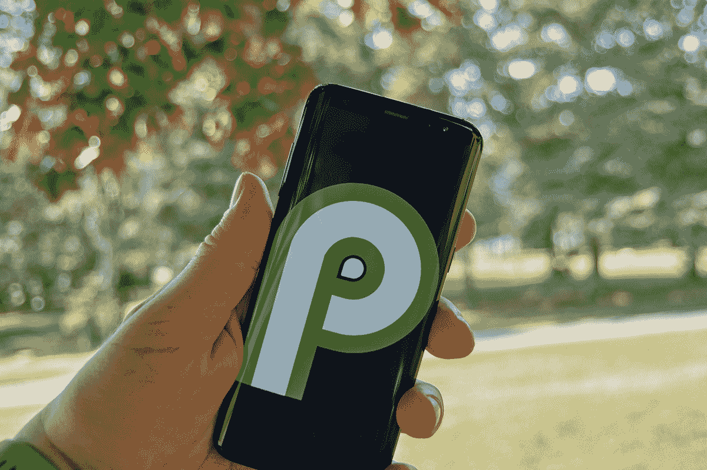

# 想学 app 开发？这些 Android 电子书和课程可节省高达 84%的费用

> 原文：<https://www.xda-developers.com/want-to-learn-app-development-save-up-to-84-off-these-android-ebooks-and-courses/>

谷歌 Play 商店每年的下载量超过 2000 亿次，对应用开发者来说是一个非常有利可图的地方。如果你想建立自己的事业或者只是修补代码，XDA Developers Depot 的这些电子书和课程可以帮助你——现在有高达 84%的折扣。

## **安卓事物快速入门指南【电子书】**

****

本数字指南帮助您探索互联设备的世界。通过 192 页，你了解到 [Android 的东西](https://www.xda-developers.com/tag/android-things/) 平台是如何工作的，如何安装系统，如何创建你的第一个物联网项目。作者是职业软件工程师 Raul Portales。

获得 [安卓事物快速入门指南【电子书】](https://depot.xda-developers.com/sales/android-things-quick-start-guide?utm_source=xda-developers.com&utm_medium=referral&utm_campaign=android-things-quick-start-guide&utm_term=scsf-481528&utm_content=a0x1P000004Z8zJQAS&scsonar=1) 售价 19.99 美元(reg。23 美元)，节省了 16%。

## **学习 Spring for Android 应用开发【电子书】**

****

Kotlin 现在是许多 Android 开发者的首选语言，而 Spring 是一个流行的 Java SE 框架。这本 392 页的电子书将两者结合在一起，向您展示如何从头开始编写企业级应用程序。它被读者评为 5 颗星。

获得 [【电子书】](https://depot.xda-developers.com/sales/learn-spring-for-android-application-development?utm_source=xda-developers.com&utm_medium=referral&utm_campaign=learn-spring-for-android-application-development&utm_term=scsf-470521&utm_content=a0x1P000004Z8zJQAS&scsonar=1)19.99 美元(reg。39 美元)，节省了 50%。

## **更新您的 Android 应用程序[视频]**

****

如果你在 Java 时代学会了构建应用程序，这段视频可以帮助你更新代码。通过 4.5 小时的视频教程，您将学习如何利用 Kotlin、实现生命周期感知组件、利用视图模型 LiveData 框架以及创建现代 UI。

花费 19.99 美元获得 [【视频】](https://depot.xda-developers.com/sales/modernizing-your-android-applications?utm_source=xda-developers.com&utm_medium=referral&utm_campaign=modernizing-your-android-applications&utm_term=scsf-481526&utm_content=a0x1P000004Z8zJQAS&scsonar=1) (注册号 124 美元)，节省了 84%。

## 【Android 性能故障排除[视频]

本课程关注性能，帮助您构建更高效的应用。在 2.5 小时的视频内容中，您会发现减少电池使用和改进内存管理的方法。你的导师是 Yusuf Saber，拥有计算机工程硕士学位。

花费 19.99 美元获得 [【视频】](https://depot.xda-developers.com/sales/troubleshooting-android-performance?utm_source=xda-developers.com&utm_medium=referral&utm_campaign=troubleshooting-android-performance&utm_term=scsf-481527&utm_content=a0x1P000004Z8zJQAS&scsonar=1) (注册 124 美元)，节省了 84%。

*价格随时变化*