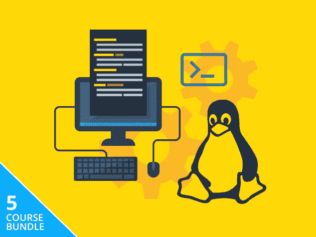

# 想更好的学习 Linux？这里有一些本周折扣很大的顶级课程

> 原文：<https://www.xda-developers.com/want-to-learn-linux-better-here-are-some-top-courses-with-huge-discounts-this-week/>

从服务器到网络安全，Linux 在专业 IT 领域扮演着非常重要的角色。如果您想了解关于该平台的更多信息，现在是开始的好时机。XDA 开发者仓库提供了六个课程包，都有令人印象深刻的降价。

## **Linux 软件包**

****

如果你对 Linux 完全陌生，这个包提供了 54 小时的基本知识。除了桌面操作系统，您还可以掌握 shell 脚本、系统管理和 Docker 部署。

花费 39 美元获得 [Linux 软件包](https://depot.xda-developers.com/sales/eduonix-linux-smart-bundle?utm_source=xda-developers.com&utm_medium=referral&utm_campaign=eduonix-linux-smart-bundle&utm_term=scsf-463174&utm_content=a0x1P000004YrpSQAS&scsonar=1)(reg。325 美元)，节省了 88%。

## **Linux/UNIX 认证培训包**

****

这两个课程的捆绑包帮助您更深入地了解 Linux 和 UNIX 管理。它还可以帮助您准备 CompTIA Linux+和 Novell Certified Linux Professional 认证考试。

花费 49 美元获得 [Linux/UNIX 认证培训包](https://depot.xda-developers.com/sales/linux-certification-training-bundle?utm_source=xda-developers.com&utm_medium=referral&utm_campaign=linux-certification-training-bundle&utm_term=scsf-463172&utm_content=a0x1P000004YrpSQAS&scsonar=1) (注册 2195 美元)，节省了 97%。

## **Linux 超级用户捆绑包**

****

这个包非常适合有抱负的工程师，它向您展示了如何让企业应用在 LAMP 堆栈上平稳运行:Linux、Apache、MySQL 和 PHP。它包括五门课程和大量实践教程。

花费 19 美元获得 [Linux 超级用户套装](https://depot.xda-developers.com/sales/linux-power-user-bundle-2?utm_source=xda-developers.com&utm_medium=referral&utm_campaign=linux-power-user-bundle-2&utm_term=scsf-463171&utm_content=a0x1P000004YrpSQAS&scsonar=1)(reg。597 美元)，节省了 96%。

## **按需付费:完整的 Linux 电子书包**

****

这个迷你电子书库介绍了 linux 安全性、shell 脚本和嵌入式 Linux 编程。这些读物会让你忙上整整 50 个小时——最棒的是，你可以为它们支付你想要的。

付费购买 [完整 Linux 电子书捆绑](https://depot.xda-developers.com/sales/pwyw-the-complete-linux-ebook-bundle?utm_source=xda-developers.com&utm_medium=referral&utm_campaign=pwyw-the-complete-linux-ebook-bundle&utm_term=scsf-463170&utm_content=a0x1P000004YrpSQAS&scsonar=1) (reg。$160).

## **CompTIA Linux 网络专业套装**

****

当谈到给技术招聘人员留下深刻印象时，CompTIA 证书是任何 it 简历的一大亮点。通过 62 小时的视频培训，这个包帮助您准备两个关键的 CompTIA 考试:Linux+和 Network+。

花费 19.99 美元获得 [CompTIA Linux 网络专业套装](https://depot.xda-developers.com/sales/the-comptia-linux-network-professional-bundle?utm_source=xda-developers.com&utm_medium=referral&utm_campaign=the-comptia-linux-network-professional-bundle&utm_term=scsf-463173&utm_content=a0x1P000004YrpSQAS&scsonar=1)(reg。590 美元)，节省了 96%。

## **完整的 2020 年学习 Linux 捆绑包**

****

对于 Linux 的终极教育，看看这个 12 门课程的捆绑包就知道了。它提供了超过 110 小时的内容，包括为 CompTIA Linux+准备。培训来自 iCollege，这是一家出版公司，17 年来一直在推出高质量的课程。

获得 [完成 2020 年学习 Linux 捆绑](https://depot.xda-developers.com/sales/the-complete-2020-learn-linux-bundle?utm_source=xda-developers.com&utm_medium=referral&utm_campaign=the-complete-2020-learn-linux-bundle&utm_term=scsf-459435&utm_content=a0x1P000004YrpSQAS&scsonar=1) 只需 59 美元(reg。3540 美元)，节省了 98%。

*价格随时变化*