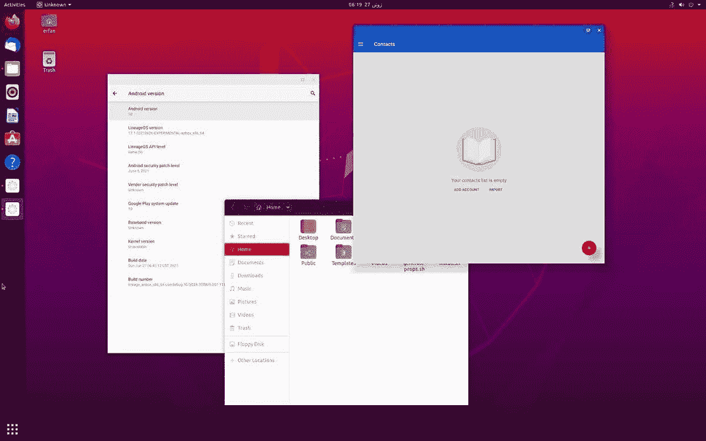

# wandroid 可以在 linux 上运行 android 应用程序而不会变慢

> 原文：<https://www.xda-developers.com/waydroid-android-apps-on-linux/>

在台式电脑上运行安卓应用有很多种方式。像 BlueStacks 这样的桌面模拟器很受欢迎，你可以在虚拟机上运行 Android x86(或者双启动)，或者你可以等待 T2 Windows 11 的 Android 应用兼容层。 [Anbox](https://www.xda-developers.com/anbox-allows-you-to-run-android-apps-on-any-gnulinux-os/) 是另一个运行 Android 应用的解决方案，旨在支持 Linux 和基于 Linux 的智能手机，但它在低功耗设备上的性能很慢。现在有另一个项目旨在将 Android 应用程序带到 Linux 设备上，但没有 Anbox 常见的缓慢和抖动。

[way droid](https://github.com/Anbox-halium/anbox-halium)(via[*Linux 智能手机*](https://linuxsmartphones.com/waydroid-lets-you-run-android-apps-on-linux-phones-with-smoother-performance-than-anbox/) 和 [*Tux 手机*](https://tuxphones.com/waydroid-anbox-linux-mainline-oneplus-6-6t-postmarketos/) )，之前被称为 Anbox-Halium，是 Anbox 的重建版本，旨在使用比 Anbox 更多的主机设备原生硬件——这意味着更快的性能。该项目的主要重点是在基于 Halium 的 Linux 手机上运行 Android 应用程序(Halium 在概念上类似于 [Android 的 GSI](https://www.xda-developers.com/android-12-beta-gsi/) ，但用于标准 Linux)，但它也可以在任何具有主流 Linux 内核的设备上运行。

上面的视频显示了 WayDroid 在 OnePlus 6 上运行在 PostmarketOS Linux 之上，因为 OnePlus 6 系列[可以运行标准的 Linux 内核](https://www.xda-developers.com/oneplus-6-6t-mainline-linux-kernel-support/)。当然，OnePlus 6 可以使用其原始操作系统运行 Android 应用程序，但 WayDroid 令人兴奋，因为它是完全开放的。你可以在手机上运行 Linux 发行版，偶尔也可以为 Android 应用程序运行 WayDroid，同时仍然可以完全控制你的设备(软件支持来自 Linux 社区)。

下面是 WayDroid 的另一个视频(来自 back，当时它仍被称为 Anbox 的重写版)，在装有 Ubuntu Touch 的 Moto Z2 Force 上运行。如果不是 Ubuntu 顶部的状态栏，很难知道 Android 应用程序没有在原生设备上运行。

WayDroid 通过直接的 Wayland 支持([现在许多 Linux 发行版使用的显示服务器](https://en.wikipedia.org/wiki/Wayland_(display_server_protocol)))在 LXC 渲染图形缓冲区，这使得它比最初的 Anbox 项目更流畅。这种超级流畅的功能不仅仅适用于 Linux 手机——它在桌面 Linux 发行版上也能很好地工作。下面是在桌面 Ubuntu 上运行的 WayDroid 的截图，窗口管理和 Chrome OS 类似。

 <picture></picture> 

WayDroid on Ubuntu Linux. Credits: XDA Recognized Developer [erfanoabdi](https://forum.xda-developers.com/m/erfanoabdi.6298645/)

看到 Linux 上的 Android 应用变得越来越好令人兴奋，尤其是功能将是 Windows 11 中更重要的变化之一。这一变化可能会使基于 Linux 的手机受益最大，因为许多重要的应用程序可能永远不会作为原生 Linux 软件提供，但它在某些情况下也会对台式电脑有用。

目前的主要问题是，WayDroid 中没有仿真层，因此 x86 设备(像大多数 PC 一样)只能运行 x86 二进制文件，ARM64 设备(大多数手机和平板电脑)只能运行 ARM64 二进制文件。这类似于 Wine 兼容层的工作方式——尽管 [Wine 可用于 Android](https://wiki.winehq.org/Android) ，但它不能在大多数 Android 设备上运行大多数 Windows 软件，因为手机通常是 ARM，而大多数 Windows 软件仅适用于 x86。开发者希望在未来通过使用来自用于 Windows 11 的 [Android 子系统的组件来实现仿真。](https://www.xda-developers.com/windows-11-android-apps/)

如果您想尝试一下 WayDroid，请查看[项目的 GitHub 资源库](https://github.com/Anbox-halium/anbox-halium)以获取最新的安装说明。