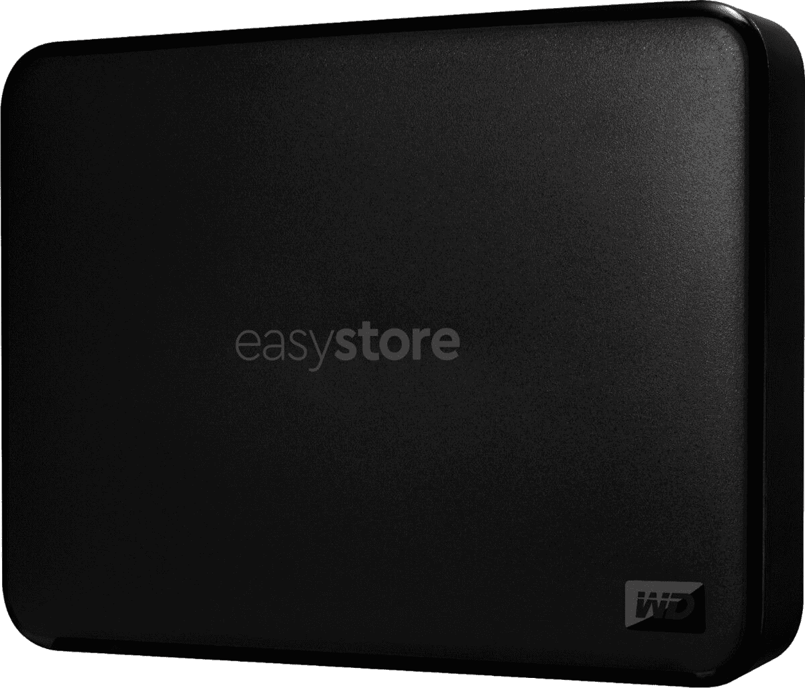

# 在百思买购买仅 90 美元的 WD easystore 5TB 外置硬盘

> 原文：<https://www.xda-developers.com/wd-easystore-5tb-deal-best-buy/>

将您的数据备份到某个物理位置总是一个好主意。云服务是美好的，但是如果你选择的服务关闭或者开始收取你不想支付的订阅费，所有的数据都将消失。这和你的内置硬盘或固态硬盘烧坏没什么区别！有了这个[百思买黑色星期五广告项目](https://shop-links.co/1722257936560682864)，你只需花 90 美元就可以保护你所有的数据。

我指的是一切——这是 [WD easystore 5TB 外置硬盘](https://shop-links.co/1722257936499234681)。5tb 的空间对于您的文件和数据来说是很大的空间。我的桌面只有大约 600GB 的空间，其中大部分是我不需要保存的游戏下载。对我来说，我可以轻松地备份我的电脑、笔记本电脑和我能想到的任何其他设备上的所有东西，并有足够的空间。

但是如果你是那种收集无损音乐或 4K 电影的人，你知道你可以很快填满空间。WD easystore 5TB 硬盘是存储这些类型的收藏的最佳方式，WD 品质让您高枕无忧，并在您的计算机上释放大量空间，因此您可以做的不仅仅是存储最新的杜比数字、4K 漫威电影。你可以救一堆！

你可能会认为 5TB 的存储空间太大了。但是，当像这样的外置硬盘出售时，没有理由不买它。目前，在百思买，4TB 的型号是 95 美元。为什么要为更小的空间多付 5 美元？

 <picture></picture> 

WD easystore 5TB External Hard Drive

##### WD easystore 外置硬盘

在一个非常大的外部硬盘上节省很多！WD easy store 5TB 硬盘售价仅为 90 美元，你可以从所有设备上备份所有文件。从一家值得信赖的公司以不到 100 美元的价格购买这么多存储？你确实不能击败那个价格。

这笔交易是百思买黑色星期五广告促销的一部分，将持续到周日。但是，他们警告说，这些项目可能会卖光，所以不要延迟挑选这个硬盘驱动器-如果你等太久，你可能会倒霉！