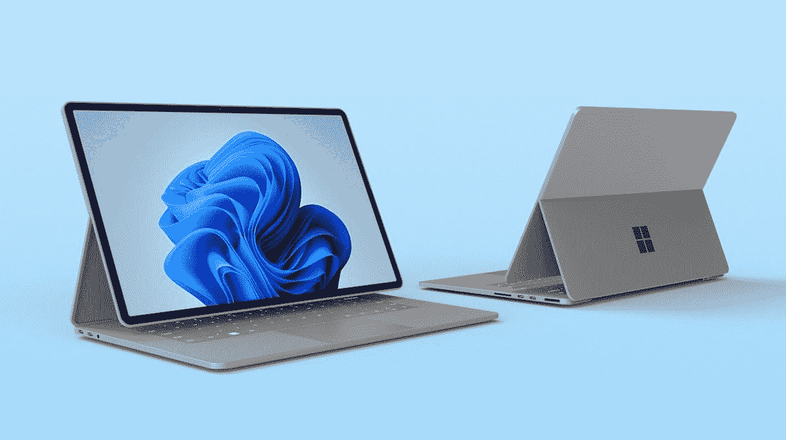
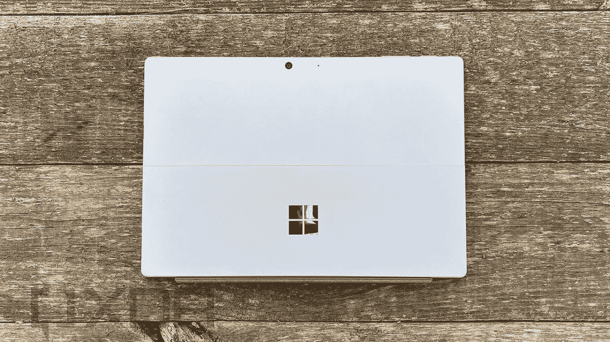
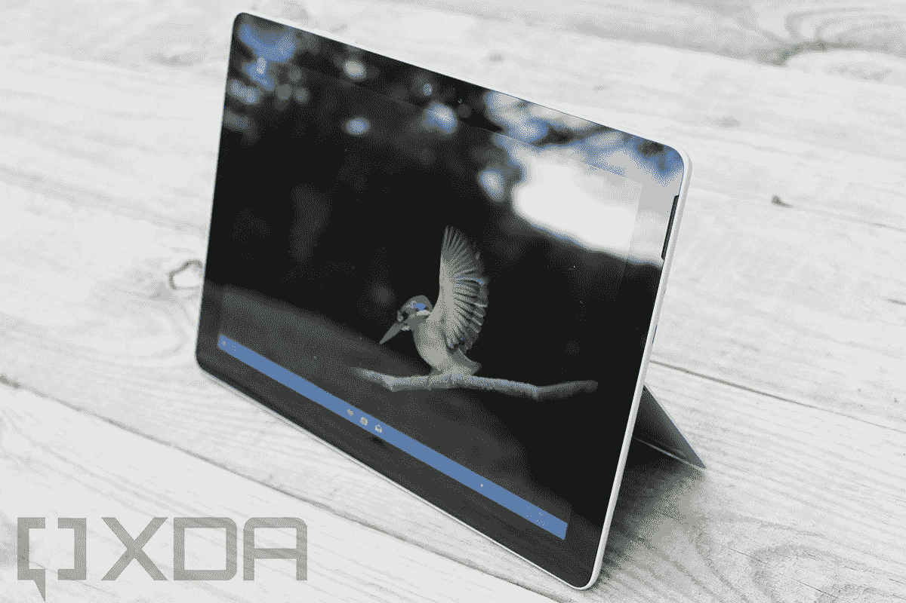
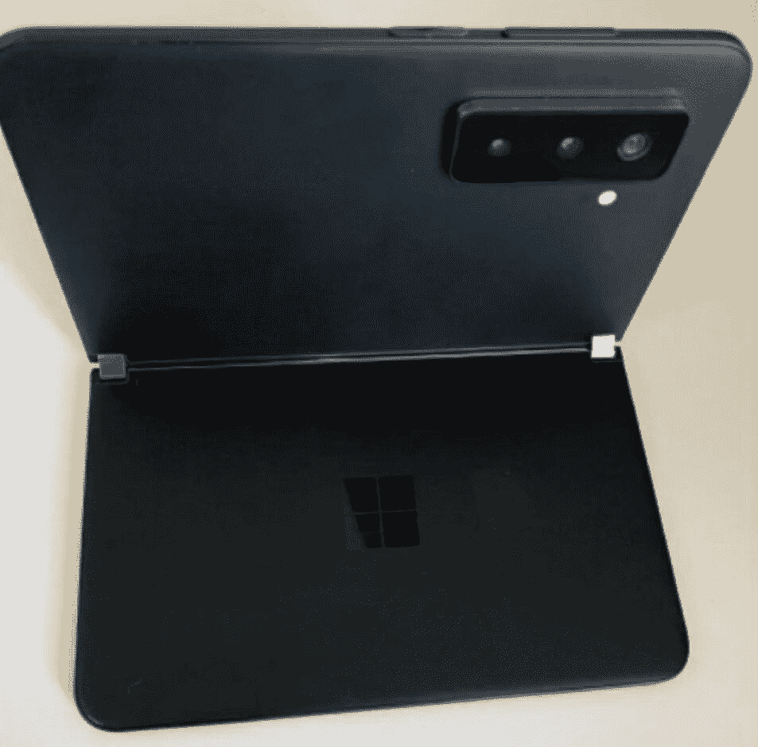
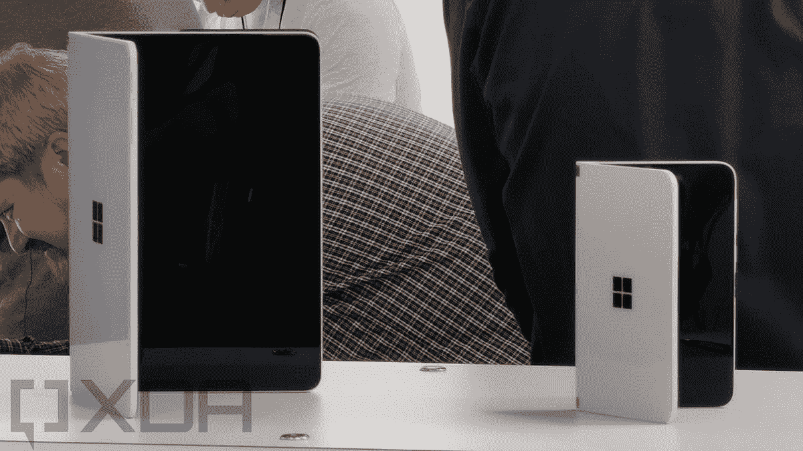

# 微软的 Surface 事件:期待什么，不期待什么

> 原文：<https://www.xda-developers.com/what-to-expect-microsoft-surface/>

我们现在距离 Windows 11 的发布只有几周时间，距离微软下一次大规模的 Surface 发布也只有几天时间。如果你是该公司硬件的粉丝，那一定会是充满惊喜的激动人心的一天。

所以要小心，前方有剧透。我们已经对 9 月 22 日将要看到的东西有了一些想法。事实上，我们非常清楚将要发布哪些产品。

## 表面书 4

当 Windows 10 发布时，微软也同时发布了硬件，Surface Book 是一款英雄设备。Windows 11 硬件发布会也将如此。Surface Book 4 正在进行适当的重新设计，而且会好很多。

显示器将不再是可拆卸的了。事实上，该产品有可能被称为 Surface Book Studio 或 Surface Laptop Studio，因为其外形与 Surface Studio 更相似。这是 OEM 厂商以前使用过的设计，例如惠普的 Elite Folio。它允许您将设备用作翻盖，然后弹出屏幕并折叠成平板电脑。

 <picture></picture> 

Surface Book 4 concept by [Ryan Smalley](https://www.behance.net/gallery/98093539/Surface-Book-4)

这为 Surface Book 开辟了很多可能性，因为旧的设计有很多问题。首先，现有的阵容非常头重脚轻，很难放在膝盖上使用。这是因为 CPU、两块电池之一、内存和存储设备都必须在显示器中，这样当它被移除时仍然可以工作。在新的设计中，显示屏不会被移除，所以那些组件可以在底座中。

将组件放在底座中的另一个好处是，它可以包括更强大的 CPU，如英特尔的 45W H 系列。这些传统上是在创造者的笔记本电脑中发现的，这是 Surface Book 系列历史上的宣传，但由于 CPU 在屏幕中，所需的热量是不可能的。

你可以期待看到的其他东西是一个更大的 14 英寸屏幕，可能有 120 赫兹的刷新率。事实上，动态刷新率可能是这里的一个主题。它还将有两个 USB Type-C 端口，微软仍然坚持使用一个 Surface Connect 端口。

## Surface Pro 8

Surface Pro 8 是另一款我们期待重新设计的产品，尽管不会像 Surface Book 那样有重大改变。首先，它将对英特尔的第 11 代处理器进行规格升级，我们已经在 Surface Pro 7+中看到了这一点。微软上一次在 Surface Pro 的两代产品中使用相同的处理器是在 Surface Pro 2 和 3 上，第三代产品是 Windows 平板电脑的第一次全面重新设计，为我们今天仍然看到的设备设定了模板。

 <picture></picture> 

Surface Pro 7

我们预计该设备的正面看起来更像 Surface Pro X，这意味着它将有更小的边框和更大的 13 英寸 3:2 显示屏。Surface Pro 7+的显示屏为 12.3 英寸，与 Surface Pro 4 以来的显示屏相同。顶部边框仍然可能会更大，但这没关系，因为雷德蒙德公司几乎是唯一一家自 2014 年以来一直使用 1080p 网络摄像头的 OEM 厂商。

它还将拥有可移动存储，就像我们在 Surface Pro 7+中看到的一样。这是为拥有敏感数据的企业准备的，因此他们可以在回收电脑时销毁这些数据。它还将获得触摸唤醒和接近唤醒等功能，这些功能是其他原始设备制造商在过去一年中一直强调的。这将是在顶部挡板中增加传感器的另一个原因。

最后，有报道称 Surface Pro 8 将至少在一种配置中配备 Thunderbolt，所以我们将拭目以待。

## surface pro 2

听起来好像会有一款新的 Surface Pro X 在发布会上出现，尽管主要是内部的变化。这是更令人困惑的谣言之一，因为高通尚未宣布其骁龙 8cx Gen 3。我们知道，微软的 SQ1 和 SQ2 基本上都是超频的骁龙 8cx 处理器。

 <picture></picture> 

Teaser image from Microsoft's event invitation

有可能 SQ3 会先于骁龙 8cx Gen 3 上市，也有可能新款 Surface Pro X 仍然会有 SQ2。不过，听起来好像会有一个只有 Wi-Fi 的模型，我们越来越多地在 ARM 设备上看到 Windows。

## Surface Go 3

Surface Go 3 不会有太大的变化。事实上，这是极少数在其第二代产品上有物理变化的 Surface 产品之一，屏幕从 10 英寸扩大到 10.5 英寸。您可以期待机箱保持不变，尽管可移动存储是一种可能性。

 <picture></picture> 

Surface Go

不过，它的规格会有所提高，可选配置包括奔腾金色 6500Y 和核心 m3-10100Y。这两款都是琥珀湖刷新家族的 14 纳米处理器，它们应该比 Surface Go 2 中的处理器提供了相当坚实的提升。

至于为什么微软会在这次发布会上发布 Surface Go 3，目前还不清楚。Panos Panay 从未在产品发布会上推出过 Surface Go，因为它不是一款英雄产品。或许，这将被宣传为一款更小的平板电脑，展示 Windows 11 的新触摸优化。

## 表面二重奏 2

Surface Duo 2 有望解决第一款的所有问题。第一个是一个糟糕的相机和最新一代的规格，所以这就是我们要解决的问题。

 <picture></picture> 

Leaked image of Surface Duo 2

双屏智能手机将拥有一个三镜头相机，相机凸起相当难看。虽然批评者抱怨说这不会让手机完全折叠起来，但如果你想要一台像样的相机，这是必要的。Surface Duo 2 是一款如此薄的设备，这只是物理上需要更多空间来放置一台性能良好的相机。

它还将有一个骁龙 888 芯片组，这是高通的最新产品。的确，Surface Duo 已经一岁了，但是骁龙 855 在 good 之下已经两岁了。Surface Duo 2 还将包括 5G 连接，这是 1400 美元的原始型号所缺乏的另一个关键项目。

## *不是*地表近地天体

有几件事你不应该期待。你肯定不会看到 Surface Laptop 5，因为它最近刚刚更新，将需要英特尔第 12 代处理器。Surface Studio 仍然不可思议地失踪，尽管最新的模型仍然有英特尔第七代 CPU。值得注意的是，你可能永远也不会听到关于地表近地天体的消息。

我的理解是，微软已经放弃了构建支持双屏或可折叠设备的 Windows 的所有努力。这意味着近地天体表面可能永远见不到阳光。

 <picture></picture> 

Surface Neo next to the smaller Surface Duo

两年前，Surface Neo 与 Windows 10X 和 Surface Duo 一起发布。Windows 10X 被宣传为全新的双屏电脑操作系统，但最终，微软表示将重新调整该操作系统的用途，使其适用于单屏设备。Windows 和设备主管 Panos Panay 表示，该计划是为了满足客户的需求，尽管事实上您仍然需要购买一台新的 PC 来获得 Windows 10X。

他说，微软会在时机成熟时重新考虑双屏设备，然后无论如何都会推出 Surface Duo，因为它运行的是安卓系统。Windows 10X 从未发货，相反，微软承诺将其一些功能内置到 Windows 11 中。这些功能不包括对双屏设备的支持。

就像我说的，我的理解是微软无意再次启动这项开发。另一个更明显的原因是，Surface Neo 不会以其宣布的形式发货，因为英特尔的 Lakefield 处理器已经停产，所以微软将不得不使用其他产品。据推测，有一个阿尔德湖处理器可以做到这一点。

很明显，产品路线图确实会改变，微软在未来可能会改变主意。别抱太大希望。

* * *

这就是我们所知道的关于微软 Surface 发布会的全部信息，发布会将于美国东部时间 9 月 22 日上午 11 点举行。你希望看到什么？请在评论中告诉我们！