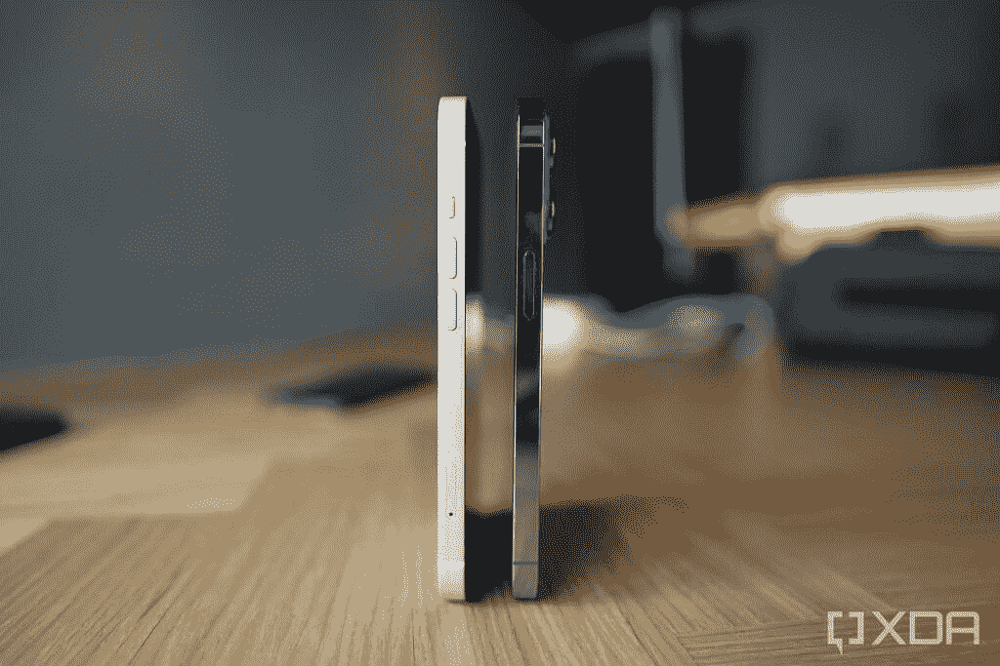
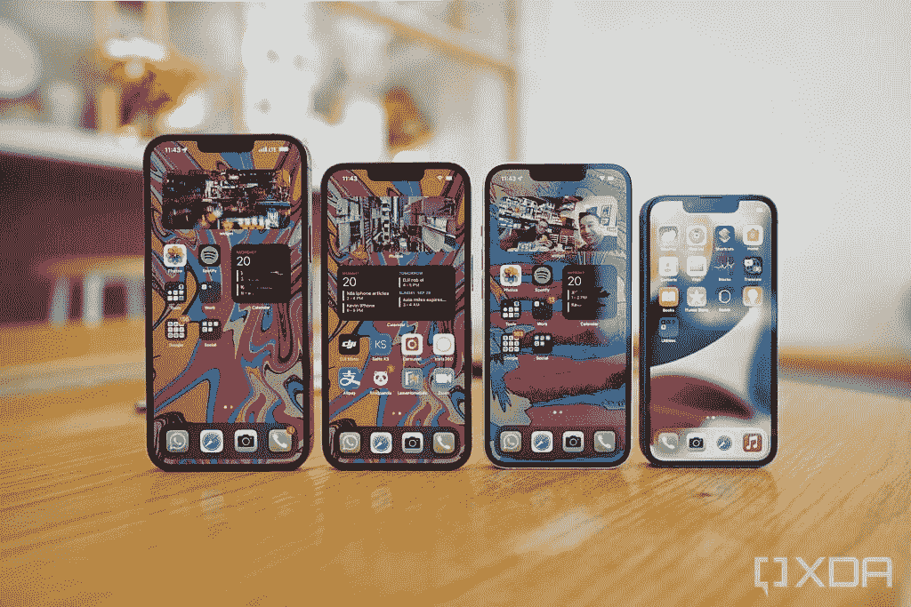
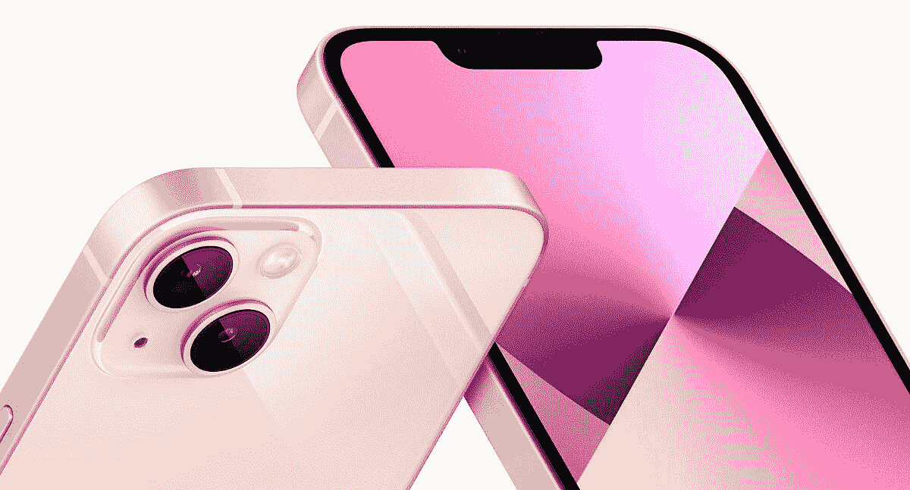

# iPhone 13 评测:物有所值，但没有专业人士的好

> 原文：<https://www.xda-developers.com/whats-your-biggest-reason-for-not-owning-an-iphone/>

去年，我们 XDA 的大多数人都认为，标准版 iPhone 12 是大多数人的最佳选择，因为它和 iPhone 12 Pro 的区别主要在于一个长焦摄像头，在我们看来，这不足以证明额外的 200 美元是合理的。但今年，苹果扩大了专业和非专业 iPhone 之间的差距，给 [iPhone 13 Pro](https://www.xda-developers.com/iphone-13-pro/) 比标准的 [iPhone 13](https://www.xda-developers.com/iphone-13/) 多了几个功能，同时保持型号之间的价格差距与去年相同。

标准版 iPhone 13 对大多数人来说还是最好的 iPhone 吗？

### 点击展开:苹果 iPhone 13 系列规格

## 苹果 iPhone 13 系列:规格

| 

规范

 | 

苹果 iPhone 13 和 iPhone 13 Mini

 | 

苹果 iPhone 13 Pro 和 iPhone 13 Pro Max

 |
| --- | --- | --- |
| **建造** | 

*   铝制中框
*   玻璃正面和背面
*   前玻璃的“陶瓷护罩”

 | 

*   不锈钢中框
*   玻璃正面和背面
*   前玻璃的“陶瓷护罩”

 |
| **尺寸&重量** | 

*   iPhone 13 Mini:
    *   131.5 毫米 x 64.2mm 毫米 x 7.65mm 毫米
    *   141g

*   iPhone 13:
    *   146.7 毫米 x 71.5mm 毫米 x 7.65mm 毫米
    *   174 克

 | 

*   iPhone 13 Pro:
    *   146.7 毫米 x 71.5mm 毫米 x 7.65mm 毫米
    *   204 克

*   iPhone 13 Pro Max:
    *   160.8 毫米 x 78.1mm 毫米 x 7.65mm 毫米
    *   240 克

 |
| **显示** | 

*   超级视网膜 XDR 有机发光二极管:
    *   iPhone 13 Mini: 5.4 英寸
    *   iPhone 13: 6.1 英寸

*   60Hz

 | 

*   超级视网膜 XDR 有机发光二极管:
    *   iPhone 13 Pro: 6.1 英寸
    *   iPhone 13 Pro Max: 6.7”

*   推广 120Hz 刷新率

 |
| **SoC** | 苹果 A15 仿生 | 苹果 A15 仿生 |
| **内存&存储** | 

*   RAM 未公开
*   128GB/256GB/512GB

 | 

*   RAM 未公开
*   128GB/256GB/512GB/1TB

 |
| **电池&充电** | 

*   电池尺寸未透露；监管文件中的大致大小:
    *   iPhone 13 Mini:2438 毫安时
    *   iPhone 13:3240 毫安时

*   高达 20W 的有线充电
*   最高 7.5W 的无线充电
*   MagSafe 充电功率高达 15W

 | 

*   电池尺寸未透露；监管文件中的大致大小:
    *   iPhone 13 Pro:3125 毫安时
    *   iPhone 13 Pro 最大:4373 毫安时

*   高达 20W 的有线充电
*   最高 7.5W 的无线充电
*   MagSafe 充电功率高达 15W

 |
| **安全** | Face ID | Face ID |
| **后置摄像头** | 

*   初级:12MP 宽，f/1.6 光圈，1.6μm
*   **次要:** 12MP 超宽，f/2.4 光圈

 | 

*   **初级:** 12MP 宽，f/1.5 光圈，1.9μm
*   **次要:** 12MP 超宽，f/1.8 光圈
*   **第三:** 12MP 长焦，3 倍光学变焦，f/2.8
*   激光雷达相机

 |
| **前置摄像头** | 12MP 原深感摄像头系统 | 12MP 原深感摄像头系统 |
| **端口** | 闪电 | 闪电 |
| **音频** | 立体声扬声器 | 立体声扬声器 |
| **连通性** | 

*   5G(低于 6 GHz 和毫米波)
*   支持 4x4 MIMO 和 LAA 的千兆级 LTE
*   支持 2x2 MIMO 的 Wi-Fi 6 (802.11ax)
*   蓝牙 5.0

 | 

*   5G(低于 6 GHz 和毫米波)
*   支持 4x4 MIMO 和 LAA 的千兆级 LTE
*   支持 2x2 MIMO 的 Wi-Fi 6 (802.11ax)
*   蓝牙 5.0

 |
| **软件** | iOS 15 | iOS 15 |
| **其他特征** | 双物理 SIM 或双 eSIM 支持 | 双物理 SIM 或双 eSIM 支持 |

***关于这篇评论:**苹果把四部 iPhones 全部借给我测试。这篇评论是在把 iPhone 13 作为我的主要手机使用了六天，又作为我的次要手机使用了一周之后写的。苹果公司没有参与这项审查。*

* * *

## iPhone 13:硬件和设计

iPhone 13 延续了苹果在其所有设备中引入的方方正正的平面设计语言。它有一个 6.1 英寸的有机发光二极管屏幕，中间有一个缺口。正面覆盖着苹果所谓的“陶瓷盾”技术。

在背面，我们有一个稍微光滑的玻璃背面(但仍然不像 iPhone X 或 Galaxy S10 那样吸引指纹)，有一个由 12MP 主(宽)镜头和 12MP 超宽镜头组成的双摄像头系统。两个后置摄像头的传感器都是新的，比 iPhone 12 的传感器更大。

iPhone 13 周围的平栏杆是由铝制成的，它有一个哑光表面，我更喜欢 Pro 的光滑不锈钢栏杆。但我会在下一节详细阐述 iPhone 13 和 iPhone 13 Pro 的区别。

 <picture></picture> 

iPhone 13's matte aluminum chassis (bottom) compared to the glossy stainless steel chassis of the 13 Pro (top).

无论是在现实世界的场景还是基准数字中，A15 仿生都击败了骁龙 888+

iPhone 13 内部是 A15 仿生硅，这无疑是最强大的移动 SoC。无论是在现实世界中(如导出/渲染视频)还是在基准测试中，它都轻而易举地击败了高通骁龙 888+。苹果 A15 仿生前沿处理能力也是让新的“电影模式”成为可能的原因。这是苹果真正领先于其他公司的一个领域。对于 iPhone 13 系列，所有四款手机都使用相同的芯片，因此在选择更便宜的手机时没有真正的妥协。你可以在我们的 [iPhone 13 Pro 评测](https://www.xda-developers.com/apple-iphone-13-pro-review/)中了解更多关于性能的信息。

 <picture></picture> 

iPhone 13 (left) and iPhone 13 Pro (right).

苹果没有透露内存或电池大小，但由于第三方拆解，我们知道 iPhone 13 运行在 4GB 的内存和 3,240 mAh 的电池上。与 Android 手机相比，这两个数字都很小，但不用担心 iPhone 13 的用户界面运行良好，电池续航时间也很长。这是 A15 Bionic 的效率和苹果无与伦比的软硬件协同作用的又一证明。

总的来说，iPhone 13 重量轻，只有 174 克，有点容易握持。我之所以说“有点”，是因为 iPhone 13 的水平尺寸仍然略宽，为 71.5 毫米(2.81 英寸)，所以平坦侧面的硬角仍然会戳进你的手掌。这是不可避免的:带有棱角的平坦侧边在手掌上的感觉不如圆形弯曲侧边舒适(就像 iPhone 11 或几乎所有安卓系统)。

### 显示

让我们再详细说明一下屏幕:2，340 x 1，080 的面板看起来很棒，最大亮度为 1，200 尼特。它只在 60 赫兹时刷新，但在我看来，苹果的 60 赫兹比安卓的 60 赫兹优化得更好，所以动画和 UI 流畅性不会像今天拿起 60 赫兹的安卓设备那样过时。

 <picture></picture> 

The iPhone 13 is the third phone from the left.

槽口更小，但这几乎无关紧要，因为苹果的 UI 没有利用额外的空间。在凹槽旁边的区域，您仍然可以看到相同数量的图标和信息。你唯一能“看到更多”的时候是你正在看一个被放大到整个屏幕的视频。

### iPhone 13 vs iPhone 13 Pro:有什么区别…这些区别重要吗？

如上所述，iPhone 13 和 iPhone 13 Pro 之间有许多不同之处:

*   **机箱材质:** iPhone 13 采用铝制边框；iPhone 13 Pro 采用不锈钢边框
*   **GPU:** iPhone 13 有四核 GPU；iPhone 13 Pro 有一个五核 GPU
*   **重量:** iPhone 13 重 174giPhone 13 Pro 重 204g
*   **屏幕刷新率:i** Phone 13 显示屏有 60Hz 刷新率；iPhone 13 Pro 显示器具有高达 120Hz 的可变刷新率
*   **摄像头阵列:** iPhone 13 有两个后置摄像头(宽和超宽)；iPhone 13 Pro 有三个后置摄像头(广角、超广角和长焦)
*   **摄像头图像传感器尺寸:** iPhone 13 的宽摄像头使用的图像传感器比 iPhone 13 Pro 的宽摄像头图像传感器小
*   **相机光圈:** iPhone 13 的超宽相机的光圈比 iPhone 13 Pro 的超宽相机慢
*   **微距模式:** iPhone 13 没有微距模式；iPhone 13 Pro 的超宽镜头可以兼作微距传感器
*   **电池容量:** iPhone 13 的 3,227 mAh 电池比 iPhone 13 Pro 的 3,095 mAh 大

上面没有提到的所有东西在这两款手机上都是一样的:自拍相机硬件、CPU、软件、外形尺寸等。这些差异是否重要应该因人而异。我将分享我对这些问题是否重要的看法:

*   理论上，不锈钢框架应该更坚固，但当我们把手机摔在地上时，我们可能更关心屏幕的耐用性，而不是框架？我也喜欢苹果给它的铝框架的哑光涂层的外观和感觉，而不是光滑的指纹磁铁不锈钢材料。
*   对于智能手机 SoC 来说，苹果 A15 Bionic 已经是大材小用了，我不确定额外的 GPU 能带来多少好处，除非你进行繁重、严肃的移动游戏或视频编辑会话。
*   重量:我觉得 iPhone 13 更容易拿，因为它轻了 30 克。
*   **屏幕刷新率:**目前，iPhones 上 120Hz 和 60Hz 之间的差异很小，因为由于一个 bug ，这只有在第一方应用[中才真正明显。苹果已经承诺向所有应用程序开放 120Hz，所以我认为这一点很重要。高刷新率总是好的。](https://www.xda-developers.com/iphone-13-pro-third-party-apps-60-hz-limit/)
*   **相机阵列:**在今年之前，我会说非专业 iPhones 跳过长焦变焦镜头没问题，因为苹果之前的 2 倍长焦变焦无论如何都很平庸。但今年，苹果将专业长焦相机改进为 3 倍光学和 15 倍数码变焦，所以我认为这很重要。我喜欢把城市周围的东西放大 5 倍、10 倍。标准的 iPhone 13 的数码变焦超过 2 倍看起来很糟糕。
*   **相机图像传感器尺寸:**如果您喜欢近距离拍摄物体时的自然散景，或者如果您经常拍摄弱光照片，13 Pro 具有更大的图像传感器。iPhone 13 将不得不更多地求助于夜间模式。好消息是苹果的夜间模式可以无缝运行，而且运行良好。
*   相机光圈:iPhone 13 ultra wide 的光圈较慢，这意味着在弱光条件下，它往往不得不求助于夜间模式。这对我很重要，但我猜不是很多。
*   **微距模式:**拍摄或拍摄时能够更靠近物体/主体很重要，所以我要说 iPhone 13 省略了微距拍摄功能很重要。
*   **电池容量:**尽管电池大小不同，但我发现标准 iPhone 13 和 iPhone 13 Pro 的电池寿命相似——我认为 Pro 型号的可变刷新率有助于节省电池。

* * *

## iPhone 13:相机

如前所述，与去年的 iPhone 12 摄像头相比，iPhone 13 的后置摄像头获得了更大的传感器，但尺寸的增加没有 iPhone 13 Pro 那么显著。换句话说，iPhone 13 的主摄像头传感器更大，但仍然小于 iPhone 13 Pro 的主摄像头传感器。

与去年的 iPhone 12 相比，iPhone 13 的后置摄像头获得了更大的传感器

更大的传感器尺寸带来了两个好处:它吸收了更多的光，这有利于夜间摄影/摄像；更大的传感器带来了更浅的景深，这使得物体和背景之间的分离更强。后者在下面的示例中非常明显。

你可以看到 iPhone 13 Pro 的图像显示了最强的自然散景，在相机和它后面的东西(汽水罐、iPhone 盒子和植物)之间产生了深度分离感。三款手机中传感器最小的 iPhone 12 的散景量最弱，因此图像看起来更平坦。iPhone 13 介于两者之间——虽然工厂有不错的散景，但汽水罐和 iPhone 盒子没有很好地与相机分开。

在大多数情况下，如果你在理想的条件下拍摄(良好的照明，不太刺眼)，iPhone 13 的双摄像头系统可以产生很好的图像，看起来质量非常接近 iPhone 13 Pro。iPhone 的自拍相机基本上和以前一样，它拍摄的照片具有一致的平衡和自然的肤色，没有任何 Android 品牌诉诸的美化技巧。

### 专业过度曝光问题

谢天谢地，标准版 iPhone 13 的曝光过度问题没那么严重

在我对 iPhone 13 Pro 的[评测中，](https://www.xda-developers.com/apple-iphone-13-pro-review/)我强调了这款手机在某些情况下有过度曝光的倾向。这一点在拍摄高对比度场景时尤其明显，比如霓虹灯下的香港夜景，或者在阳光明媚的日子朝着太阳拍摄。我的结论是，这个问题可能是由于苹果公司处理新的更大的传感器，没有足够的时间来微调软件。

我很高兴地报告，标准 iPhone 13 上的问题没有那么严重，讽刺的是，因为 iPhone 13 的摄像头硬件不如 Pro 的强大。iPhone 13 的主摄像头和超宽摄像头的图像传感器都比 Pro 的小，在超宽的情况下，13 shooter 的光圈也较慢(所有这些都意味着 iPhone 13 摄像头*比 13 Pro 的进光量*少)。

你应该能在上面的样张中看到，iPhone 13 Pro 第一套吹出了天空，第二套是霓虹灯 logo。讽刺的是，iPhone 13 的图像看起来略好，因为它的图像传感器更小。但这是一个小众的情况(我特意对着太阳拍摄，以测试第一集的曝光)。在大多数情况下，太阳一落山，或者如果我们走进室内，光线不是很好，专业相机会更好。

### 弱光拍摄

因此，iPhone 13 的摄像头不像 Pro 机型那样吸收那么多光线，但 iPhone 的夜间模式仍然很好。例如，夜间模式无缝启动，不像许多安卓手机需要你滑动几次才能打开。当你让夜间模式发挥它的魔力时，iPhone 13 的弱光图像看起来几乎和 13 Pro 一样好。但如果你关闭夜间模式，那么你可以看到 iPhone 13 Pro 的主摄像头产生了更亮的图像。

如果使用超宽镜头拍摄，这一点会更加明显。如果我们不使用夜间模式，iPhone 13 的超宽会产生更暗的镜头。

现在你可能会问“如果夜间模式这么好，那为什么不用夜间模式测试呢？”。嗯，夜间模式并不总是理想的。因为你必须等待 2-3 秒钟让夜间模式捕捉，这意味着如果你拍摄动作场景，或有许多移动物体的镜头，夜间模式可能会产生不稳定的模糊镜头。最终，夜间模式是很好的保险，它仍然是最好的，只是有一个相机，可以自然地接受更多的光线。

### 变焦镜头

由于 iPhone 13 根本没有变焦镜头，这意味着任何变焦都将是数码变焦，苹果将其限制在 5 倍。换句话说，不要期望太多:任何带有变焦镜头的手机都会产生比 iPhone 13 更清晰的变焦图像。

正如我之前所写的:去年 iPhone 12 缺少变焦镜头并不是什么大不了的事情，因为 iPhone 12 Pro 只有一个普通的 2 倍变焦镜头。但今年的 iPhone 13 Pro 升级到了 3 倍变焦镜头(传感器更大)，可以数码变焦 15 倍。因此，与今年的 Pro 相比，iPhone 13 缺乏变焦是一个更明显的疏漏。

### 电影模式

在我看来，iPhone 13 最好的新相机功能是“电影模式”我已经在几篇文章中写过这个功能，它的要点是它是视频的肖像模式:当你在电影模式下拍摄剪辑时，你可以选择聚焦前景或背景中的物体/主题，然后苹果的 A15 Bionic 将使用其神经引擎处理场景，并在失焦区域产生人工散景(模糊)。

这一功能并不完美——训练有素的眼睛将能够立即从真正的全画幅相机中识别出这不是一个真正的散景——但在某些条件下它足够好，它确实为原本看起来平淡无奇的智能手机视频添加了电影风格。动态改变焦点的能力还允许 iPhone 13 实现“支架聚焦”，这是一种电影技巧，焦点从前景的物体/主题转移到背景(反之亦然)。

* * *

## iPhone 13:软件

iPhone 13 像所有其他 iPhone 13 型号一样，开箱即可运行 [iOS 15](https://www.xda-developers.com/ios-15/) ，但几天后，它就收到了 iOS 15.1 的更新。这个最新版本的 iOS 主要是对 iOS 14 的迭代升级，带来了相同的视觉元素和变化，例如应用程序库(苹果版本的 Android 应用程序抽屉)和主屏幕上的小部件。

iOS 15 的新功能包括一个新的 FaceTime 应用程序，允许你向 Android 手机用户发送链接以加入通话。FaceTime 在香港并没有被广泛使用，但从我的测试来看，它是有效的。

有一些小的视觉改革，比如重新设计的通知面板，将显示联系人照片，以及更大的应用程序图标。但是面对现实吧，iOS 对通知的处理相比 Android 还是逊色不少。

iOS 15 中有一个新的焦点模式，基本上允许你设置特定的配置文件(如“工作”、“周末”、“晚上”)，然后当你处于该模式时，只允许特定的联系人和应用程序联系你。

iOS 15 更有用的新功能之一是 spotlight search 现在也可以在你拍摄的照片中进行搜索。例如，我可以搜索“洛杉矶照片”，它会直接在搜索结果中显示我在洛杉矶拍摄的照片。

总的来说，iOS 是一个流畅快速的操作系统，拥有最好的应用生态系统以及最好的第三方配件生态系统。然而，我对 iOS 的大多数抱怨仍然存在。缺乏真正免费的主屏幕网格，无法摆脱通知气泡，我必须从右上角一直刷到访问控制中心。

* * *

## iPhone 13:电池寿命和其他细节

得益于更大的电池，iPhone 13 的电池续航时间非常长。在一周的使用中，这款手机可以让我持续使用整整 14 个小时，只有在周末使用量非常大的时候，我才需要在晚上结束之前充值。苹果承诺更长的电池续航时间，它确实做到了。令人惊讶的是，iPhone 13 和 iPhone 13 Pro 的电池续航时间没有太大差异:我原本预计普通设备的续航时间会更长，但两者的续航时间差不多。iPhone 13 Pro 的可变刷新率(以及 iOS 将更高的刷新率仅限于苹果应用程序的错误)有助于 Pro 节省电池。因此，与 iPhone 13 Pro 相比，普通 iPhone 13 并没有真正和直接的电池优势。

在 iPhone 13 上玩游戏和看视频是一种可靠的体验。显然，手机足够强大，可以处理任何游戏，立体声扬声器听起来非常棒。但我发现带缺口的 6.1 英寸屏幕有点局促，可能是因为我通常使用带打孔功能的 6.7 英寸安卓系统。

* * *

## iPhone 13 结论:物超所值，但这次显然是小兄弟

在每个顶级安卓旗舰都达到或远远超过四位数价格区间的时候，iPhone 13 的 799 美元起价可以被认为是非常划算的，特别是因为苹果今年已经将基本存储增加了一倍，达到 128GB。iPhone 13 值得 iPhone 老用户等待吗？确实是。

在每个顶级安卓旗舰都达到四位数价格区间的时候，iPhone 13 的 799 美元起价是物有所值的

然而，尽管去年的 iPhone 12 在功能和功率方面与 12 Pro 保持了足够的接近，但今年的 iPhone 13 显然比 iPhone 13 Pro 低了一个级别。失去变焦镜头是一回事，但也失去了微距镜头、120Hz 刷新率和明显更小的图像传感器？这使得 iPhone 13 不完全是苹果旗舰。这几乎是一款旗舰产品，就像我眼中的 Galaxy S21 和 Pixel 5 一样。

 <picture></picture> 

Apple iPhone 13

##### 苹果 iPhone 13

iPhone 13 带来了强大的 A15 Bionic 和一个非常好的主摄像头，以及常见的苹果软件包和生态系统。

iPhone 13 Pro 是真正展示了苹果今年想要展示的东西的手机。但如果你真的不能(或拒绝)支付超过 800 美元，那么标准的 iPhone 13 仍然是一个不错的选择。你仍然可以获得智能手机领域最好的 SoC 和视频功能。