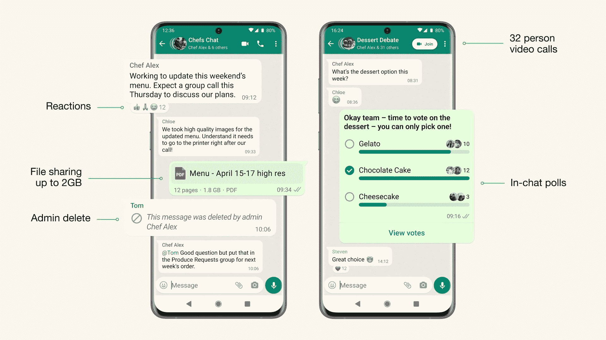

# WhatsApp 的新社区功能现已在全球推出

> 原文：<https://www.xda-developers.com/whatsapp-communities-polls-32-person-video-calls/>

经过几个月的测试，WhatsApp 终于开始在全球推出新的社区功能。该功能允许用户在一个保护伞下连接多个群组，以帮助他们更好地组织平台上的群组对话。除了社区之外，WhatsApp 还在最新的更新中推出了一些其他功能，包括支持聊天调查、32 人视频通话和最多 1024 名成员的群组。

Meta 的首席执行官马克·扎克伯格(Mark Zuckerberg)最近在脸书的一个视频中宣布了这一计划，强调了 WhatsApp 社区将如何为管理员提供工具，在一个全新的标签下组织对话。

该选项卡将出现在 Android 聊天的顶部，在 iOS 聊天的底部，它将包括帮助管理员创建新社区或向社区添加现有群组的选项。在社区中，用户可以轻松地在群组之间切换，管理员可以一次与所有群组共享重要更新。

 <picture></picture> 

The latest WhatsApp update also brings support for in-chat polls, 32-person video calls, and groups with up to 1,024 participants.

扎克伯格还证实，随着最新的 WhatsApp 更新，其他几个正在开发的功能将向用户推出。此次更新支持多达 32 名参与者的视频通话，这是扎克伯格在今年早些时候 WhatsApp [推出通话链接](https://www.xda-developers.com/whatsapp-debuts-call-links/)时首次提到的。最近发现的对 1，024 个成员组的支持，也将随着最新的更新推出，以及创建聊天中投票的能力。

在 WhatsApp [在测试频道](https://www.xda-developers.com/whatsapp-avatar-support-beta/)推出头像支持后几天，新功能就推出了，允许用户在他们的个人资料上创建和使用自定义头像。

你对 WhatsApp 的新社区功能有什么看法？你会用它来组织你的小组吗？请在下面的评论区告诉我们。

* * *

**来源:** [脸书](https://www.facebook.com/4/posts/pfbid0R91PoUHets2WjTBQVhMnLQqKPz4w7XxfLU2NRVnkGGMnKhJMRQfnQtg93b6aTMz4l/)， [WhatsApp](https://blog.whatsapp.com/)